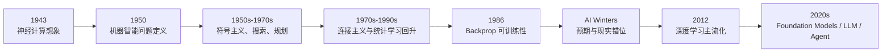

# AI History Timeline Map

## 地图目标

- 用时间线梳理 AI 的几次关键转折与范式变化

## 怎么看这张图

- 左边不是“古早历史”，而是今天很多问题的起点
- 中间的符号主义、连接主义、统计学习，不是互相消失，而是不断重组
- 右边的大模型与 agent，更像旧问题在新系统条件下的再出现

## 关联

- [[../05-Topics/AI History|AI History]]
- [[../05-Topics/AI Winters|AI Winters]]
- [[../../AI 历史主时间线：从符号主义到大模型|AI 历史主时间线：从符号主义到大模型]]
