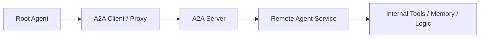
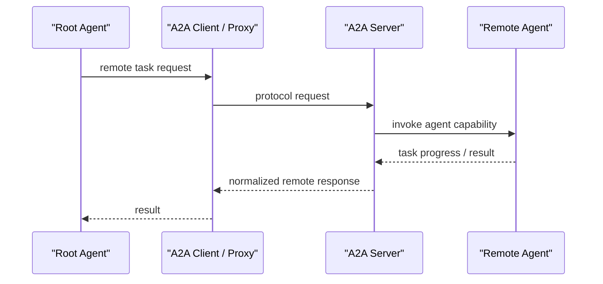

# A2A

## 它解决什么问题

`A2A` 解决的是“独立 agent 服务之间，怎么以标准协议互联和协作，而不是把对方当成普通工具调用”这个问题。

## 为什么现在值得关注

当 agent 开始跨团队、跨服务、跨框架部署时，本地 sub-agent 已经不够了。你会遇到：

- 某个 agent 是单独服务，由别的团队维护
- 某个能力本身就是 remote specialist agent
- 不同团队使用不同 agent framework 或不同语言实现
- 需要强边界、强契约，而不是随便透传内部 memory 和 tools

`A2A` 值得关注，是因为它在尝试把这些“agent 服务互联”问题提升成协议层，而不是让每个团队自己发明一套接口。来源：[ADK A2A Intro](https://adk.dev/a2a/intro/)、[A2A GitHub](https://github.com/a2aproject/A2A)

## 它在技术生态里的位置

- 属于 `agent-to-agent interoperability`
- 更像 `协议 + 互联层`
- 面向远程 agent 服务，不是本地工具调用
- 和 `MCP` 互补，不是替代关系
- 和 `LangGraph`、`AutoGen` 也不是同一层

如果按我们现在的核心 8 样本看：

- `LangGraph`：应用内编排
- `AutoGen`：多 Agent 协作范式
- `A2A`：跨服务边界的 agent 互联协议

## 工作原理

A2A 的核心思路是：

1. 一个 agent 通过 A2A server 暴露自己的能力
2. 另一个 agent 通过 A2A client / proxy 去消费它
3. 双方围绕任务、能力、模态和长任务生命周期进行交互
4. 被调用方仍保持 `opaque` —— 不需要暴露内部 memory、tools 或实现细节

官方仓库对它的描述很直接：`An open protocol enabling communication and interoperability between opaque agentic applications.` 这句话的关键在于：

- 互联的是 `agentic applications`
- 不是 tool functions
- 也不是共享内部状态

来源：[A2A GitHub](https://github.com/a2aproject/A2A)

## 核心组件与架构

- A2A server
- A2A client / proxy
- remote agent
- capability discovery
- task lifecycle
- modality negotiation
- long-running task handling
- agent card / service description

如果按工程层次拆，它大致像：

- expose layer
- consume layer
- task lifecycle layer
- capability contract layer
- network boundary / auth layer

## 核心对象模型 / 核心抽象

- `remote agent`
- `capability / skill discovery`
- `task`
- `task lifecycle`
- `modality negotiation`
- `agent card / service description`
- `client / proxy`
- `server`

这里最关键的抽象是：

- agent 是服务，不是本地对象
- 交互依赖协议契约，而不是共享内存
- 长任务生命周期是协议的一部分，而不是应用自己私下处理

## 主流程 / 关键链路

### 链路 1：Expose Remote Agent 主链路

1. 某个 agent 被包装成 A2A service
2. A2A server 对外暴露能力描述和交互契约
3. 外部系统可以发现这个 agent 的能力面
4. agent 作为独立服务进入生态

### 链路 2：Consume Remote Agent 主链路

1. 根 agent 发起任务
2. client/proxy 根据协议连接远程 A2A agent
3. 任务在网络上被转发和执行
4. 结果或中间状态返回给根 agent

### 链路 3：Long-running Task 主链路

1. 远程 agent 执行较长任务
2. 协议跟踪任务生命周期和交互状态
3. 调用方在不暴露内部实现的前提下持续观察执行进度
4. 最终结果或中间状态返回给调用方

### 链路 4：Capability / Modality 主链路

1. 调用方读取对方 agent 能做什么
2. 双方协商输入输出模态和任务形式
3. 任务按正式契约执行
4. 调用方把远程 agent 当成一等协作对象，而不是工具壳

## 架构图

## 数据流图 / 请求流图

## 工程质量观察

A2A 最值得学的不是某个 SDK，而是它试图把“agent 间协作”从私有集成提升成独立协议层。这个层很像分布式系统里的服务互联，但语义对象换成了 agent。

它最有启发性的地方在于：

- 它承认 remote agent 和 local sub-agent 不是一回事
- 它强调 formal contract，而不是隐式约定
- 它把 network boundary 当成一等问题，而不是工程细节

## 和相邻项目怎么区分

### 和 [[MCP Servers]]

`MCP` 偏工具/资源/prompt 接入；`A2A` 偏 agent 服务互联。一个是 tool/context interop，一个是 agent interop。

### 和 [[LangGraph]]

`LangGraph` 偏应用内 orchestration runtime；`A2A` 偏跨服务边界互联。前者处理本地图执行，后者处理 remote agent 协作。

### 和 [[AutoGen]]

`AutoGen` 是框架/runtime；`A2A` 是协议层。`AutoGen` 可以作为应用内多 Agent 协作框架，`A2A` 则适合把远程 agent 纳入系统。

## 自托管 / 运行判断

- 本地学习：可以，但至少要有两个 agent/service 才比较像真场景
- Mac 学习：中等，更适合概念验证和最小互联实验
- 生产：高，因为一旦进入跨团队、跨语言、跨框架协作，这层协议价值会明显提高

## 适合什么场景

### 很适合

- 独立 agent 服务互联
- 跨团队或跨框架 agent 协作
- remote specialist agent 模式
- 需要 formal contract 的 agent 平台边界

### 不太适合

- 单进程内本地 sub-agent 调用
- 只是想接工具，而不是接另一个 agent 服务
- 你需要低延迟共享内存而不是网络边界

## 适配度标签

- local_fit: `medium`
- mac_fit: `medium`
- production_fit: `high`
- learning_fit: `high`
- 解释见：[[../04-Patterns/项目适配度标签说明|项目适配度标签说明]]

## 对我来说最重要的学习价值

如果你以后研究 `multi-agent platform / remote specialists / protocol design`，A2A 最值得学的是：

- remote agent 和 local sub-agent 的边界
- formal contract 为什么重要
- long-running task 为什么必须进协议层
- agent 服务互联为何不能直接等价成 tools

## 推荐的学习动作

1. 先读 `When to Use A2A vs Local Sub-Agents`
2. 再看 expose / consume 两条 quickstart
3. 再看 remote agent 的 use cases
4. 最后把它和 `MCP`、`AutoGen`、`LangGraph` 做边界对照

## 下一步实验建议

- 做一个 `LangGraph + Remote A2A Agent` 实验
- 做一个 `AutoGen local collaboration + A2A remote collaboration` 对照实验
- 做一个 `A2A vs MCP` 边界实验：何时接 agent，何时接 tool

## 风险与边界

- 多 agent 互联会把网络、鉴权、生命周期复杂度带进来
- 标准存在不代表生态立即成熟
- 协议层一旦抽象不稳，会导致互操作性表面统一、语义却不一致
- remote agent 调用如果缺少 observability，会比 tool 调用更难 debug

## 官方入口

- [A2A GitHub](https://github.com/a2aproject/A2A)
- [ADK A2A Intro](https://adk.dev/a2a/intro/)

## 相关项目

- [[MCP Servers]]
- [[AutoGen]]
- [[LangGraph]]
- [[LiteLLM]]

## 关联

- [[../08-Workflows/开源项目深度分析工作流|开源项目深度分析工作流]]
- [[../06-Maps/Agent 系统核心 8 关系图|Agent 系统核心 8 关系图]]
