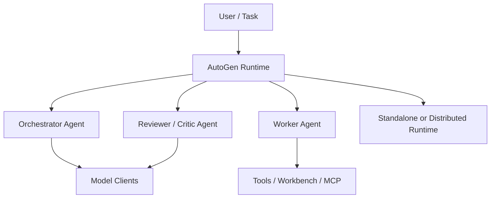
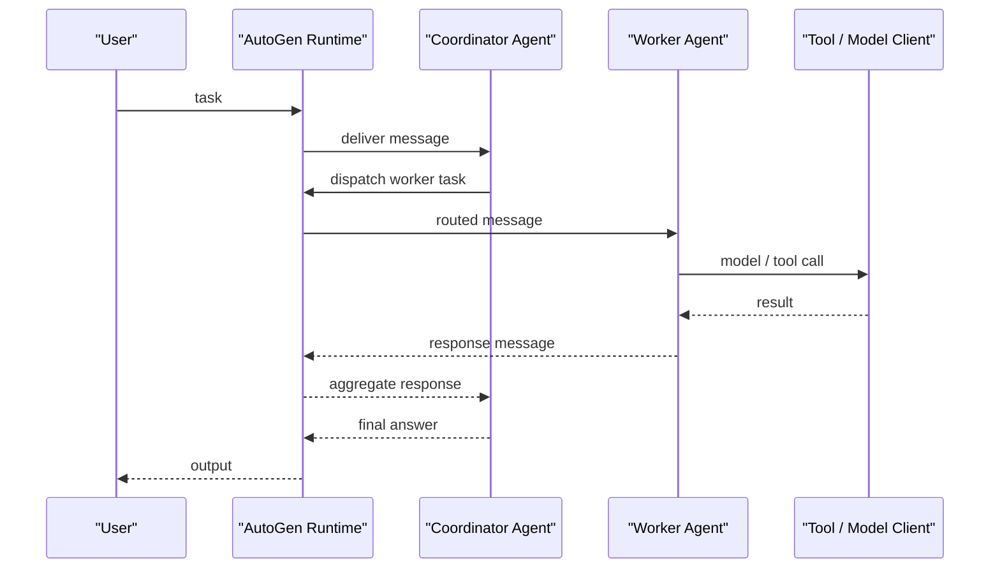

# AutoGen

## 它解决什么问题

`AutoGen` 解决的是“多个 agent 如何通过消息协作、组合成多 agent 应用”这个问题。它不是单个 prompt runner，也不是单纯的 workflow 图，而是把 agent 看成会通信、会维护自身状态、会根据消息做动作的软件实体。

## 为什么现在值得关注

如果你想研究多 Agent，不只要看 `LangGraph` 这种更偏 workflow/runtime 的路线，还要看 message-based multi-agent 范式。`AutoGen` 在这条线上很有代表性，因为它把：

- agent runtime
- message protocol
- runtime environment
- tools / model clients / workbench
- multi-agent design patterns

收进了一套比较完整的框架栈。来源：[AutoGen Stable Docs](https://microsoft.github.io/autogen/stable/user-guide/core-user-guide/core-concepts/agent-and-multi-agent-application.html)、[Application Stack](https://microsoft.github.io/autogen/dev/user-guide/core-user-guide/core-concepts/application-stack.html)

## 它在技术生态里的位置

- 属于 `multi-agent framework / runtime`
- 更像 `框架 + runtime + pattern library`
- 强调 agent 之间通过消息协作
- 强调从 `standalone runtime` 到 `distributed runtime` 的连续性
- 和 `LangGraph` 互补，不是简单替代关系

如果按我们现在的 Agent 系统核心 8 样本来看：

- `LangGraph` 更偏生产级编排
- `AutoGen` 更偏多 Agent 协作范式
- `A2A` 更偏跨服务互联协议

## 工作原理

官方文档把 agent 定义为：通过消息通信、维护自身状态、并在收到消息或状态变化后执行动作的软件实体。`AutoGen` 的工作原理不是“让多个 prompt 轮流说话”，而是：

1. 用 runtime 管理 agent 的身份、生命周期和通信
2. 用 message protocol 定义 agent 之间的行为契约
3. 用 model clients、tools、workbench 等组件承接外部动作能力
4. 用 patterns 把 group chat、handoff、debate、reflection 这些协作形态收成可复用结构

也就是说，它把多 Agent 从“prompt trick”提升成了 `runtime + protocol + components + patterns` 的系统。来源：[Agent Runtime Environments](https://microsoft.github.io/autogen/0.5.5/user-guide/core-user-guide/core-concepts/architecture.html)、[Application Stack](https://microsoft.github.io/autogen/dev/user-guide/core-user-guide/core-concepts/application-stack.html)

## 核心组件与架构

从官方 application stack 和 core concepts 看，可以把它收成这几层：

- agent runtime
- base messaging / routing facilities
- message protocol / behavior contract
- agent implementations
- model clients
- tools / workbench / MCP integration
- standalone runtime
- distributed runtime
- agentchat / higher-level patterns

这套分层很值得学，因为它在告诉你：

- 多 Agent 系统的底层不只是 LLM
- 真正稳定的是 runtime、protocol 和 lifecycle
- pattern 是建立在 runtime 之上的，不是最底层

## 核心对象模型 / 核心抽象

- `agent`
- `runtime`
- `message`
- `behavior contract`
- `topic / subscription`
- `identity / lifecycle`
- `tool / workbench`
- `model client`
- `standalone runtime`
- `distributed runtime`

这些抽象里最关键的不是 agent 本身，而是：

- agent 通过什么协议交互
- runtime 如何承接交互与生命周期
- agent 如何在不改核心逻辑的情况下迁移到不同运行环境

## 主流程 / 关键链路

### 链路 1：Standalone Runtime 主链路

1. 多个 agent 在同一进程内注册到 runtime
2. runtime 负责消息路由和 agent 生命周期
3. agent 收到消息后调用模型、工具或 workbench
4. 结果作为新消息返回 runtime
5. runtime 再决定下一个接收者

这个链路适合本地实验和单进程应用，重点是先把多 agent 交互语义立住。

### 链路 2：Distributed Runtime 主链路

1. agent 分布在不同 worker / 机器上
2. host servicer 负责跨 worker 通信和连接状态
3. worker 上的 gateway 把消息转给本地 agent
4. agent 逻辑不变，但运行时边界变成网络边界

这条链路是 `AutoGen` 和很多只停留在本地 demo 的多 agent 框架的关键差别：它认真考虑了分布式 runtime。

### 链路 3：Pattern Library 主链路

1. 开发者定义 worker / orchestrator / reviewer / critic 等角色
2. 每个角色都通过消息协议参与协作
3. runtime 驱动整个协作过程
4. 最终形成 handoff、group chat、debate、reflection 等模式

### 链路 4：Tool / Workbench 主链路

1. agent 收到任务消息
2. 运行时允许 agent 访问模型上下文、工具、workbench 或 MCP
3. agent 将工具结果再转成消息继续协作
4. 协作结果被逐步沉淀成最终输出

## 架构图

## 数据流图 / 请求流图

## 工程质量观察

`AutoGen` 最值得学的不是“多 agent 很酷”，而是它把多 agent 的工程底层说清楚了：

- 有 runtime，不只是函数调用
- 有 behavior contract，不只是 prompt 约定
- 有 standalone 和 distributed 两种运行环境
- 有工具、workbench、MCP 这些真实动作面
- 有 pattern library，但 pattern 不是脱离 runtime 的空壳

这会迫使你从“对话编排”提升到“多 agent runtime 设计”。

## 和相邻项目怎么区分

### 和 [[LangGraph]]

`LangGraph` 更偏 state graph、workflow、checkpoint、interrupt、durable execution。`AutoGen` 更偏消息驱动、多 agent runtime 和协作模式。

### 和 [[A2A]]

`A2A` 是跨服务边界的协议层；`AutoGen` 是框架/runtime。本地多 agent 可以只用 `AutoGen`，跨服务互联时才更像 `A2A`。

### 和 [[OpenHands]]

`OpenHands` 更像 coding agent 产品与平台落地；`AutoGen` 更像多 agent 框架层。

## 自托管 / 运行判断

- 本地学习：友好
- Mac 上学习：友好
- 生产使用：中等偏高，适合研究和构建复杂协作系统，但治理、debug 和运行复杂度也明显更高

## 适合什么场景

### 很适合

- 学多 Agent 协作模式
- 研究消息驱动 runtime
- 研究 orchestrator / worker / reviewer / debate 等模式
- 做 standalone 到 distributed 的连续实验

### 不太适合

- 你只是想跑单 agent 简单工具调用
- 你更需要固定 workflow 和 durable execution，而不是多 Agent 协作
- 你还没有准备好处理消息风暴、调试复杂度和角色边界问题

## 适配度标签

- local_fit: `high`
- mac_fit: `high`
- production_fit: `medium`
- learning_fit: `high`
- 解释见：[[../04-Patterns/项目适配度标签说明|项目适配度标签说明]]

## 对我来说最重要的学习价值

如果你想真正理解“多 Agent 为何成立、何时不值得做”，`AutoGen` 很有价值，因为它迫使你思考：

- 消息协议比 prompt 更底层
- runtime 比角色描述更关键
- 分布式协作和本地 sub-agent 不是一回事
- design patterns 是建立在 runtime 和 contract 之上的

## 推荐的学习动作

1. 先读 `Agent and Multi-Agent Applications`
2. 再读 `Application Stack`
3. 再读 `Agent Runtime Environments`
4. 然后选两个模式：`handoffs` 和 `group chat`
5. 最后再把它和 `LangGraph`、`A2A` 对照着看

## 下一步实验建议

- 做一个 `AutoGen vs LangGraph` 的多 agent / workflow 对照实验
- 做一个 `AutoGen + LiteLLM` 的统一模型接入实验
- 做一个本地 standalone runtime 和模拟 distributed runtime 的差异实验

## 风险与边界

- 多 agent 非常容易引入复杂度膨胀
- message-based 架构如果没有足够观测，会很难 debug
- 角色多不等于效果更好
- distributed runtime 让工程能力要求明显上升

## 官方入口

- [AutoGen GitHub](https://github.com/microsoft/autogen)
- [AutoGen Stable Docs](https://microsoft.github.io/autogen/stable/user-guide/core-user-guide/core-concepts/agent-and-multi-agent-application.html)
- [AutoGen Application Stack](https://microsoft.github.io/autogen/dev/user-guide/core-user-guide/core-concepts/application-stack.html)
- [AutoGen Runtime Environments](https://microsoft.github.io/autogen/0.5.5/user-guide/core-user-guide/core-concepts/architecture.html)

## 相关项目

- [[LangGraph]]
- [[A2A]]
- [[LiteLLM]]
- [[OpenHands]]

## 关联

- [[../08-Workflows/开源项目深度分析工作流|开源项目深度分析工作流]]
