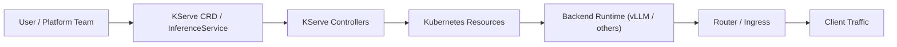
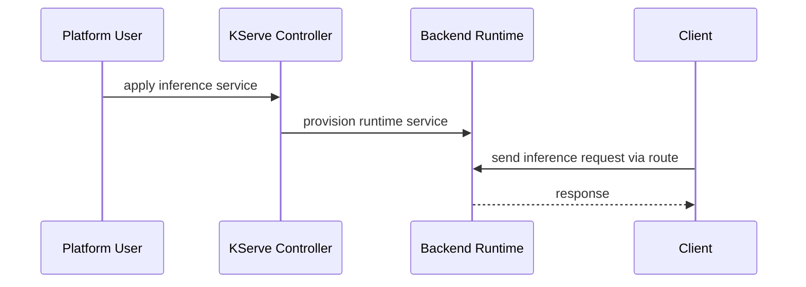

# KServe

## 它解决什么问题

`KServe` 解决的是“如何在 Kubernetes 上把预测式和生成式 AI inference 变成标准化、可扩展的平台服务”这个问题。

## 为什么现在值得关注

只要团队开始认真做多模型、多框架、Kubernetes-native 的 model serving，`KServe` 就是绕不过去的开源平台代表之一。

## 它在技术生态里的位置

- 属于 `Kubernetes-native AI serving platform`
- 更像 `平台`
- 下接 `vLLM` 等 inference backend，上接企业平台与集群运营

## 工作原理

它的工作原理是：在 Kubernetes 上提供标准化 CRD / controller 和部署模型，把模型服务生命周期、扩缩容、路由、多框架支持和生成式 / 预测式 AI serving 统一起来。GitHub README 直接把它定义成 Standardized Distributed Generative and Predictive AI Inference Platform。

## 核心组件与架构

- CRDs / controllers
- model / inference service abstractions
- multi-framework deployment
- Kubernetes integrations
- router / controllers / charts

## 核心对象模型 / 核心抽象

- inference service
- controller
- router
- backend runtime
- Kubernetes resources

## 主流程 / 关键链路

### 链路 1：Deployment 主链路

1. 用户声明模型服务资源
2. controller 监听并协调 Kubernetes 对象
3. backend runtime 启动服务
4. router / ingress 暴露请求入口

### 链路 2：Request 主链路

1. 请求进入 KServe 入口
2. 路由到具体 inference service
3. 由后端 runtime（例如 `vLLM` 等）执行
4. 结果返回

### 链路 3：Platform 主链路

1. 统一多模型、多框架和扩缩容策略
2. 让平台团队站在 Kubernetes 层治理服务

## 架构图

## 数据流图 / 请求流图

## 工程质量观察

- repo 结构明显平台化：controllers、charts、config、install、pkg 都在主干
- 工程价值在 Kubernetes 平台抽象，不在单一推理算法
- 很适合研究“服务平台层”和“执行后端”如何分层

## 和相邻项目怎么区分

- 和 `vLLM`：平台层 vs serving engine
- 和 `Kubeflow`：`Kubeflow` 更大、更像 AI reference platform；`KServe` 更聚焦 inference
- 和 `Ray Serve`：都能做 serving，但 KServe 强 Kubernetes 平台抽象

## 自托管 / 运行判断

它适合：

- Kubernetes 平台团队
- 企业多模型 serving
- 研究 AI serving 平台化

## 适合什么场景

- Kubernetes 平台
- 企业 inference platform
- backend runtime 统一接入

### 不太适合

- Mac 本机实操
- 只做本地原型
- 不需要 K8s 的小团队

## 适配度标签

- `local_fit: low`
- `mac_fit: low`
- `production_fit: high`
- `learning_fit: high`
- 解释见：[[../04-Patterns/项目适配度标签说明|项目适配度标签说明]]

## 对我来说最重要的学习价值

它最重要的学习价值是：帮你建立“推理引擎”和“推理平台”之间的分层判断。

## 推荐的学习动作

1. 先看 README、架构、安装与 operator/controller 相关内容
2. 再对照 `vLLM` 看 backend vs platform
3. 最后再和 `Kubeflow` 看谁是更大控制塔

## 下一步实验建议

1. 画一张 `KServe <- vLLM / SGLang / Ray Serve` 的分层图
2. 设计一个 InferenceService 生命周期实验
3. 把 KServe 放进企业平台选型图

## 风险与边界

- 对非 K8s 场景学习成本高
- 本地开发体验不如本地优先项目
- 平台能力强，但会把你带进运维复杂度

## 官方入口

- [KServe GitHub](https://github.com/kserve/kserve)
- [KServe Website](https://kserve.github.io/website/latest/)
- [KServe Roadmap](https://github.com/kserve/kserve/blob/master/ROADMAP.md)

## 相关项目

- [[vLLM]]
- [[Kubeflow]]
- [[Ray]]
- [[../04-Patterns/Serving 数据面与推理加速模式|Serving 数据面与推理加速模式]]

## 关联

- [[项目索引|项目索引]]
- [[../01-Categories/Kubernetes 上的 AI 平台|Kubernetes 上的 AI 平台]]
- [[../02-Organizations/KServe Community|KServe Community]]
