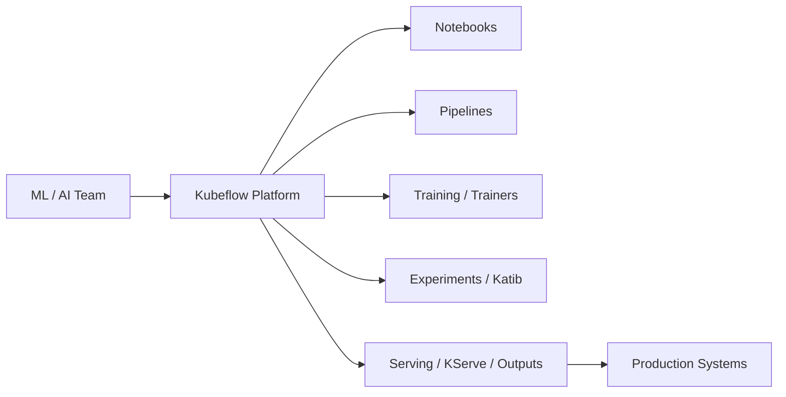
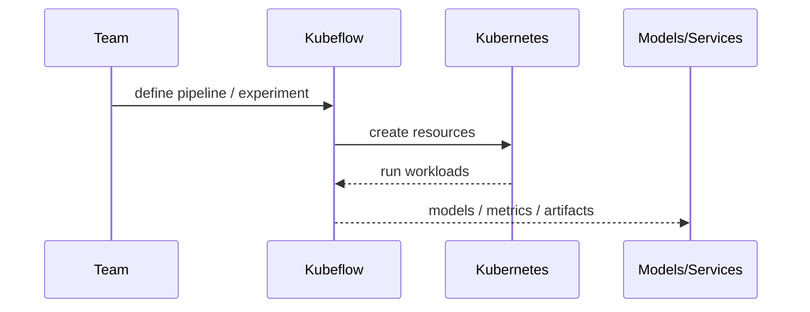

# Kubeflow

## 它解决什么问题

`Kubeflow` 解决的是“如何在 Kubernetes 上提供一整套 ML / AI reference platform，包括训练、流水线、实验、笔记本、调优和相关工具链”这个问题。

## 为什么现在值得关注

如果 `KServe` 代表 inference 平台，`Kubeflow` 代表的是更大的 AI / ML 平台路线。对平台、MLOps、LLMOps 学习来说，它非常有代表性。

## 它在技术生态里的位置

- 属于 `AI reference platform on Kubernetes`
- 更像 `平台`
- 范围大于单一 serving
- 和 `KServe` 是包含 / 并列关系的一部分

## 工作原理

它的工作原理是把多种 Kubernetes-native ML 组件和工作流组织到一个统一平台：训练、pipeline、notebooks、Katib 调参、不同 AI operators 等都在同一个控制塔里。官方 introduction 和文档导航就能看出它覆盖面很广。

## 核心组件与架构

- notebooks
- pipelines
- training operators
- Katib hyperparameter tuning
- distributed cache / trainers
- Kubernetes integrations

## 核心对象模型 / 核心抽象

- pipeline
- experiment
- trainer
- notebook
- operator
- platform component

## 主流程 / 关键链路

### 链路 1：ML platform 主链路

1. 团队在平台上定义训练 / 实验 / pipeline
2. Kubeflow 组件在 Kubernetes 上协同运行
3. 输出模型、实验结果或服务工件

### 链路 2：Experiment / tuning 主链路

1. 定义实验目标和搜索空间
2. Katib 等组件驱动试验
3. 反馈最佳配置

### 链路 3：LLM / AI extension 主链路

1. 通过新增 operator / trainer / cache 支持现代 AI 工作负载
2. 把新的 AI 系统纳入统一平台

## 架构图

## 数据流图 / 请求流图

## 工程质量观察

- 平台跨度极大，工程价值在“统一控制塔”而不在单一组件
- 文档导航本身就揭示了它的复杂度和覆盖面
- 学习时一定要抓分层，不要妄图一次读完所有组件

## 和相邻项目怎么区分

- 和 `KServe`：`KServe` 更聚焦 serving，`Kubeflow` 更像更大平台
- 和 `Ray`：`Ray` 是分布式 runtime，`Kubeflow` 是 Kubernetes 平台控制层
- 和 `MLflow`：一个偏平台运行面，一个偏实验 / 生命周期管理

## 自托管 / 运行判断

它适合：

- 平台团队
- 企业 AI / ML 平台研究
- Kubernetes-native AI 体系学习

## 适合什么场景

- AI / ML 控制塔平台
- Kubernetes-native 训练与实验体系
- 复杂平台化研究

### 不太适合

- Mac 本地实验
- 只想学单一 serving engine
- 只想做一个最小 agent runtime 原型

## 适配度标签

- `local_fit: low`
- `mac_fit: low`
- `production_fit: high`
- `learning_fit: high`
- 解释见：[[../04-Patterns/项目适配度标签说明|项目适配度标签说明]]

## 对我来说最重要的学习价值

它最重要的学习价值是帮助你理解“AI 平台”到底意味着什么：不是一个模型服务，而是一组互相配合的控制平面和运行平面。

## 推荐的学习动作

1. 先看 introduction，把组件族群分出来
2. 再看 pipelines / trainers / Katib / serving 这些主组件
3. 最后再和 `KServe`、`Ray` 分层比较

## 下一步实验建议

1. 做一张 `Kubeflow control tower` 架构图
2. 画出 Kubeflow 与 KServe 的边界
3. 补一页“什么时候需要 Kubeflow，什么时候不需要”

## 风险与边界

- 项目大而复杂，容易学散
- 本地实验门槛高
- 不是所有团队都需要这种平台重量级

## 官方入口

- [Kubeflow Introduction](https://www.kubeflow.org/docs/started/introduction/)
- [Kubeflow Components](https://www.kubeflow.org/docs/components/)
- [Kubeflow GitHub](https://github.com/kubeflow/kubeflow)

## 相关项目

- [[KServe]]
- [[Ray]]
- [[../04-Patterns/Serving 数据面与推理加速模式|Serving 数据面与推理加速模式]]

## 关联

- [[项目索引|项目索引]]
- [[../01-Categories/Kubernetes 上的 AI 平台|Kubernetes 上的 AI 平台]]
- [[../02-Organizations/Kubeflow Community|Kubeflow Community]]
