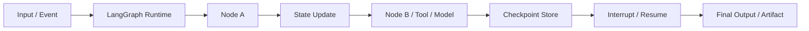
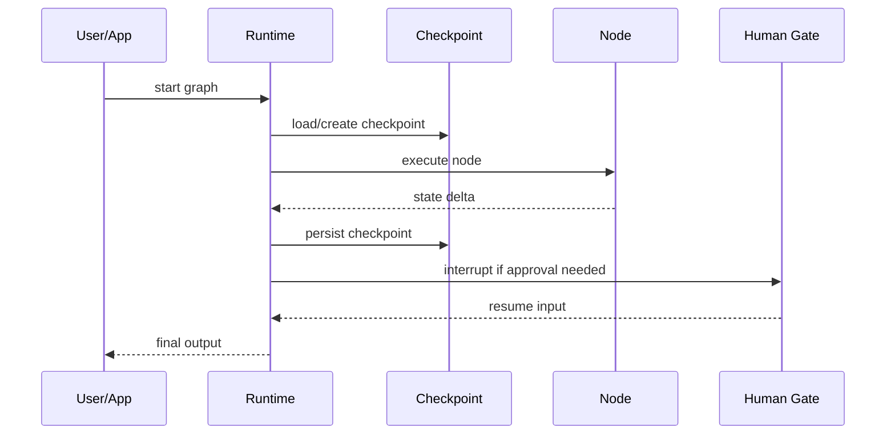

# LangGraph

## 它解决什么问题

`LangGraph` 解决的是“agent 如何在真实工程里变成可恢复、可中断、可检查点、可长期运行的 workflow runtime”。它不是 prompt 库，也不是 observability 平台，而是 agent orchestration runtime。

## 为什么现在值得关注

只要你开始认真做 agent，而不是只跑单轮工具调用，就会遇到 state、checkpoint、interrupt、human-in-the-loop、resume、memory 这些问题。`LangGraph` 是这条路线最有代表性的开源项目之一。

## 它在技术生态里的位置

- 属于 `agent runtime / orchestration`
- 更像 `底座 + 子系统`
- 常和 `LangMem`、`Langfuse`、`OpenHands` 组合
- 不负责模型推理本身，也不等于平台控制面

## 工作原理

官方 overview 明确把它定义成 long-running, stateful agents 的 low-level orchestration framework and runtime。它的工作原理是：把 agent 表示成 graph / state transitions，然后通过 runtime 管理节点执行、状态更新、checkpoint、interrupt 和 resume。

## 核心组件与架构

- Graph API / Functional API
- runtime
- nodes / edges
- state
- checkpoint / durable execution
- interrupt / human-in-the-loop
- ecosystem: memory, deployment, observability

## 核心对象模型 / 核心抽象

- state graph
- node
- edge
- checkpoint
- interrupt
- resume
- store / memory
- artifact / output

## 主流程 / 关键链路

### 链路 1：Graph execution 主链路

1. 输入进入 graph
2. runtime 读取当前 state
3. 节点按 edge 关系执行
4. 节点输出更新 state
5. 直到结束条件或下一个 interrupt

### 链路 2：Durable execution 主链路

1. 每个关键步骤写 checkpoint
2. 失败或中断时保存上下文
3. 后续从 checkpoint resume

### 链路 3：Human-in-the-loop 主链路

1. graph 到达需要审批或输入的节点
2. runtime interrupt
3. 外部人类输入恢复执行

## 架构图

## 数据流图 / 请求流图

## 工程质量观察

- 抽象很清楚：graph、state、runtime、checkpoint、interrupt
- 明显面向长期运行和可恢复，而不是一次性 demo
- 适合把 agent 从“prompt 技巧”提升到“系统工程”

## 和相邻项目怎么区分

- 和 `OpenHands`：`OpenHands` 更偏完整 coding agent 平台，`LangGraph` 更底层、更通用
- 和 `OpenClaw`：`OpenClaw` 更像 personal assistant runtime；`LangGraph` 是更通用的 orchestration runtime
- 和 `LangMem`：`LangMem` 更像 memory 子系统，`LangGraph` 是执行骨架

## 自托管 / 运行判断

它适合：

- 构建长流程 agent
- 需要 checkpoint / interrupt / resume
- 需要明确 state machine 的团队
- 本地原型和生产研究都适合

## 适合什么场景

- 长流程 agent
- 有状态 workflow
- human-in-the-loop
- runtime 架构研究

### 不太适合

- 只想做最轻的一次性 prompt 调用
- 没有状态和长期运行需求
- 想直接要完整平台而不是 runtime

## 适配度标签

- `local_fit: high`
- `mac_fit: high`
- `production_fit: high`
- `learning_fit: high`
- 解释见：[[../04-Patterns/项目适配度标签说明|项目适配度标签说明]]

## 对我来说最重要的学习价值

它最重要的学习价值是：把 agent 从“对话脚本”变成“有状态的执行系统”。这会直接提升你对 runtime、memory、approval、governance 的理解。

## 推荐的学习动作

1. 先看 overview、graph execution、runtime
2. 再看 durable execution / human-in-the-loop
3. 最后再接 `LangMem` 看 state 与 memory 的边界

## 下一步实验建议

1. 做一个最小 graph：tool -> interrupt -> resume
2. 画出 state、checkpoint、artifact 的边界
3. 和 `OpenHands`、`OpenClaw` 各做一张 runtime 对比卡

## 风险与边界

- 学的时候容易把它误当“agent 全家桶”
- 它提供的是 runtime 骨架，不自动等于 eval、observability、memory 平台
- 过度抽象也可能让简单任务变复杂

## 官方入口

- [LangGraph Overview](https://docs.langchain.com/oss/python/langgraph/overview)
- [Graph API](https://docs.langchain.com/oss/python/langgraph/graph-api)
- [Runtime](https://docs.langchain.com/oss/python/langgraph/runtime)
- [Durable Execution](https://docs.langchain.com/oss/python/langgraph/durable-execution)

## 相关项目

- [[LangMem]]
- [[OpenHands]]
- [[OpenClaw]]
- [[../04-Patterns/State Graph 与 Agent Runtime 模式|State Graph 与 Agent Runtime 模式]]

## 关联

- [[项目索引|项目索引]]
- [[../01-Categories/Agent Runtime 与工作流编排|Agent Runtime 与工作流编排]]
- [[../02-Organizations/LangChain|LangChain]]
- [[../../AI-Engineering/07-Topics/Agent Runtime Architecture|Agent Runtime Architecture]]
