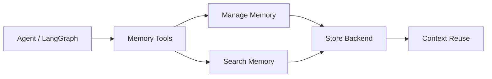
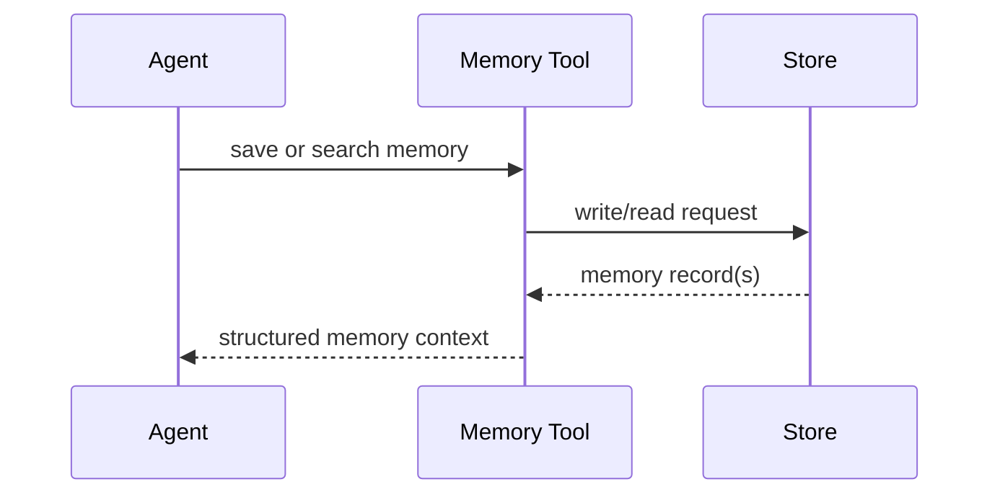

# LangMem

## 它解决什么问题

`LangMem` 解决的是“agent 的长期记忆如何被写入、检索、管理和约束”这个问题。它不是完整 runtime，而是偏 memory subsystem。

## 为什么现在值得关注

随着 agent 进入长流程和长期运行，memory 不再只是 chat history。`LangMem` 值得学，因为它让 memory write/read、structured memory、store 和 tool 化成为明确子系统。

## 它在技术生态里的位置

- 属于 `memory subsystem`
- 更像 `子系统`
- 常和 `LangGraph` 组合
- 不等于完整 agent 平台

## 工作原理

从 README 可以直接看出，它通过 memory tools 与 LangGraph 的 store 结合：`create_manage_memory_tool`、`create_search_memory_tool` 这样的接口，让 agent 可以主动管理长期记忆；底层则依赖 store（InMemoryStore 或 DB-backed store）持久化。

## 核心组件与架构

- memory tools
- store abstraction
- search / manage operations
- integration with LangGraph

## 核心对象模型 / 核心抽象

- memory record
- store
- manage memory tool
- search memory tool
- namespace
- persistence backend

## 主流程 / 关键链路

### 链路 1：Memory write 主链路

1. agent 在运行中产生值得记住的信息
2. manage memory tool 决定写入
3. store 持久化到 memory backend

### 链路 2：Memory retrieval 主链路

1. agent 在执行时调用 search memory
2. store 返回相关 memory
3. memory 加入当前 context

### 链路 3：Production persistence 主链路

1. 原型可用 InMemoryStore
2. 生产切换到 Postgres 等持久化 store
3. memory 跨重启持续存在

## 架构图

## 数据流图 / 请求流图

## 工程质量观察

- 把 memory 做成明确子系统而不是隐含变量，很值得学
- README 用最小代码就把 `agent + store + memory tools` 的关系讲清楚了
- 非常适合拿来理解 memory 与 state 的边界

## 和相邻项目怎么区分

- 和 `LangGraph`：runtime vs memory subsystem
- 和 `OpenClaw`：`OpenClaw` 把 memory 放进 personal runtime；`LangMem` 专注 memory 本身
- 和 `ChatGPT memory`：产品能力 vs 开源 memory engineering 子系统

## 自托管 / 运行判断

它适合：

- 研究 memory engineering
- 给 LangGraph agent 加长期记忆
- 本地做 memory prototype

## 适合什么场景

- memory engineering
- LangGraph memory prototype
- store / retrieval / write policy 研究

### 不太适合

- 想直接要完整 assistant 平台
- 不关心 memory 设计，只想先让 agent 跑起来

## 适配度标签

- `local_fit: medium`
- `mac_fit: high`
- `production_fit: medium`
- `learning_fit: high`
- 解释见：[[../04-Patterns/项目适配度标签说明|项目适配度标签说明]]

## 对我来说最重要的学习价值

它最重要的价值是把“记忆”从模糊概念变成可设计、可评测、可替换的工程子系统。

## 推荐的学习动作

1. 先读 README 里的 create agent 示例
2. 再理解 InMemoryStore 和持久化 store 的差异
3. 最后把它和 `LangGraph`、`OpenClaw` 连接起来看

## 下一步实验建议

1. 做一个最小 memory write / search 实验
2. 写一张 `state vs memory vs artifact` 对照卡
3. 设计一条 memory poisoning / gate 的测试思路

## 风险与边界

- memory 很容易被误写成 chat history
- 持久化后会引入污染、租户隔离、评测和回滚问题
- 真正难点在写入和治理，不只在 retrieval

## 官方入口

- [LangMem GitHub](https://github.com/langchain-ai/langmem)
- [LangGraph Add Memory](https://docs.langchain.com/oss/python/langgraph/add-memory)
- [LangGraph Persistence](https://langchain-ai.github.io/langgraph/how-tos/persistence/)

## 相关项目

- [[LangGraph]]
- [[OpenClaw]]
- [[../04-Patterns/Learnings、Promotion 与 Skill Extraction 模式|Learnings、Promotion 与 Skill Extraction 模式]]

## 关联

- [[项目索引|项目索引]]
- [[../01-Categories/记忆、上下文与自改进系统|记忆、上下文与自改进系统]]
- [[../02-Organizations/LangChain|LangChain]]
- [[../../AI-Learning/09-Systems/LangMem|LangMem]]
