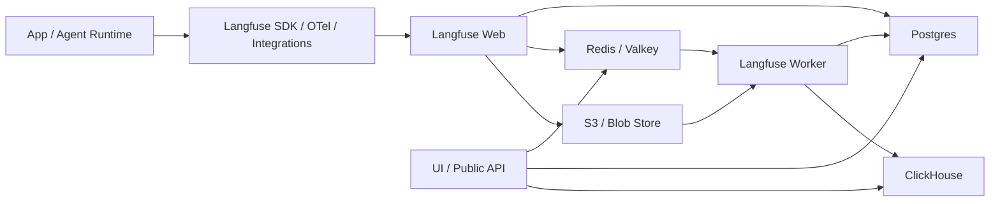
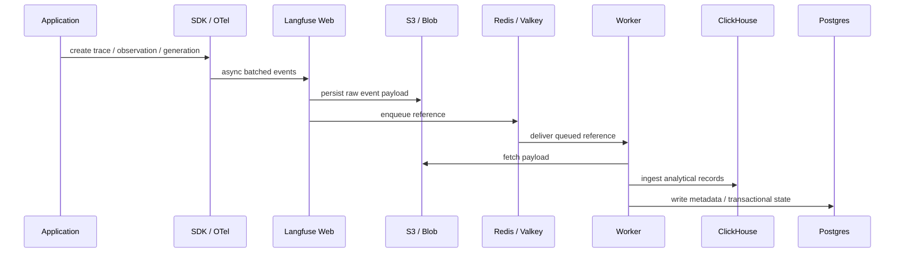
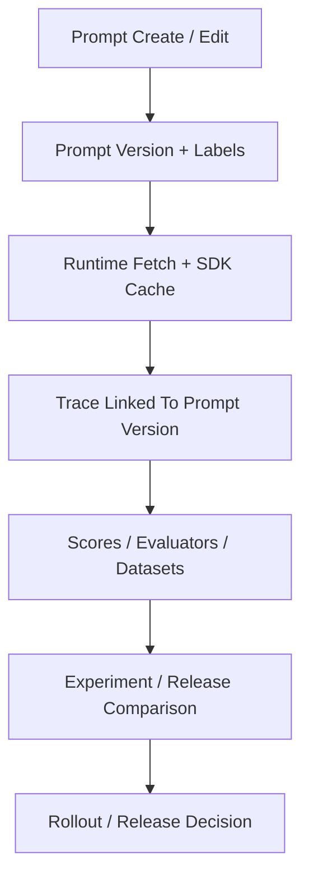

# Langfuse

## 它是什么

`Langfuse` 是一个开源的 `LLM engineering platform`。如果只看最表层，它像“LLM observability”；但如果按工程边界看，它其实同时覆盖了四块：

- observability / tracing
- prompt management
- evaluation
- platform / data plane

它不是单纯日志系统，也不是执行 runtime，而是把 `trace -> prompt -> eval -> metrics -> release comparison` 收进一个统一工作台。

## 为什么现在值得重点关注

现在很多团队已经不再卡在“模型能不能调通”，而是卡在：

- 哪个 prompt 版本退化了
- 哪个 tool span 出错了
- 哪个 dataset run 揭示了 regression
- 哪个 release 提高了 latency 或 cost
- 哪条 agent workflow 在生产里开始不稳定

`Langfuse` 值得学，不是因为它是一个又新的平台，而是因为它把“可观察、可评测、可回归、可治理”这些长期痛点，收成了一套工程控制面。这个定位和只做 tracing 或只做离线 eval 的项目都不一样。

## 它在 stack 的哪一层

更准确地说，`Langfuse` 属于：

- `LLMOps / AgentOps` 控制层
- `observability + eval + prompt` 一体化平台层
- 不是模型 runtime
- 不是训练框架
- 不是 serving data plane

如果用我们当前知识库的坐标系：

- `LangGraph` 更像执行内核
- `OpenClaw` 更像 assistant runtime / operating layer
- `vLLM` / `SGLang` 更像 serving data plane
- `Langfuse` 更像“看、评、比、管”的工作台

## 核心组件与架构

按官方文档，现在可以把它收成几个关键部件：

### 1. Observability

它的 trace 不只看 LLM 调用，还会把 retrieval、embedding、API 调用和非 LLM 逻辑都接进来。官方文档还强调：

- 支持 sessions / user tracking
- agent 可以表示成 graph
- 可以通过 Python / JS SDK、50+ integrations、OpenTelemetry 或 LLM gateway 接入

这意味着它不是一个“专门给某个框架做的 tracing UI”，而是尽量站在更开放的 telemetry 面上。来源：[Langfuse Overview](https://langfuse.com/docs)、[Observability Overview](https://langfuse.com/docs/observability/overview)

### 2. Prompt Management

它把 prompt 从“代码里的字符串”提升成了可版本化对象：

- 可创建、编辑、协作
- 可用 label 部署到不同环境
- 可在 Playground 测试
- 可把 prompt 版本和 traces 连起来看

这点很关键，因为很多团队的 prompt 问题不是“想不出提示词”，而是“不知道生产里到底跑的是哪个版本”。来源：[Prompt Management Overview](https://langfuse.com/docs/prompt-management/overview)

### 3. Evaluation

它把评测放成一等公民，而不是附属脚本。官方文档强调：

- LLM-as-a-judge
- user feedback
- manual labeling / annotation queues
- custom evals
- datasets 与 experiments
- production trace 上的在线评测

也就是说，它同时支持：

- 开发期的离线实验
- 生产期的在线质量监控

这正是 `LLMOps / AgentOps` 真正难的地方。来源：[Evaluation Overview](https://langfuse.com/docs/evaluation/overview)

### 4. Self-hosting / Platform 底座

官方 self-hosting 文档说明了它的运行面：

- `Langfuse Web`
- `Langfuse Worker`
- `Postgres`
- `ClickHouse`
- `Redis/Valkey`
- `S3/Blob Store`
- 可选 LLM API / gateway

这说明它并不是一个轻薄前端，而是带有明确数据平台形态的系统。尤其 `ClickHouse` 的引入，说明它对 traces / observations / scores 这类 OLAP 风格查询是认真设计过的。来源：[Self-Hosting](https://langfuse.com/self-hosting)、[Why is Langfuse Open Source?](https://langfuse.com/handbook/chapters/open-source)

## 工作原理

如果把 `Langfuse` 当成一个运行中的平台来看，它的核心工作原理可以概括成一句话：

> 把应用里的 trace、prompt、score 和 dataset 事件统一收进平台，再把这些事件转换成可查询、可比较、可回归的控制面对象。

这里面有三个关键机制：

### 1. 事件先进入 tracing / prompt / eval 入口

应用通过：

- Langfuse Python / JS SDK
- OTel instrumentation
- 集成框架
- API / gateway

把 trace、prompt version、score 等事件发到 Langfuse。

### 2. 读写路径被拆成事务面和分析面

- `Postgres` 承担事务性数据
- `ClickHouse` 承担读重、分析重的数据查询
- `Redis/Valkey` 承担 queue / cache
- `S3/Blob` 承担事件持久化和大对象

这说明它的工作原理不是“收到请求直接落一个数据库表”，而是把 ingest、缓存、异步处理、分析查询拆开。

### 3. 平台再把原始事件重组为工程对象

最终你在 UI/查询层看到的不是散乱日志，而是：

- traces
- sessions
- users
- prompt versions
- scores
- datasets
- experiments
- dashboards / comparisons

也就是说，Langfuse 的核心价值来自“把原始 telemetry 提升成 AI 工程控制对象”。

## 主流程 / 关键链路

### 链路 1：Trace Ingest 主链路

这是 Langfuse 最核心的一条链：

1. 应用或 agent runtime 产生 trace / observation / generation
2. SDK 或 OTel exporter 异步发送事件
3. `Langfuse Web` 接收批量事件
4. 事件先写入 `S3/Blob Store`
5. 只把引用或队列信号放进 `Redis/Valkey`
6. `Langfuse Worker` 异步消费并处理
7. 分析数据进入 `ClickHouse`
8. 事务/元数据进入 `Postgres`
9. UI / API 从分析面和事务面查询结果

这一点很重要，因为官方 self-hosting 文档明确强调：

- queued trace ingestion
- 先写 S3/Blob
- 再由 worker 处理进 ClickHouse

这就是它面对高峰流量、数据库抖动时还能保住 ingest 的关键。来源：[Self-Hosting](https://langfuse.com/self-hosting)

### 链路 2：Prompt Lifecycle 主链路

1. 团队在 UI / API / SDK 中创建 prompt
2. prompt 形成 version
3. 通过 labels 部署到环境
4. 应用在运行时取 prompt
5. SDK 本地缓存 prompt，后台 revalidate
6. 运行结果与 trace 绑定
7. 平台再比较不同 prompt version 的 cost / latency / scores

这条链说明：`Langfuse` 的 prompt management 不是“存模板”，而是把 prompt 纳入版本控制和运行观测闭环。来源：[Prompt Management Overview](https://langfuse.com/docs/prompt-management/overview)

### 链路 3：Evaluation / Regression 主链路

1. 从 traces、datasets 或用户反馈获得评测输入
2. 跑 LLM-as-a-judge / custom eval / annotation
3. 生成 score
4. score 绑定 trace / dataset run / experiment
5. 通过 dashboard / experiment comparison 观察变化
6. 把结论用于 release decision

这条链最值钱的地方是：它把“模型和 prompt 变更”翻译成了“可以比较的工程结果”。来源：[Evaluation Overview](https://langfuse.com/docs/evaluation/overview)

## 架构图

## 数据流图 / 请求流图

### Trace / Observation 数据流

### Prompt / Eval 关键流

## 核心对象模型 / 核心抽象

从工程视角看，最该抓住的是这些对象：

- trace
- observation / span / generation
- session
- user
- prompt version
- score
- dataset
- experiment

这组对象连起来，才让它从“看日志”变成“做 release comparison 和质量治理”。

## 工程上最值得学的设计点

### 1. 先保 ingest，再谈查询体验

它没有把“高峰事件写库”直接绑在主事务上，而是通过 `S3/Blob + Redis + Worker` 先保住事件，再异步加工。这是典型的“写入可靠性优先”设计。

### 2. 用不同存储承担不同工作负载

- `Postgres` 处理事务性对象
- `ClickHouse` 处理分析查询

这是非常典型、也非常值得学的平台分层。

### 3. Prompt / Trace / Eval 不分家

很多工具只做其中一块。Langfuse 之所以更像平台，是因为它把三者连成了一条链。

### 4. OpenTelemetry-friendly

它不是封死自己的私有格式，而是主动站在 OTel 上。这会让它在复杂平台里更容易接入，也降低 vendor lock-in。

## 适合什么场景

### 很适合

- agent / workflow 已经跑起来，开始需要真正可调试
- 需要把 prompt、trace、dataset、score 串起来
- 需要做 release comparison
- 有 self-hosting / data control 要求
- 希望 observability 和 eval 不分家

### 不太适合

- 你现在只是想跑一个极简 demo
- 没有 trace / eval / release 需求
- 团队还没进入 agent 或 LLM app 的长期运营阶段
- 你只想要一个轻量单机评测脚本

## 和相邻项目怎么区分

### 和 Phoenix

- `Phoenix` 更偏 tracing / evaluation 分析体验
- `Langfuse` 更明显往 `prompt + dataset + score + release comparison` 一体化平台走

### 和 Promptfoo

- `Promptfoo` 更偏 pre-release eval、CI、red-team
- `Langfuse` 更偏线上 tracing、dataset runs、prompt lifecycle、production monitoring

### 和 MLflow / W&B

- `MLflow` / `W&B` 更宽，覆盖传统 ML 生命周期
- `Langfuse` 更专注 LLM / agent 这条 control surface

## 自托管与运行判断

如果团队有更强的数据控制要求，`Langfuse` 的 self-hosting 路线很有吸引力。官方文档显示：

- 可本地、云上或 on-prem 部署
- 可用 Helm 在 Kubernetes 上部署
- 可完全离线 / air-gapped 运行
- OSS、自托管企业版和 Cloud 共享同一架构

这使它对受监管团队、平台团队、B2B 团队特别有吸引力。来源：[Self-Hosting](https://langfuse.com/self-hosting)、[Why is Langfuse Open Source?](https://langfuse.com/handbook/chapters/open-source)

## 边界处理、稳定性与性能设计

从官方资料能看出来，它比较重视这些边界点：

- SDK 异步发送，尽量不影响应用 latency
- queued trace ingestion，避免高峰直接打爆数据库
- API key 缓存在 Redis，减少每次鉴权打数据库
- prompt 有 read-through cache，避免热 prompt 每次查库
- 多模态大对象直接进 S3/Blob，不把数据库当对象仓库
- 事件先持久化再处理，提高 recoverability

这些点都说明：它不是只把功能做出来，而是明确考虑了生产环境里的高峰、查询负载和恢复能力。来源：[Observability SDK Overview](https://langfuse.com/docs/observability/sdk/overview)、[Self-Hosting](https://langfuse.com/self-hosting)

## 社区与演进信号

如果从“项目是不是活的”这个角度看，Langfuse 的信号不差：

- 官方文档和产品页维护很积极
- GitHub stars 当前约 `24K+`
- 官方说明 release `multiple times a week`
- Docs、SDK、Server、Integrations 分工清楚
- GitHub Discussions / Issues / roadmap 都是公开的

这说明它不是一次性项目，而是一个持续演进的平台路线。来源：[Why is Langfuse Open Source?](https://langfuse.com/handbook/chapters/open-source)

## 如何真正掌握它

如果你想真的掌握 `Langfuse`，不要只停在“知道它能 tracing”。建议按这条线：

1. 先回答它在 stack 的边界
2. 再把 ingest 主链路画出来
3. 再把 prompt lifecycle 和 eval chain 画出来
4. 再对照 `Phoenix` / `Promptfoo` / `MLflow` 做 tradeoff
5. 最后亲手接一次 tracing + prompt + eval 的最小实验

做到这一步，你对它的理解才算从“工具名词”升级成“平台判断力”。

## 推荐的学习动作

### 第一步：先看它的边界

先别急着装。先回答：

- 它到底是 tracing 工具，还是平台控制面？
- 它和 `Phoenix` / `Promptfoo` / `MLflow` 的边界在哪？

### 第二步：按对象读文档

建议按这个顺序读官方文档：

1. Overview
2. Observability
3. Prompt Management
4. Evaluation
5. Self-hosting

### 第三步：盯住两条主链路

- `Trace Ingest`
- `Prompt + Eval + Release Comparison`

只要把这两条链盯住，你就不会把它学成“又一个 observability 工具”。

## 下一步实验建议

1. 在本地或测试环境里只接 tracing，感受它如何表示 session / agent graph
2. 再接 prompt management，看 prompt 版本是不是能真正进入工作流
3. 最后接 dataset + eval + release comparison，看它是否真的形成 control surface
4. 如果再往前一步，可以用一个简单 agent workflow 试 `prompt version -> score -> release comparison` 的闭环

## 风险与边界

- 不要把它误当 runtime
- 不要把它误当通用 APM 的完全替代
- 不要在团队还没有最小 trace discipline 时就期待它解决所有工程混乱
- 自托管虽然强，但也意味着你要接受它的运维复杂度和数据存储成本

## 适配度标签

- local_fit: `high`
- mac_fit: `high`
- production_fit: `high`
- learning_fit: `high`
- 解释见：[[../04-Patterns/项目适配度标签说明|项目适配度标签说明]]

## 相关项目

- [[Phoenix]]
- [[Promptfoo]]
- [[LangGraph]]
- [[LangMem]]
- [[../04-Patterns/Eval Gate 与 Observability 闭环|Eval Gate 与 Observability 闭环]]

## 官方入口

- [Langfuse Docs](https://langfuse.com/docs)
- [Observability Overview](https://langfuse.com/docs/observability/overview)
- [Prompt Management Overview](https://langfuse.com/docs/prompt-management/overview)
- [Evaluation Overview](https://langfuse.com/docs/evaluation/overview)
- [Langfuse Self-Hosting](https://langfuse.com/self-hosting)
- [Langfuse Open Source Handbook](https://langfuse.com/handbook/chapters/open-source)
- [Langfuse GitHub](https://github.com/langfuse/langfuse)

## 关联

- [[项目索引|项目索引]]
- [[../01-Categories/Eval、Observability 与 Guardrails|Eval、Observability 与 Guardrails]]
- [[../02-Organizations/Langfuse|Langfuse]]
- [[../../AI-Learning/09-Systems/Langfuse|Langfuse]]
- [[../../AI-Engineering/07-Topics/LLMOps、AgentOps 与 Observability|LLMOps、AgentOps 与 Observability]]
- [[../../AI-Engineering/07-Topics/Agent 平台架构（LangGraph、Langfuse、ADK）|Agent 平台架构（LangGraph、Langfuse、ADK）]]
