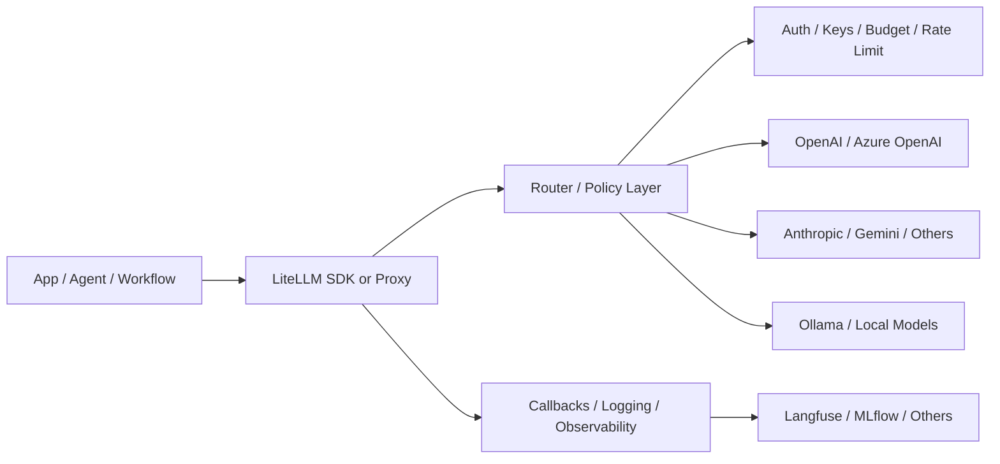
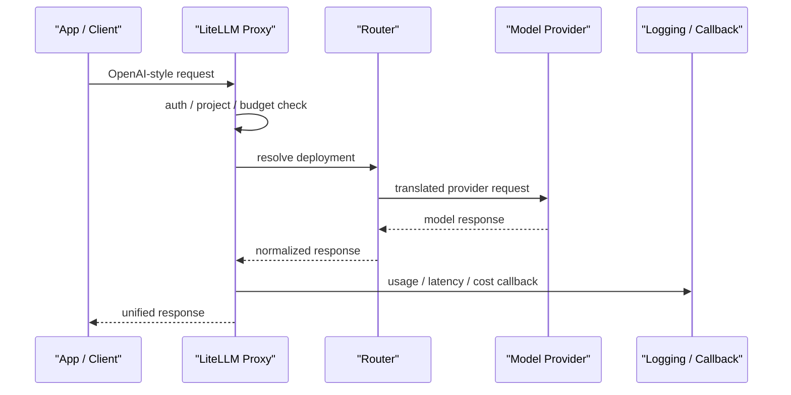

# LiteLLM

## 它解决什么问题

`LiteLLM` 解决的是“多模型、多供应商、多个部署入口，怎么用一套统一接口接进应用和平台”这个问题。它既可以作为 Python SDK 嵌进代码，也可以作为统一的 `LLM gateway / proxy server` 放在团队的入口层。

## 为什么现在值得关注

当团队从单模型试玩走向真实系统时，很快会遇到：

- 同一套应用要接 `OpenAI / Azure / Anthropic / Gemini / Ollama` 等不同入口
- 不同团队想用不同模型，但不想改一堆 SDK 代码
- 需要 fallback、routing、budget、rate limit、auth、usage tracking
- 需要把 LLM 接入变成平台能力，而不是每个应用自己硬连

`LiteLLM` 值得学，是因为它把“统一 API + 路由 + 成本/权限控制 + 平台网关”收进了一套比较直接的工程形态。来源：[LiteLLM Docs](https://docs.litellm.ai/)

## 它在技术生态里的位置

- 属于 `model gateway / model access layer`
- 更像 `平台入口层 + 子系统`
- 既可以是应用内 SDK，也可以是团队级统一网关
- 常和 `Langfuse`、`LangGraph`、`OpenHands`、`browser-use` 这类项目配合
- 不负责 agent 编排，也不负责长期 memory 或 eval 控制面

## 工作原理

官方文档把它拆成两种主要使用方式：

- `LiteLLM Python SDK`：在应用代码里直接统一调用 100+ 模型提供方
- `LiteLLM Proxy Server`：作为中心化 LLM Gateway，对外暴露 OpenAI 风格接口，再把请求翻译、路由到后端模型提供方

它的核心原理不是“重新发明模型接口”，而是：

1. 对上提供统一输入输出格式
2. 对下做 provider adapter / exception mapping
3. 在中间增加 router、budget、rate limit、auth、logging、callbacks

所以 `LiteLLM` 的工程价值不只在 SDK，而在“把模型接入层平台化”。来源：[LiteLLM Docs](https://docs.litellm.ai/)

## 核心组件与架构

- Python SDK
- Proxy Server / LLM Gateway
- Router
- provider adapters
- model alias / config.yaml
- virtual keys / auth hooks
- logging hooks / observability callbacks
- cost tracking / budgets / rate limits

## 核心对象模型 / 核心抽象

- `model_name`：应用看到的逻辑模型名
- `litellm_params`：实际 provider 参数与部署信息
- `deployment`：可被路由的一组模型实例
- `router`：重试、fallback、负载分发的策略层
- `proxy key / project`：权限、成本、租户边界
- `callback / logging hook`：接观测与审计

## 主流程 / 关键链路

### 链路 1：SDK 统一调用主链路

1. 应用使用 LiteLLM SDK 发 OpenAI 风格请求
2. LiteLLM 根据模型名识别 provider
3. 请求被翻译成对应 provider 的参数格式
4. provider 返回结果后再被标准化
5. 应用看到的是统一输出和统一错误模型

### 链路 2：Proxy Server 网关主链路

1. 客户端把请求发到 LiteLLM Proxy
2. Proxy 做 auth / project / key / budget / rate-limit 校验
3. Router 根据策略选择目标 deployment
4. 请求转发到真实模型提供方
5. 返回结果并写 usage / logging / callbacks

### 链路 3：Routing / Fallback 主链路

1. 某个 deployment 失败或超时
2. Router 按策略切到备选 deployment
3. 统一错误映射和成本统计继续保持一致
4. 上层应用不需要感知 provider 级差异

## 架构图

## 数据流图 / 请求流图

## 工程质量观察

`LiteLLM` 最值得学的，不只是“支持很多模型”，而是它把模型接入层做成了一个真正的工程层：

- provider 差异被压到 adapter 层
- routing / fallback 被提到平台层
- cost / auth / rate-limit 被提到控制层
- callback 让它更容易接 `Langfuse` 等观测系统

这类设计很适合平台团队，而不只是单个应用开发者。

## 和相邻项目怎么区分

### 和 OpenAI SDK / Anthropic SDK

官方 SDK 是“直连某一家模型服务”；`LiteLLM` 是统一接入层。

### 和 OpenRouter

`OpenRouter` 更偏托管聚合入口；`LiteLLM` 更适合团队自己掌控网关与策略。

### 和 Langfuse

`Langfuse` 是观测/评测/控制面；`LiteLLM` 是模型入口与接入面。

## 自托管 / 运行判断

- 本地实验：很友好，Mac 上可以直接跑 SDK 或 Proxy
- 团队试点：适合，很适合做统一网关薄层
- 生产使用：适合，但要认真处理 key、budget、routing、审计和高可用

## 适合什么场景

### 很适合

- 多模型、多供应商统一接入
- 需要统一 API 格式和统一 error model
- 平台团队要建设 LLM gateway
- 需要预算、速率、项目隔离和 usage tracking

### 不太适合

- 单人小 demo，只接一个模型，不需要 routing
- 你真正要解决的是 agent orchestration 或 observability，而不是接入层
- 需要非常重的专有 provider 特性且不想经过统一抽象

## 适配度标签

- local_fit: `high`
- mac_fit: `high`
- production_fit: `high`
- learning_fit: `high`
- 解释见：[[../04-Patterns/项目适配度标签说明|项目适配度标签说明]]

## 对我来说最重要的学习价值

如果你以后要做 `Agent Platform / Harness / Runtime`，`LiteLLM` 最值得学的是：

- 统一模型接入层怎么抽象
- routing / fallback 怎么设计成平台能力
- auth / project / budget 怎么放到入口层
- 如何把模型调用和 observability 控制面接起来

## 推荐的学习动作

1. 在本地把 LiteLLM Proxy 跑起来
2. 配两个后端：一个云模型，一个本地模型
3. 实验 fallback / routing
4. 接一层 `Langfuse` 或 logging callback

## 下一步实验建议

- 做一版 `LiteLLM + Langfuse` 的最小平台入口
- 做一版 `LiteLLM + Ollama` 的本地/云双路由
- 在 `Agent Platform` 项目里思考它和 `LangGraph`、`OpenHands` 的分工

## 风险与边界

- 统一抽象会掩盖 provider 的专有能力差异
- 网关一旦中心化，就会变成稳定性和安全的关键节点
- fallback 和 routing 策略如果不透明，容易制造“偶发行为变化”
- 成本统计、密钥管理和租户隔离如果没设计好，会变成平台事故源

## 官方入口

- [LiteLLM Docs](https://docs.litellm.ai/)
- [LiteLLM GitHub](https://github.com/BerriAI/litellm)

## 相关项目

- [[Langfuse]]
- [[LangGraph]]
- [[OpenHands]]
- [[Ollama]]

## 关联

- [[../08-Workflows/开源项目深度分析工作流|开源项目深度分析工作流]]
- [[../04-Patterns/Eval Gate 与 Observability 闭环|Eval Gate 与 Observability 闭环]]
