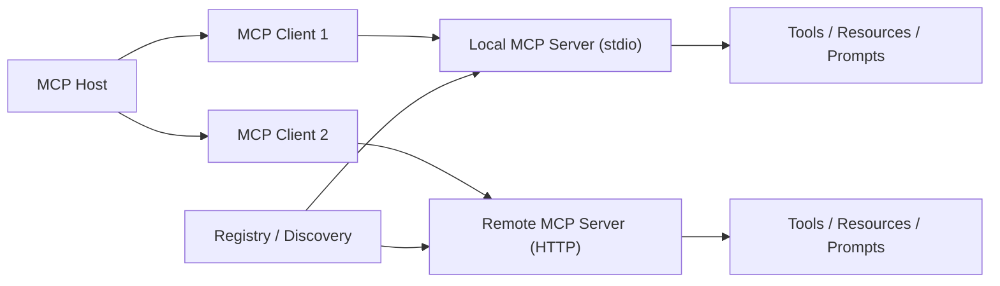
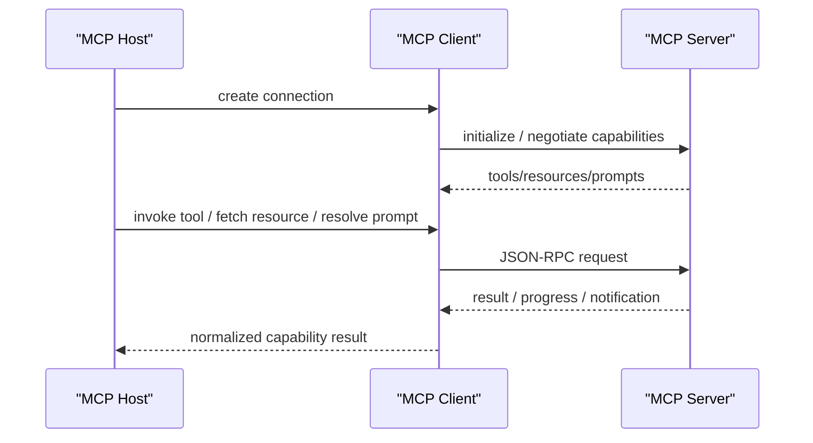

# MCP Servers

## 它解决什么问题

`MCP Servers` 解决的是“AI host 怎么以统一协议接入工具、资源和 prompts，而不是每个工具都写一套私有适配”的问题。它不是单一 repo，而是围绕 `Model Context Protocol` 长出来的 server 生态。

## 为什么现在值得关注

MCP 已经成为很多 agent/runtime 产品研究“标准化工具接入”的关键参照。它最重要的价值不是某一个 server，而是：

- host 和 server 的职责被明确分离
- tools / resources / prompts 被提升成协议原语
- 本地 `stdio` 和远程 `Streamable HTTP` 两条接入路径被统一到同一模型里
- 一个 server 可以被多个不同 host 复用

也就是说，MCP 让“工具接入”从私有插件接口，升级成了独立生态层。来源：[MCP Architecture Overview](https://modelcontextprotocol.io/docs/learn/architecture)、[MCP Tools Spec](https://modelcontextprotocol.io/specification/draft/server/tools)

## 它在技术生态里的位置

- 属于 `tool / context protocol ecosystem`
- 更像 `协议 + server 生态 + registry`
- 是 host 与外部能力之间的标准接入层
- 常和 `Codex`、`Claude Code`、`OpenClaw`、`OpenHands`、`LangGraph` 等路线一起研究

如果按我们现在的核心 8 样本看：

- `LiteLLM` 统一模型入口
- `MCP Servers` 统一工具与上下文入口
- `A2A` 统一 remote agent 入口

这三者各在一层，不应该混成一锅。

## 工作原理

MCP 采用 client-server 架构：

- `MCP Host`：AI 应用或 agent 运行环境
- `MCP Client`：host 为每个 server 建立的连接组件
- `MCP Server`：提供 tools、resources、prompts 的程序

协议分两层：

- `data layer`：JSON-RPC 消息语义、capabilities、tools/resources/prompts/notifications
- `transport layer`：`stdio` 和 `Streamable HTTP`

真正值得学的点在于：

1. host 不直接耦合工具实现
2. server 通过 capability negotiation 暴露能力面
3. host 可以把工具、资源、prompt 当成统一的协议对象处理
4. transport 变了，但上层对象模型不变

这意味着 MCP 的重点不只是“能调工具”，而是“工具接入怎么被工程化成一层稳定协议”。来源：[MCP Architecture Overview](https://modelcontextprotocol.io/docs/learn/architecture)

## 核心组件与架构

- MCP Host
- MCP Client
- MCP Server
- capability negotiation
- tools
- resources
- prompts
- notifications / progress
- `stdio` transport
- `Streamable HTTP` transport
- official registry

如果把这层画成工程模块，它其实像：

- host runtime
- per-server connection layer
- server capability surface
- transport adapters
- discovery / registry layer

## 核心对象模型 / 核心抽象

- `host`
- `client`
- `server`
- `capability`
- `tool`
- `resource`
- `prompt`
- `notification`
- `transport`
- `server registry entry`

这里最关键的抽象不是 tool 本身，而是 capability model：

- host 先知道 server 会什么
- 再决定如何调用
- 再以统一协议处理返回结果、进度和异常

## 主流程 / 关键链路

### 链路 1：本地 stdio server 主链路

1. host 启动本地 server 进程
2. host 为该 server 建立 MCP client
3. client 通过 stdio 和 server 交换 JSON-RPC 消息
4. client 初始化并协商 capabilities
5. host 获得 tools/resources/prompts
6. 后续所有调用都走同一连接语义

这条链路最适合本地实验，也最适合理解 MCP 的最小心智模型。

### 链路 2：远程 HTTP server 主链路

1. host 连接远程 MCP server
2. 完成 capability negotiation 和 auth
3. server 提供远程 tools/resources/prompts
4. host 在运行时调用这些能力
5. 结果、通知和错误以协议对象返回

这条链路真正把 MCP 推向了跨环境复用，而不是只停留在本地插件。

### 链路 3：Registry / Server 生态主链路

1. 开发者在 registry 中发现 server
2. 选择 local / remote server
3. 将其接入 host
4. 在 agent/runtime 中复用相同接入方式
5. 多个 host 可以共享同一个 server 生态

### 链路 4：Tool / Resource / Prompt 混合主链路

1. host 读取 server 的 capabilities
2. 某些能力作为 tool 被执行
3. 某些能力作为 resource 被读取
4. 某些能力作为 prompt 被装配到上下文
5. host 最终把三类能力统一进一个 runtime 工作集

## 架构图

## 数据流图 / 请求流图

## 工程质量观察

MCP 最值得学的，不只是协议文档，而是它背后的工程切分：

- host 不直接绑定工具实现
- server 不直接感知宿主内部逻辑
- transport 和 capability 分层
- 工具、资源、prompt 三类对象被统一进一个协议面
- local 和 remote 可以共存

这对你做 `Harness / Plugin / Tool Gateway / Agent Runtime` 都很有迁移价值。

## 和相邻项目怎么区分

### 和 plugin

plugin 更像宿主内的私有扩展；MCP 更像跨产品复用的协议层。

### 和 [[A2A]]

MCP 面向的是工具、资源和 prompts；`A2A` 面向的是另一个独立 agent 服务。一个是 tool/context interop，一个是 agent interop。

### 和 [[LiteLLM]]

`LiteLLM` 统一模型接入；MCP 统一工具与上下文接入。

## 自托管 / 运行判断

- 本地实验：很友好，尤其 `stdio` server
- Mac 学习：友好，很适合本机做最小 server 实验
- 生产：高，但前提是你认真处理权限、边界、鉴权和 server 治理

## 适合什么场景

### 很适合

- 标准化工具接入
- 把内部系统能力暴露给多个 host
- 将 tools/resources/prompts 从 agent runtime 解耦
- 想研究“工具生态如何标准化”

### 不太适合

- 你需要的是 agent 间协作协议，而不是工具协议
- 你的能力只在单一宿主里使用，不打算复用
- 你还没准备好处理远程 server 的安全和治理问题

## 适配度标签

- local_fit: `high`
- mac_fit: `high`
- production_fit: `high`
- learning_fit: `high`
- 解释见：[[../04-Patterns/项目适配度标签说明|项目适配度标签说明]]

## 对我来说最重要的学习价值

如果你以后做 `Harness / Tool Gateway / Agent Platform`，MCP 最值得学的是：

- 工具接入怎样从 SDK 适配变成协议层
- host/client/server 边界怎样划
- 为什么 tool、resource、prompt 应该是不同原语
- local / remote 两条接入路径怎样共存

## 推荐的学习动作

1. 先读架构文档
2. 再看 tools/resources/prompts 三个原语
3. 再看 registry 里的真实 server
4. 再自己实现一个最小本地 server
5. 最后把它和 `plugin`、`A2A` 做边界对照

## 下一步实验建议

- 做一个本地 `MCP server + Codex/OpenClaw host` 实验
- 对比 `MCP` 和 `plugin` 的工程边界
- 对比 `MCP` 和 `A2A`：何时暴露 tool，何时暴露 remote agent

## 风险与边界

- server 权限边界和数据外泄风险高
- 远程 server 的 auth、CORS、transport 选择会影响安全模型
- registry 热闹不等于每个 server 都成熟可靠
- 如果 host 不做最小权限和审计，协议层会放大风险

## 官方入口

- [MCP Architecture Overview](https://modelcontextprotocol.io/docs/learn/architecture)
- [Official MCP Registry](https://registry.modelcontextprotocol.io/)
- [MCP Tools Spec](https://modelcontextprotocol.io/specification/draft/server/tools)

## 相关项目

- [[A2A]]
- [[OpenClaw]]
- [[OpenHands]]
- [[LiteLLM]]

## 关联

- [[../08-Workflows/开源项目深度分析工作流|开源项目深度分析工作流]]
- [[../06-Maps/Agent 系统核心 8 关系图|Agent 系统核心 8 关系图]]
