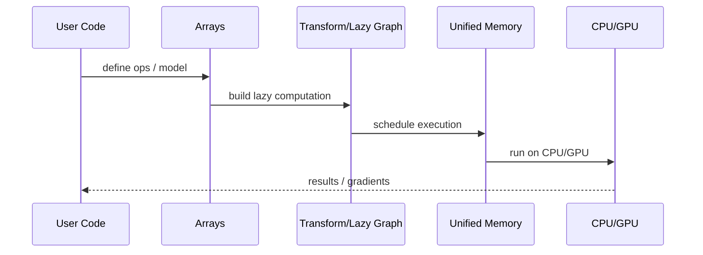

# MLX

## 它解决什么问题

`MLX` 解决的是“如何在 Apple Silicon 上用一个原生数组框架做训练、推理、LoRA 和研究实验”。它不是单个 LLM 产品，而是 Apple Silicon 上的通用 ML 计算框架。

## 为什么现在值得关注

对主力机器是 `MacBook Pro Max M4` 的学习路径来说，`MLX` 不是可选项，而是最值得深学的本地原生路线之一。

## 它在技术生态里的位置

- 属于 `local-first ML framework`
- 更像 `底座`
- 对 Apple Silicon 非常友好
- 和 `llama.cpp`、`Ollama` 分别构成“框架层 / 执行底座 / 产品壳层”的不同层级

## 工作原理

`MLX` 的核心原理是：用 Apple Silicon 的统一内存和本地 CPU / GPU 执行能力，提供一个类似 NumPy / PyTorch 的数组框架，并通过 lazy computation、dynamic graph、composable transforms 和 unified memory 提供高效而直观的本地 ML 开发体验。

## 核心组件与架构

- core arrays
- function transformations
- dynamic graph
- multi-device execution
- unified memory
- higher-level packages: `mlx.nn`, `mlx.optimizers`
- MLX-LM / examples ecosystem

## 核心对象模型 / 核心抽象

- array
- lazy computation
- dynamic graph
- unified memory
- device / stream
- model / optimizer / transform

## 主流程 / 关键链路

### 链路 1：Array compute 主链路

1. 用户定义数组和操作
2. MLX 惰性构建计算
3. 在需要 materialize 时执行
4. CPU / GPU 共享统一内存，无需显式搬运

### 链路 2：Training / LoRA 主链路

1. 通过 `mlx.nn` 定义模型
2. 自动微分和优化器驱动训练
3. 在 Apple Silicon 上完成本地实验

### 链路 3：LLM local route

1. 借助 `MLX-LM` 或 examples 加载模型
2. 做推理或 LoRA 微调
3. 在 Mac 上完成模型级实验

## 架构图

## 数据流图 / 请求流图

## 工程质量观察

- 设计目标非常清楚：Apple Silicon、本地研究、低摩擦
- README 对 unified memory、lazy computation、dynamic graph 讲得很直接，抽象感很强
- 非常适合 Mac-first AI 学习

## 和相邻项目怎么区分

- 和 `llama.cpp`：`llama.cpp` 是 LLM 推理底座；`MLX` 是更通用的 ML 框架
- 和 `Ollama`：`Ollama` 是产品壳层；`MLX` 是框架层
- 和 `PyTorch MPS`：都在 Mac 路线，但 `MLX` 更 Apple-native

## 自托管 / 运行判断

它适合：

- Mac 本地训练 / LoRA
- Apple Silicon 原生实验
- 本地框架层学习
- 需要自己掌握数组 / 训练抽象的人

## 适合什么场景

- Mac 上的框架层学习
- LoRA / 微调
- Apple Silicon 原生实验
- 本地数组与模型训练

### 不太适合

- GPU cluster 大规模 serving
- 只想最小成本跑模型，不想碰框架
- 只做企业平台选型时的第一入口

## 适配度标签

- `local_fit: high`
- `mac_fit: high`
- `production_fit: medium`
- `learning_fit: high`
- 解释见：[[../04-Patterns/项目适配度标签说明|项目适配度标签说明]]

## 对我来说最重要的学习价值

它最重要的价值是让你在自己的 Mac 上真正建立“模型框架层”的手感，而不只是会调用现成 API。

## 推荐的学习动作

1. 先看 README 里列出的 key features
2. 再看 docs 的 quickstart / core arrays / device
3. 最后结合 `MLX-LM` 看 LLM 路线

## 下一步实验建议

1. 在 Mac 上跑一次最小 array + gradient + LoRA 实验
2. 画 `MLX vs PyTorch MPS vs llama.cpp` 的层次图
3. 记录 unified memory 对学习路径的实际意义

## 风险与边界

- Apple Silicon 友好，但跨平台通用性不如通用框架
- 容易被误当成“只适合 LLM”，其实它是通用 ML 框架
- 生产迁移价值要分场景看

## 官方入口

- [MLX Docs](https://ml-explore.github.io/mlx/build/html/)
- [MLX GitHub](https://github.com/ml-explore/mlx)
- [MLX Examples](https://github.com/ml-explore/mlx-examples)

## 相关项目

- [[llama-cpp|llama.cpp]]
- [[Ollama]]
- [[../04-Patterns/本地优先 AI 开发模式|本地优先 AI 开发模式]]

## 关联

- [[项目索引|项目索引]]
- [[../01-Categories/本地模型与本地优先开发|本地模型与本地优先开发]]
- [[../02-Organizations/Apple MLX|Apple MLX]]
- [[../../AI-Learning/09-Systems/MLX|MLX]]
