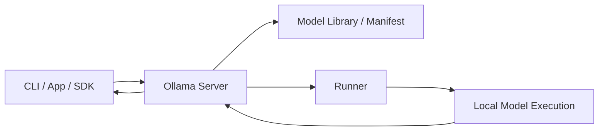
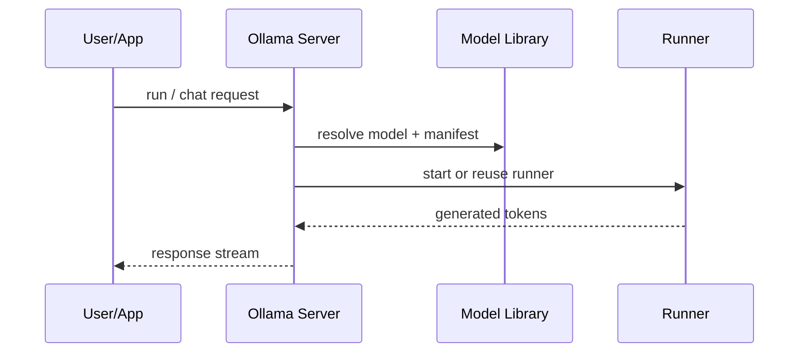

# Ollama

## 它解决什么问题

`Ollama` 解决的是“本地模型如何用最少摩擦被拉取、运行、暴露 API 并融入应用开发”这个问题。它不是最底层推理内核，而是把模型分发、运行和本地 API 封装成一个很顺手的壳层。

## 为什么现在值得关注

它几乎成了本地 LLM 实验的默认入口。只要你在做本地 agent、RAG、Mac 上的 AI 开发，迟早都会遇到 `Ollama`。

## 它在技术生态里的位置

- 属于 `local-first runtime shell`
- 更像 `壳层 + 子系统`
- 底层可结合不同推理实现，但对使用者暴露统一模型拉取与 API 体验
- 很适合作为本地实验基线

## 工作原理

`Ollama` 的工作原理不是重新发明推理算法，而是把模型 registry / pull、model manifest、runner、server、OpenAI-like compatibility 和 app integration 做成一套统一开发体验。GitHub 仓库目录里可以直接看到 `server`、`runner`、`model`、`manifest`、`openai` 等模块，这说明它的价值主要在“运行产品化”，而不是“底层 kernel”。

## 核心组件与架构

- model library / manifests
- runner
- local server
- OpenAI-compatible layer
- app / CLI / integrations

## 核心对象模型 / 核心抽象

- model manifest
- model pull / registry
- runner
- local API
- compatibility layer

## 主流程 / 关键链路

### 链路 1：Pull-and-run 主链路

1. 用户选择模型
2. Ollama 从模型库拉取 manifest 和权重
3. 本地 runner 启动模型
4. 通过本地 API / CLI 提供服务

### 链路 2：App integration 主链路

1. 本地应用以 OpenAI-like 方式请求 Ollama
2. server 路由到对应 model runner
3. 结果返回给 app

### 链路 3：Local development 主链路

1. 开发者先用 Ollama 验证模型选择
2. 再接 `LangChain`、`LlamaIndex`、agent 原型
3. 再决定是否迁移到更重的 serving 栈

## 架构图

## 数据流图 / 请求流图

## 工程质量观察

- 工程价值不在底层 kernel，而在统一分发和开发体验
- repo 结构能看出它是一个完整产品，而不是单一库
- 适合当“本地 AI 默认入口”，非常有学习与迁移价值

## 和相邻项目怎么区分

- 和 `llama.cpp`：`llama.cpp` 更底层，`Ollama` 更像易用壳层
- 和 `MLX`：`MLX` 是 Apple Silicon 原生框架，`Ollama` 是本地运行产品层
- 和 `vLLM`：不在一个重量级，`vLLM` 面向高吞吐 serving

## 自托管 / 运行判断

它适合：

- 本地模型实验
- Mac 开发机上的 AI 原型
- 最小 API 化本地推理
- agent / RAG 原型

## 适合什么场景

- 本地模型原型
- Mac 开发机
- 快速验证模型选择
- 本地 API 兼容层

### 不太适合

- 大规模 GPU serving
- 严格的生产容量规划
- 深学 KV cache / batching 内核

## 适配度标签

- `local_fit: high`
- `mac_fit: high`
- `production_fit: medium`
- `learning_fit: high`
- 解释见：[[../04-Patterns/项目适配度标签说明|项目适配度标签说明]]

## 对我来说最重要的学习价值

它最适合帮你快速建立“本地模型能怎样进入应用”的感觉。对学习者来说，它是通往 `llama.cpp`、`MLX`、`vLLM` 的很好入口。

## 推荐的学习动作

1. 先理解 `runner / server / manifest / openai` 这几个目录
2. 再把它和 `llama.cpp`、`MLX` 分层看
3. 最后再把它接进一个最小 agent 或 RAG 原型

## 下一步实验建议

1. 在 Mac 上做一次 `Ollama -> local app -> Langfuse tracing` 的最小实验
2. 画一张 `Ollama vs llama.cpp vs MLX` 的层次图
3. 记录哪些场景该停在 `Ollama`，哪些该升级到更重栈

## 风险与边界

- 容易被误当成“推理底层本身”
- 对生产高吞吐和多租户来说通常不够
- 太顺手反而容易让人忽略底层原理

## 官方入口

- [Ollama GitHub](https://github.com/ollama/ollama)
- [Ollama Docs](https://docs.ollama.com/)
- [Ollama API](https://docs.ollama.com/api)

## 相关项目

- [[llama-cpp|llama.cpp]]
- [[MLX]]
- [[../04-Patterns/本地优先 AI 开发模式|本地优先 AI 开发模式]]

## 关联

- [[项目索引|项目索引]]
- [[../01-Categories/本地模型与本地优先开发|本地模型与本地优先开发]]
- [[../02-Organizations/Ollama|Ollama]]
- [[../../AI-Learning/09-Systems/Ollama|Ollama]]
