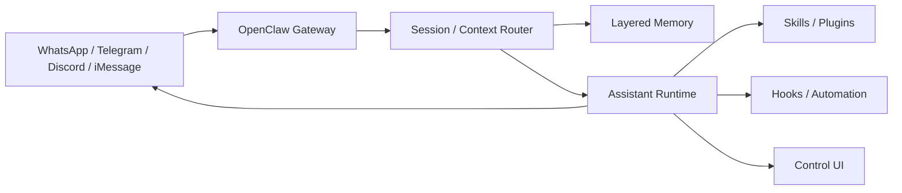
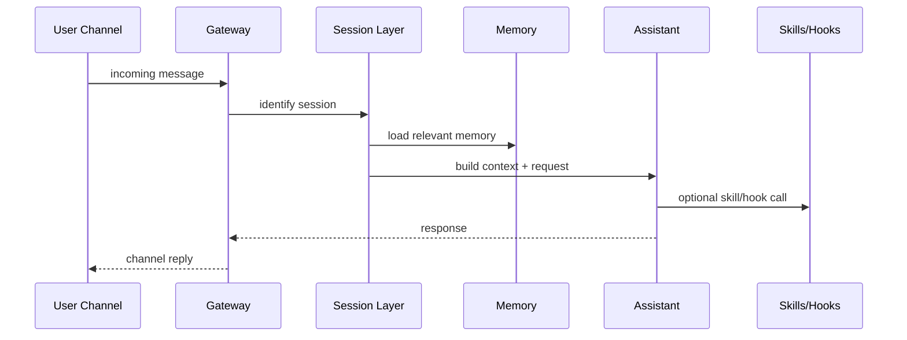

# OpenClaw

## 它解决什么问题

`OpenClaw` 解决的是“如何把个人 assistant 变成一个跨聊天渠道、带 skills、memory、hooks、automation 和可控自改进的自托管运行系统”。它不是单纯聊天 UI，而是一个 personal assistant gateway / runtime。

## 为什么现在值得关注

现在很多 agent 产品都在往 browser、CLI、desktop、channel 扩展，但多数闭源。`OpenClaw` 值得关注，是因为它把 `gateway + memory + hooks + skills + automation` 这些能力做成了开源、可自托管、偏个人操作系统的路线。

## 它在技术生态里的位置

- 属于 `personal agent runtime / operating layer`
- 更像 `平台 + 子系统`
- 既有 runtime，也有 onboarding、dashboard、plugins、memory、automation
- 和 `LangGraph` 的关系更像：一个偏 personal gateway，一个偏通用 orchestration runtime

## 工作原理

官方首页把它定义成 self-hosted gateway：通过单一 Gateway 进程把 WhatsApp、Telegram、Discord、iMessage 等渠道接进来，再把消息、sessions、memory、skills、hooks、automation 统一管理。它的工作原理是：消息从 channel 进入 gateway，经过 session / context / memory 组装后调用 agent，再把结果和 learnings 反写回系统。

## 核心组件与架构

- Gateway
- channel adapters
- onboarding / pairing
- control UI
- sessions / memory
- skills / plugins
- hooks / automation

## 核心对象模型 / 核心抽象

- gateway
- channel adapter
- session
- memory layers
- skill
- hook
- automation
- control UI

## 主流程 / 关键链路

### 链路 1：Channel to agent 主链路

1. 用户从 WhatsApp / Telegram / Discord 等发消息
2. gateway 统一接收并路由到 session
3. memory / context 组装工作集
4. assistant 执行并可能调用 skills / hooks
5. 响应回写到原 channel

### 链路 2：Learning / self-improving 主链路

1. 运行中产生 learnings / errors / incidents
2. hooks 捕获事件
3. 写入 memory / ledger
4. 进入 shadow review 或 skill extraction

### 链路 3：Personal operating flow

1. onboarding 建立账号和配对
2. control UI 管 session、config、automation
3. background tasks 持续运行

## 架构图

## 数据流图 / 请求流图

## 工程质量观察

- 对“个人 assistant operating layer”的抽象非常鲜明
- docs 把 onboarding、CLI、automation、memory、hooks 放在一起，说明它不是单点工具
- 适合研究 bounded self-improving workflow，而不是神化的 autonomous agent

## 和相邻项目怎么区分

- 和 `LangGraph`：`LangGraph` 更通用、更偏 orchestration；`OpenClaw` 更 personal / channel-first
- 和 `OpenHands`：`OpenHands` 偏 coding agent；`OpenClaw` 更偏 pocket assistant / runtime
- 和 `LangMem`：`LangMem` 是 memory 子系统，`OpenClaw` 是带 memory 的 runtime

## 自托管 / 运行判断

它适合：

- 研究 channel-first assistant
- 研究 layered memory、skills、hooks、automation
- 研究 bounded self-improving workflow
- 自托管个人 assistant 实验

## 适合什么场景

- personal AI assistant
- channel-first runtime
- self-improving workflow research
- memory / hooks / skills 协同研究

### 不太适合

- 追求标准企业平台化 agent orchestration
- 想要最小纯函数式 runtime
- 不需要 channel / gateway 维度

## 适配度标签

- `local_fit: medium`
- `mac_fit: medium`
- `production_fit: medium`
- `learning_fit: high`
- 解释见：[[../04-Patterns/项目适配度标签说明|项目适配度标签说明]]

## 对我来说最重要的学习价值

它最重要的学习价值，在于把 `assistant` 这件事从 prompt / CLI 工具提升成了一个有 gateway、memory、extension、automation 的操作层系统。

## 推荐的学习动作

1. 先读 overview、architecture、memory、hooks、skills
2. 再看 onboarding / gateway / dashboard
3. 最后研究 self-improving 这条线的边界和风险

## 下一步实验建议

1. 用我们已经做的 `self-improving-memory-lab` 对照 OpenClaw 的 `learnings -> promotion -> skill extraction`
2. 画出 gateway、session、memory、skills、hooks 的分层图
3. 再和 `LangGraph` 对比 runtime 目标差异

## 风险与边界

- 渠道和 personal assistant 视角很强，不一定适合所有企业场景
- 自改进能力必须配 `shadow review / gate / rollback`
- 学习时容易被 feature list 吸走，忘记其核心是 gateway/runtime

## 官方入口

- [OpenClaw Docs](https://docs.openclaw.ai/)
- [OpenClaw Architecture](https://docs.openclaw.ai/concepts/architecture)
- [OpenClaw Memory](https://docs.openclaw.ai/concepts/memory)
- [OpenClaw Hooks](https://docs.openclaw.ai/automation/hooks)

## 相关项目

- [[LangGraph]]
- [[LangMem]]
- [[OpenHands]]
- [[../04-Patterns/Learnings、Promotion 与 Skill Extraction 模式|Learnings、Promotion 与 Skill Extraction 模式]]

## 关联

- [[项目索引|项目索引]]
- [[../01-Categories/记忆、上下文与自改进系统|记忆、上下文与自改进系统]]
- [[../02-Organizations/OpenClaw|OpenClaw]]
- [[../../AI-Learning/09-Systems/OpenClaw|OpenClaw]]
