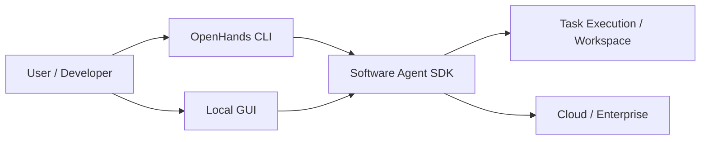
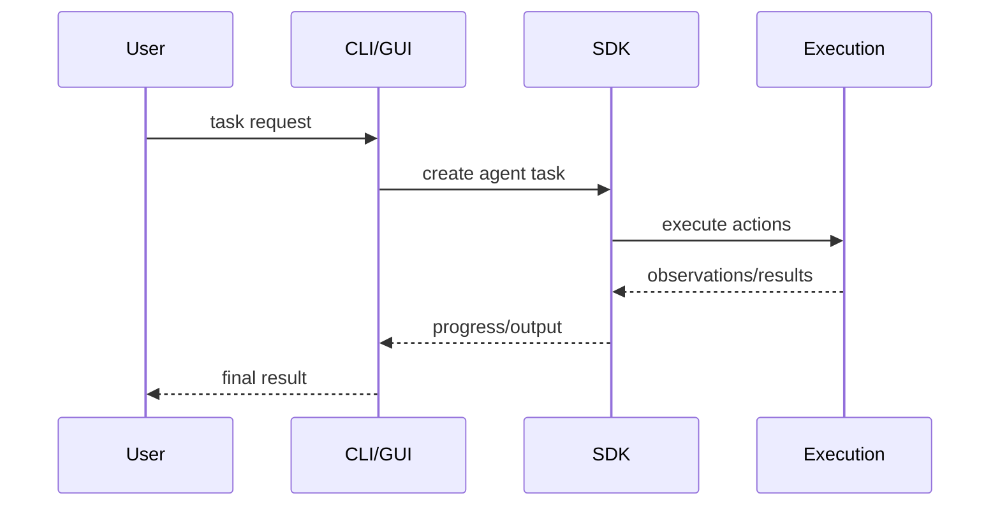

# OpenHands

## 它解决什么问题

`OpenHands` 解决的是“coding agent 如何从单次回答变成可运行、可扩展、可本地或云端部署的软件工程代理平台”这个问题。

## 为什么现在值得关注

如果你想研究开源 coding agent，而不只看闭源产品体验，`OpenHands` 是很重要的代表样本。它把 SDK、CLI、Local GUI、Cloud 这些层都摆了出来。

## 它在技术生态里的位置

- 属于 `coding agent runtime / platform`
- 更像 `平台 + 子系统`
- 兼有 SDK、CLI、GUI 和 cloud 形态
- 不只是 orchestration 库

## 工作原理

官方 introduction 强调 `SDK is the engine that powers everything else`：SDK 是底层 agentic tech，往上再长 CLI、Local GUI、Cloud、Enterprise。这说明它的工作原理是“agent engine -> execution surfaces -> deployment modes”的分层，而不是一个单体应用。

## 核心组件与架构

- Software Agent SDK
- CLI
- Local GUI
- Cloud / Enterprise
- execution / task handling

## 核心对象模型 / 核心抽象

- agent SDK
- task
- runtime
- workspace / execution surface
- local GUI
- cloud deployment

## 主流程 / 关键链路

### 链路 1：SDK 主链路

1. 在代码里定义 agent
2. 由 SDK 执行任务和动作
3. 可本地运行或放大到云端

### 链路 2：CLI / GUI 主链路

1. 用户通过 CLI 或本地 GUI 发起任务
2. 调用底层 SDK
3. 展示执行与结果

### 链路 3：Cloud 主链路

1. 相同 agentic tech 迁移到云端
2. 扩展到更多 agent 和更长任务

## 架构图

## 数据流图 / 请求流图

## 工程质量观察

- 层次结构比很多“会写代码的 agent demo”更完整
- 把 SDK 放成底层引擎，这个抽象很值得学
- 适合研究 coding agent 如何平台化

## 和相邻项目怎么区分

- 和 `LangGraph`：`LangGraph` 更底层通用；`OpenHands` 更面向 coding agent 平台
- 和 `OpenClaw`：`OpenClaw` 偏 personal assistant；`OpenHands` 偏 software agent
- 和 `Codex / Claude Code`：开源平台 vs 闭源产品 / 运行时

## 自托管 / 运行判断

它适合：

- 研究 coding agent 平台设计
- 本地与云端 agent runtime 对照
- 学软件工程代理的产品化层次

## 适合什么场景

- coding agent 平台研究
- SDK 到 CLI / GUI / cloud 分层学习
- 软件工程代理产品化路径

### 不太适合

- 只想做一个最小自定义 graph
- 不关心 coding agent 方向
- 只做 prompt 工程

## 适配度标签

- `local_fit: medium`
- `mac_fit: medium`
- `production_fit: medium`
- `learning_fit: high`
- 解释见：[[../04-Patterns/项目适配度标签说明|项目适配度标签说明]]

## 对我来说最重要的学习价值

它很适合帮助你理解“为什么真正的 coding agent 不只是模型 + shell”，而需要 SDK、workspace、execution surfaces 和平台形态。

## 推荐的学习动作

1. 先看 introduction 对 SDK / CLI / GUI / Cloud 的分层
2. 再对照 `LangGraph` 想 runtime vs platform 的差异
3. 最后再看本地 GUI 和开发者文档

## 下一步实验建议

1. 做一张 `OpenHands vs LangGraph vs OpenClaw` 对照卡
2. 重点研究 SDK 到 CLI / GUI 的分层
3. 再决定是否要本地起一个最小实验

## 风险与边界

- 学习时容易被 UI 体验吸走，忽略 SDK 是核心
- 作为平台项目，理解成本比纯库更高
- 真正的生产成熟度要看组织需求与部署方式

## 官方入口

- [OpenHands Introduction](https://docs.openhands.dev/overview/introduction)
- [OpenHands GitHub](https://github.com/All-Hands-AI/OpenHands)

## 相关项目

- [[LangGraph]]
- [[OpenClaw]]
- [[../04-Patterns/State Graph 与 Agent Runtime 模式|State Graph 与 Agent Runtime 模式]]

## 关联

- [[项目索引|项目索引]]
- [[../01-Categories/Agent Runtime 与工作流编排|Agent Runtime 与工作流编排]]
- [[../02-Organizations/All Hands AI|All Hands AI]]
