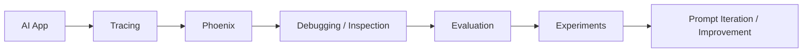
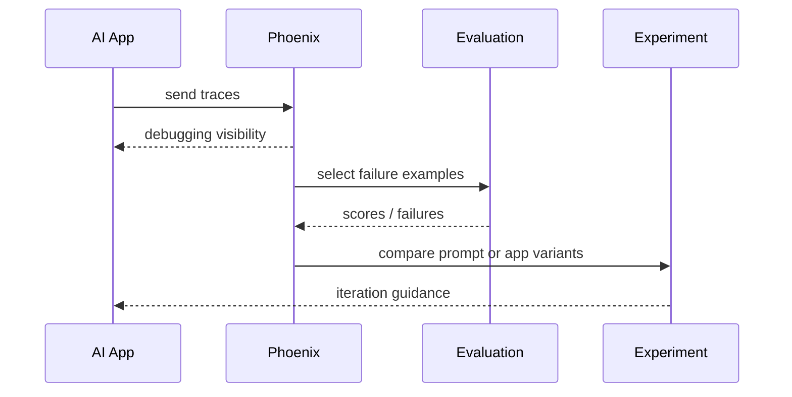

# Phoenix

## 它解决什么问题

`Phoenix` 解决的是“如何通过 tracing、evaluation、prompt iteration 和 experiments 来理解并改进 AI 应用”这个问题。它是开源的 observability / evaluation 平台。

## 为什么现在值得关注

如果 `Langfuse` 代表一体化 control plane，`Phoenix` 代表的是另一条很有代表性的开源 observability / eval 路线，特别适合研究 tracing 与 iteration workflow。

## 它在技术生态里的位置

- 属于 `observability + evaluation` 平台层
- 更像 `平台 + 子系统`
- 站在 tracing、prompts、datasets / experiments、production guide 的交汇点

## 工作原理

官方首页把 Phoenix 描述为 AI Observability and Evaluation，并强调 workflow for debugging and iteration：你把 traces 发进去，用 evals 识别 failures / regressions，用真实生产样例迭代 prompts，用 experiments 比较变更。

## 核心组件与架构

- tracing
- prompts
- datasets & experiments
- production guide / environments
- Python / TypeScript SDK
- OpenInference ecosystem

## 核心对象模型 / 核心抽象

- trace
- prompt
- dataset
- experiment
- environment
- evaluator

## 主流程 / 关键链路

### 链路 1：Tracing 主链路

1. 应用发送 traces
2. Phoenix 展示运行细节
3. 开发者定位失败与异常样例

### 链路 2：Prompt iteration 主链路

1. 从 traces 中挑真实生产样例
2. 调整 prompt
3. 用 experiments 对照变更
4. 判断是否改进

### 链路 3：Evaluation 主链路

1. 选择数据或 trace 样例
2. 运行 evaluation
3. 识别 failures / regressions
4. 指导下一轮迭代

## 架构图

## 数据流图 / 请求流图

## 工程质量观察

- docs 明确把 tracing、prompts、datasets/experiments 放在一起
- 和 OpenInference 生态耦合明显，适合研究开放 observability 路线
- 更强调 `debug + iterate` 工作流

## 和相邻项目怎么区分

- 和 `Langfuse`：都在 observability / eval 层，但 `Langfuse` 更明显强调 prompt management + self-hosting platform；`Phoenix` 更突出 tracing / debugging / iteration workflow
- 和 `Promptfoo`：Phoenix 更偏调试 / 实验闭环，Promptfoo 更偏 gate / CI / red-team

## 自托管 / 运行判断

它适合：

- 观察和调试 AI 应用
- 基于 trace 的迭代
- 做 experiments 比较变更
- 学 observability / eval 平台设计

## 适合什么场景

- tracing + eval
- debug / iterate workflow
- OpenInference 生态学习
- 开源 observability 平台研究

### 不太适合

- 替代完整 runtime
- 替代上线前 CI gate
- 单机超轻量实验的唯一入口

## 适配度标签

- `local_fit: high`
- `mac_fit: high`
- `production_fit: high`
- `learning_fit: high`
- 解释见：[[../04-Patterns/项目适配度标签说明|项目适配度标签说明]]

## 对我来说最重要的学习价值

它最重要的学习价值是让你看到“debugging and iteration”如何成为 AI 应用的一等工程流程。

## 推荐的学习动作

1. 先看 tracing、prompts、datasets & experiments
2. 再对照 `Langfuse` 看对象模型差异
3. 最后思考它和 OpenInference 的关系

## 下一步实验建议

1. 画一张 `Phoenix vs Langfuse vs Promptfoo` 三角对照图
2. 设计一条 trace -> eval -> experiment 的最小链路
3. 记录 OpenInference 在这里扮演的角色

## 风险与边界

- 容易和其他 observability / eval 项目边界模糊
- 如果没有 trace discipline，平台价值发挥不出来
- 是否适合作为主 control plane 需要和团队需求一起判断

## 官方入口

- [Phoenix Docs](https://arize.com/docs/phoenix)
- [OpenInference](https://github.com/Arize-ai/openinference)
- [Phoenix GitHub](https://github.com/Arize-ai/phoenix)

## 相关项目

- [[Langfuse]]
- [[Promptfoo]]
- [[../04-Patterns/Eval Gate 与 Observability 闭环|Eval Gate 与 Observability 闭环]]

## 关联

- [[项目索引|项目索引]]
- [[../01-Categories/Eval、Observability 与 Guardrails|Eval、Observability 与 Guardrails]]
- [[../02-Organizations/Arize|Arize]]
