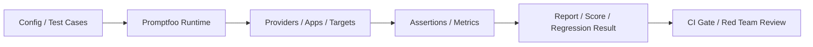
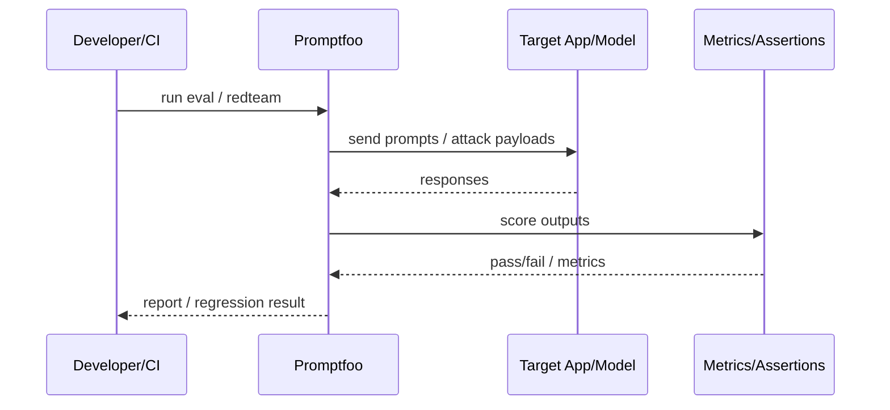

# Promptfoo

## 它解决什么问题

`Promptfoo` 解决的是“LLM app 在上线前如何做可重复评测、红队和回归门禁”这个问题。它不是 runtime，也不是 observability 平台，而是偏 pre-release eval gate 的工具链。

## 为什么现在值得关注

当团队开始做 prompt、RAG、agent、browser-computer 或 tool use，最大的风险往往不是“功能没做出来”，而是“改一下 prompt/工具后偷偷回归”。`Promptfoo` 值得关注，就是因为它把这种风险翻译成了可以进 CI 的评测与红队流程。

## 它在技术生态里的位置

- 属于 `eval / safety gate` 层
- 更像 `子系统 + 工具链`
- 可作为 CLI、library 或 CI/CD 组件使用
- 和 `Langfuse`、`Phoenix` 是互补而不是完全替代

## 工作原理

官方 intro 说得很直：它是 open-source CLI and library for evaluating and red-teaming LLM apps。工作原理是：把 prompts、providers、datasets、assertions、red-team probes 和 target discovery 组织成可重复运行的评测配置，再输出分数、失败样例和回归结论。

## 核心组件与架构

- CLI
- config / test cases
- assertions & metrics
- runtime execution
- red teaming
- plugins
- CI/CD integration

## 核心对象模型 / 核心抽象

- prompt case
- provider
- assertion
- metric
- red-team target
- regression baseline

## 主流程 / 关键链路

### 链路 1：Eval 主链路

1. 定义 prompts / test cases / providers
2. 运行评测
3. 根据 assertions 和 metrics 自动打分
4. 输出 pass/fail 和 regression 结论

### 链路 2：Red team 主链路

1. 发现或声明 target
2. 生成攻击 / 测试 payload
3. 执行并收集结果
4. 标记风险模式

### 链路 3：CI gate 主链路

1. 新改动触发 CI
2. Promptfoo 回放测试集
3. 输出 regression 报告
4. 作为 release gate

## 架构图

## 数据流图 / 请求流图

## 工程质量观察

- 作为 CLI / library / CI 组件非常清晰
- 文档对 eval、red teaming、plugins、runtime 分层明确
- 很适合“把 AI 评测拉进工程门禁”这个目标

## 和相邻项目怎么区分

- 和 `Langfuse`：`Langfuse` 更偏线上 control plane，`Promptfoo` 更偏上线前 gate
- 和 `Phoenix`：`Phoenix` 更偏 tracing / debugging / experiments；`Promptfoo` 更偏 config-driven eval / red-team
- 和 `OpenClaw`：一个管上线前质量，一个是 runtime

## 自托管 / 运行判断

它适合：

- prompt / RAG / agent regression
- red teaming
- CI 中加入 AI 质量门禁
- 本地和团队评测流程

## 适合什么场景

- pre-release eval
- regression gate
- red teaming
- CI / CD quality gate

### 不太适合

- 想要完整 observability 平台
- 想替代 runtime
- 只想看线上 traces，不做 pre-release gate

## 适配度标签

- `local_fit: high`
- `mac_fit: high`
- `production_fit: high`
- `learning_fit: high`
- 解释见：[[../04-Patterns/项目适配度标签说明|项目适配度标签说明]]

## 对我来说最重要的学习价值

它最值得学的地方，是把“AI 应用质量”做成了工程门禁，而不是手工试几次。

## 推荐的学习动作

1. 先看 intro、eval、red teaming、CI/CD 使用方式
2. 再看 assertions / metrics / plugins
3. 最后把它和 `Langfuse` 分成“上线前 / 上线后”两层

## 下一步实验建议

1. 做一个最小 prompt regression 套件
2. 再做一个 prompt injection red-team pack
3. 记录它与 `Langfuse` 的分工边界

## 风险与边界

- 容易被误当成 observability 平台
- 需要你先有测试样例 / 评测 discipline
- 对实时线上问题的直接可视化不如 tracing 平台

## 官方入口

- [Promptfoo Intro](https://www.promptfoo.dev/docs/intro/)
- [Promptfoo Guide](https://www.promptfoo.dev/docs/configuration/guide/)
- [Promptfoo Red Teaming](https://www.promptfoo.dev/docs/red-team/overview/)
- [Promptfoo CI/CD](https://www.promptfoo.dev/docs/integrations/ci-cd/)

## 相关项目

- [[Langfuse]]
- [[Phoenix]]
- [[../04-Patterns/Eval Gate 与 Observability 闭环|Eval Gate 与 Observability 闭环]]

## 关联

- [[项目索引|项目索引]]
- [[../01-Categories/Eval、Observability 与 Guardrails|Eval、Observability 与 Guardrails]]
- [[../02-Organizations/Promptfoo|Promptfoo]]
- [[../../AI-Engineering/07-Topics/Eval Harness 与 Regression Suites|Eval Harness 与 Regression Suites]]
