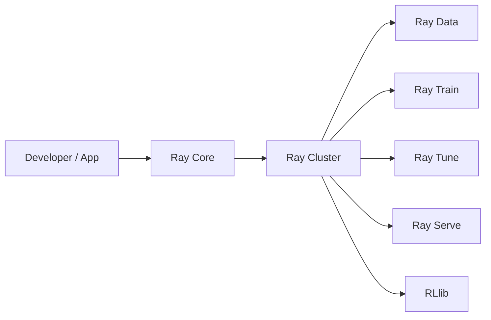
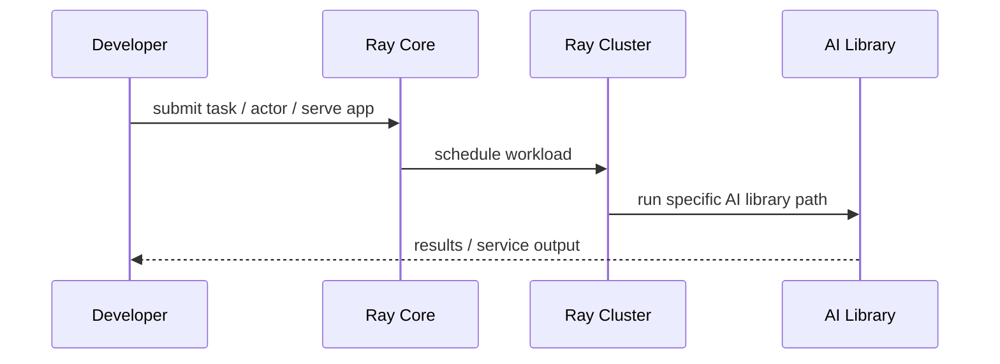

# Ray

## 它解决什么问题

`Ray` 解决的是“如何把 Python 应用和 AI workload 扩展到分布式运行”这个问题。它不是只做 serving，而是一个分布式 runtime，加上一组 AI libraries。

## 为什么现在值得关注

Ray 的特别之处在于它既是 runtime，又长出 Data、Train、Tune、Serve、RLlib 等库，所以它非常适合帮助你理解“分布式 runtime”和“AI 平台能力”之间的关系。

## 它在技术生态里的位置

- 属于 `distributed runtime + AI compute engine`
- 更像 `底座 + 平台`
- 往上能长出 Serve、Train、Tune 等能力
- 和 `KServe`、`Kubeflow` 是不同层级的互补 / 竞争关系

## 工作原理

官方 overview 明确把 Ray Core 定义为 distributed computing library，并强调五个 native libraries：Data、Train、Tune、Serve、RLlib。它的工作原理是：先有统一分布式 runtime 和 cluster，再在上面承载不同 AI workload libraries。

## 核心组件与架构

- Ray Core
- Ray Clusters
- Ray Data
- Ray Train
- Ray Tune
- Ray Serve
- RLlib

## 核心对象模型 / 核心抽象

- task
- actor
- cluster
- library（Data / Train / Tune / Serve）
- runtime

## 主流程 / 关键链路

### 链路 1：Distributed app 主链路

1. 开发者写 Python 任务 / actor
2. Ray Core 把它们调度到 cluster
3. 多节点协同运行

### 链路 2：AI library 主链路

1. 在 Ray Core 上调用 Data / Train / Tune / Serve
2. 针对不同 AI workload 使用不同库
3. 共享同一个分布式 runtime

### 链路 3：Serve 主链路

1. 服务逻辑进入 Ray Serve
2. 部署到 Ray cluster
3. 在线推理由 runtime 调度

## 架构图

## 数据流图 / 请求流图

## 工程质量观察

- 抽象层次很清楚：Core -> Cluster -> Libraries
- 既能学分布式 runtime，也能学 AI workload 平台化
- 适合做“统一运行时”这条路线的代表项目

## 和相邻项目怎么区分

- 和 `KServe`：`KServe` 是 Kubernetes inference 平台，`Ray` 是更通用的 distributed runtime
- 和 `Kubeflow`：`Kubeflow` 是控制塔平台，`Ray` 是运行时和库体系
- 和 `vLLM`：`vLLM` 是推理引擎，可挂到 `Ray Serve` 上

## 自托管 / 运行判断

它适合：

- 研究分布式 runtime
- 研究 AI libraries 如何共享统一运行时
- Serve / Train / Data 一体化探索

## 适合什么场景

- distributed runtime 学习
- AI compute engine 研究
- Serve / Train / Data 一体化

### 不太适合

- 只想在 Mac 上轻量本地玩一下
- 不关心分布式系统
- 只想要一个 K8s 平台而非 runtime

## 适配度标签

- `local_fit: medium`
- `mac_fit: medium`
- `production_fit: high`
- `learning_fit: high`
- 解释见：[[../04-Patterns/项目适配度标签说明|项目适配度标签说明]]

## 对我来说最重要的学习价值

它最有学习价值的地方，是让你看到“AI compute engine”可以不是单个框架，而是一整套 runtime + libraries 的分层体系。

## 推荐的学习动作

1. 先看 Ray overview 和 Ray Core
2. 再看五个 native libraries 的边界
3. 最后对照 `KServe`、`Kubeflow`、`vLLM` 画层次图

## 下一步实验建议

1. 做一张 `Ray Core -> Libraries` 的结构图
2. 把 `Ray Serve` 放进推理平台地图
3. 记录它和 `KServe` 的分层差异

## 风险与边界

- 项目跨度很大，容易把 Core 和上层库混在一起
- 本地能跑不代表能理解它的分布式价值
- 生产引入往往意味着比较重的运行时选择

## 官方入口

- [Ray Overview](https://docs.ray.io/en/latest/ray-overview/index.html)
- [Ray Core](https://docs.ray.io/en/latest/ray-core/walkthrough.html)
- [Ray Serve](https://docs.ray.io/en/latest/serve/index.html)

## 相关项目

- [[KServe]]
- [[Kubeflow]]
- [[vLLM]]
- [[../04-Patterns/Serving 数据面与推理加速模式|Serving 数据面与推理加速模式]]

## 关联

- [[项目索引|项目索引]]
- [[../01-Categories/Kubernetes 上的 AI 平台|Kubernetes 上的 AI 平台]]
- [[../02-Organizations/Ray Project|Ray Project]]
