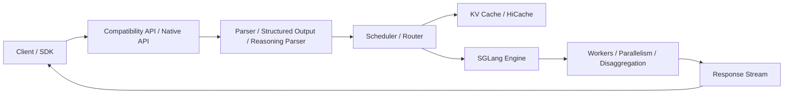
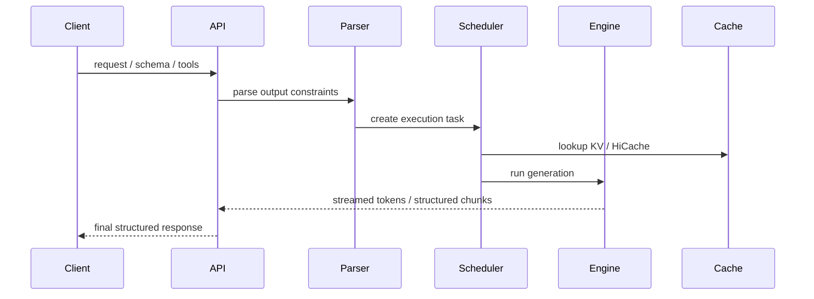

# SGLang

## 它解决什么问题

`SGLang` 解决的是“如何把 LLM / VLM / reasoning inference 做成高性能、可编排、可结构化输出的 serving/runtime 系统”。它既是 serving 系统，也带有更强的 generation runtime 色彩。

## 为什么现在值得关注

如果 `vLLM` 帮你理解“推理数据面”，`SGLang` 帮你理解“推理数据面如何和 generation programming、structured outputs、tool/reasoning parsing 结合”。它代表的是另一条很强的 serving 路线。

## 它在技术生态里的位置

- 属于 `serving data plane`，但更偏 `底座 + 壳层`
- 既做引擎，也做 OpenAI-compatible API、native API 和 generation runtime 能力
- 和 `vLLM` 经常正面对比

## 工作原理

官方文档把 `OpenAI-Compatible APIs`、`Offline Engine API`、`SGLang Native APIs`、`Structured Outputs`、`Tool Parser`、`Reasoning Parser`、`Quantized KV Cache`、`PD/EPD Disaggregation` 放在一起，这说明它的设计目标不是单纯跑得快，而是把“高性能 + generation control + serving”做成一体。

## 核心组件与架构

- API surface：OpenAI-compatible、Ollama-compatible、offline engine、native APIs
- serving features：speculative decoding、quantization、LoRA serving、expert parallelism、DP router
- advanced data plane：PD disaggregation、HiCache、observability
- model gateway / parser / structured outputs

## 核心对象模型 / 核心抽象

- request
- parser（tool / reasoning / structured outputs）
- engine
- KV cache / HiCache
- disaggregated prefill-decode
- native API vs compatibility API

## 主流程 / 关键链路

### 链路 1：Compatibility API 主链路

1. 客户端发 OpenAI-compatible 请求
2. request 被转换成 SGLang 内部 generation task
3. parser 和 sampling 逻辑决定输出约束
4. engine 调度执行并流式返回

### 链路 2：Structured generation 主链路

1. 请求声明 schema / structured output
2. parser 或 decoding constraint 参与生成
3. engine 在输出过程中持续约束 token
4. 返回更结构化、更适合集成的结果

### 链路 3：高性能 serving 主链路

1. scheduler 组织 batch
2. KV cache / quantized KV / HiCache 提升效率
3. PD/EPD disaggregation 让长上下文和推理阶段分离

## 架构图

## 数据流图 / 请求流图

## 工程质量观察

- 文档把性能优化与 generation control 放在同一层，这是它区别于纯推理引擎的地方
- 高级特性很多，说明它瞄准的是“能打的 serving stack”而不是玩具系统
- 学习时要防止被 feature list 淹没，最好只抓 `API -> parser -> engine -> cache -> response` 这条主链

## 和相邻项目怎么区分

- 和 `vLLM`：`vLLM` 更像通用高吞吐引擎，`SGLang` 更像带 generation/runtime 语义的 serving 系统
- 和 `Ollama`：不是同一个层；`Ollama` 更本地优先
- 和 `Promptfoo`：一个是执行层，一个是评测层

## 自托管 / 运行判断

它适合：

- 研究高性能 LLM/VLM serving
- 研究 structured outputs / reasoning / tool-aware generation
- 需要把 serving 与输出约束做紧耦合的团队

## 适合什么场景

- 高性能 serving
- structured output / parser 驱动的 generation
- reasoning / tool-aware runtime

### 不太适合

- 只想本地轻量实验
- 只想理解基本的 OpenAI API 兼容壳层
- 没有 GPU / cluster 背景时直接全量上手

## 适配度标签

- `local_fit: medium`
- `mac_fit: low`
- `production_fit: high`
- `learning_fit: high`
- 解释见：[[../04-Patterns/项目适配度标签说明|项目适配度标签说明]]

## 对我来说最重要的学习价值

它最有学习价值的地方，是让你看到“生成系统”不只是一层 HTTP 包装，而可以把 parser、schema、tool/reasoning logic 和高性能推理放在同一个 runtime 里思考。

## 推荐的学习动作

1. 先看 `OpenAI-Compatible APIs`、`Native APIs`、`Structured Outputs`
2. 再看 `HiCache`、`PD/EPD Disaggregation`、`Observability`
3. 最后和 `vLLM` 做一张路线对照图

## 下一步实验建议

1. 补一张 `SGLang vs vLLM` 的关键链路对照图
2. 设计一个带 schema 的 generation 实验，看看它的工程边界
3. 把 parser / cache / engine 的分层关系画出来

## 风险与边界

- 文档特性多、跨度大，容易学散
- 对 Mac 学习者来说更适合架构学习，不适合本机深跑
- 真正的价值在数据面和 generation runtime 的结合，不在“多一个兼容 API”

## 官方入口

- [SGLang Docs](https://docs.sglang.ai/)
- [OpenAI-Compatible APIs](https://docs.sglang.ai/basic_usage/openai_api.html)
- [Structured Outputs](https://docs.sglang.ai/advanced_features/structured_outputs.html)
- [HiCache](https://docs.sglang.ai/advanced_features/hicache.html)

## 相关项目

- [[vLLM]]
- [[KServe]]
- [[Promptfoo]]
- [[../04-Patterns/Serving 数据面与推理加速模式|Serving 数据面与推理加速模式]]

## 关联

- [[项目索引|项目索引]]
- [[../01-Categories/推理服务与 Serving 数据面|推理服务与 Serving 数据面]]
- [[../02-Organizations/SGL Project|SGL Project]]
