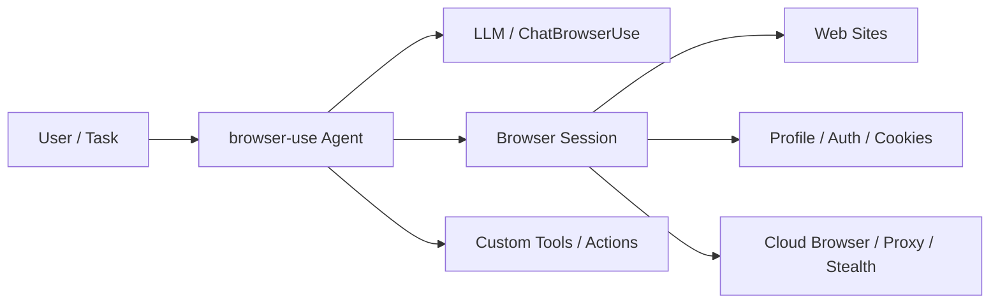
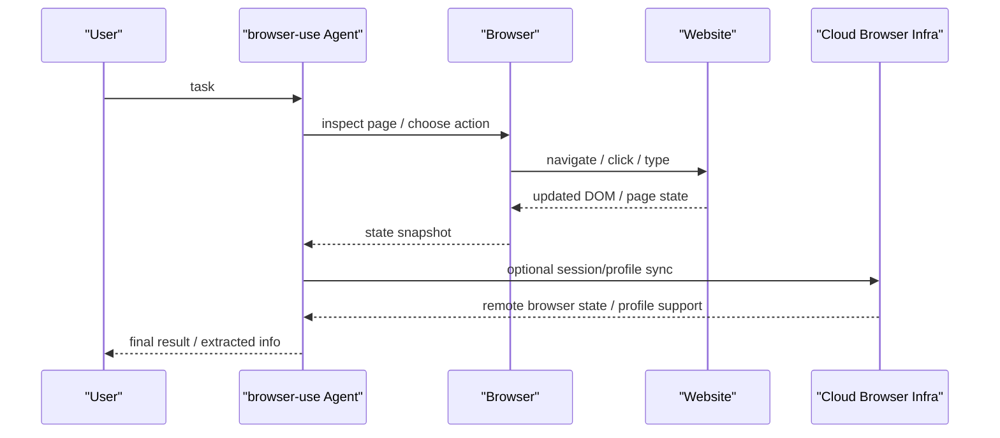

# browser-use

## 它解决什么问题

`browser-use` 解决的是“AI agent 如何真正操作网页，而不只是调用 API”这个问题。它把网页浏览器变成 agent 的动作面，让 agent 可以导航页面、填写表单、读取内容、执行交互。

## 为什么现在值得关注

如果你在研究 browser / desktop agent，`browser-use` 是很重要的开源样本。官方仓库和文档已经把它从“玩具 demo”推进成了一个相对完整的浏览器动作栈：

- 本地开源库
- Cloud browsers
- profile / auth 同步
- proxy / stealth / session persistence
- examples 和 cloud tutorials

它已经不只是“一个会点网页的 agent 脚本”，而更像一条完整的 `browser action surface` 路线。来源：[browser-use GitHub](https://github.com/browser-use/browser-use)、[Browser Use Docs](https://docs.browser-use.com/cloud/quickstart)

## 它在技术生态里的位置

- 属于 `browser action surface`
- 更像 `动作 runtime + 执行层`
- 常和 coding agent、workflow agent、QA agent 结合
- 是 agent 的“网页手和眼”，不是编排框架，也不是模型网关

如果按我们现在的核心 8 样本看：

- `LangGraph` 管编排
- `LiteLLM` 管模型接入
- `Langfuse` 管观测与评测
- `browser-use` 管网页动作面

## 工作原理

它的核心原理是把 LLM/agent 放到浏览器旁边，让 agent 通过浏览器状态理解页面，再执行导航和交互动作。官方 quickstart 展示得很直接：

- 先创建 `Browser`
- 再创建 `ChatBrowserUse()` 或其他模型接口
- 再把二者交给 `Agent`
- 最后调用 `agent.run()`

而官方仓库继续往前推到了：

- cloud browser
- sandbox deployment
- profile / cookie 同步
- proxy / stealth browser

这说明它不是“浏览器驱动器 + prompt”的简单组合，而是逐步把浏览器基础设施也收进来了。来源：[browser-use GitHub](https://github.com/browser-use/browser-use)、[Browser Use Cloud](https://docs.browser-use.com/introduction)、[Sessions & Profiles](https://docs.browser-use.com/concepts/profile)

## 核心组件与架构

- `Agent`
- `Browser`
- `ChatBrowserUse` / model side
- local browser
- cloud browser
- profiles / auth sync
- proxies / stealth infra
- sandbox deployment
- tools / custom actions

## 核心对象模型 / 核心抽象

- `task`
- `agent`
- `browser session`
- `browser state`
- `profile`
- `proxy`
- `tool / action`
- `history / run result`

这组对象里最关键的是：

- 浏览器不是被动脚本宿主，而是运行时的一等对象
- profile 和 session 不是边角功能，而是生产可用性的核心边界
- cloud browser 和 local browser 是同一路动作面的不同运行模式

## 主流程 / 关键链路

### 链路 1：本地 Agent 主链路

1. 用户定义 task
2. 创建本地 `Browser`
3. `Agent` 读取浏览器状态
4. agent 决定下一步网页动作
5. 浏览器执行动作并返回新状态
6. 循环直到任务完成

### 链路 2：Cloud Browser 主链路

1. agent 请求 cloud browser
2. cloud browser 提供代理、隐身能力、持久会话和可管理的浏览器环境
3. agent 在远程浏览器上执行动作
4. 结果和 history 返回给调用方

### 链路 3：Profile / Auth 主链路

1. 用户同步本地浏览器 profile / cookie
2. session 复用登录态
3. agent 在后续任务中直接继承认证上下文
4. 浏览器任务不需要每次重走登录流程

### 链路 4：Tool-extended Browser 主链路

1. 创建 `Tools`
2. 为 agent 注册自定义动作
3. agent 在浏览器动作和自定义工具之间切换
4. 整个任务不再局限于纯网页点击

## 架构图

## 数据流图 / 请求流图

## 工程质量观察

`browser-use` 最值得学的，不只是“网页能操作起来”，而是它把浏览器动作面逐步做成了一条工程链：

- 本地浏览器运行
- cloud 浏览器运行
- profile / auth 复用
- stealth / proxy 能力
- 自定义工具扩展
- sandbox / production 路径

这说明它已经开始认真面对“浏览器 agent 为什么难以生产化”的问题，而不只是展示一个 demo。

## 和相邻项目怎么区分

### 和 Playwright

Playwright 更偏确定性脚本自动化；`browser-use` 更偏 LLM agent 驱动的网页执行。

### 和 [[OpenHands]]

`OpenHands` 更偏 coding agent 平台；`browser-use` 更偏网页动作能力。两者可以组合，但不在同一层。

### 和桌面/Computer Use 路线

`browser-use` 更聚焦浏览器内动作，不是泛桌面 OS 操作 runtime。

## 自托管 / 运行判断

- 本地实验：很友好
- Mac 学习：友好
- 生产使用：中等，真正的难点不在“能点网页”，而在 session、代理、反爬、并发 browser infra

## 适合什么场景

### 很适合

- 网页操作型 agent
- form fill / search / extract / QA automation
- 研究 browser action surface
- 想理解“浏览器为什么会变成 agent runtime 的一部分”

### 不太适合

- 纯 API 任务
- 需要极端确定性和可重复脚本的场景
- 不希望承受 UI 波动、CAPTCHA、登录态和代理复杂度

## 适配度标签

- local_fit: `high`
- mac_fit: `high`
- production_fit: `medium`
- learning_fit: `high`
- 解释见：[[../04-Patterns/项目适配度标签说明|项目适配度标签说明]]

## 对我来说最重要的学习价值

如果你想研究 `Harness / Action Surfaces / Browser Agents`，`browser-use` 最值得学的是：

- 浏览器为什么是独立动作面
- session / profile 为什么是生产关键点
- browser infra 为什么会反向决定 agent 可用性
- 自定义 tools 怎么和网页动作混合

## 推荐的学习动作

1. 先跑本地 quickstart
2. 再区分 `Agent` 模式和 `Browser` 模式
3. 再读 profile / auth / cloud browser 文档
4. 再看 examples repo，理解真实接入方式

## 下一步实验建议

- 做一个 `browser-use + LiteLLM` 的浏览器 agent 实验
- 做一个 `browser-use + Langfuse` 的网页操作观测实验
- 做一个 `browser-use + OpenHands` 的 coding + browser 组合样例

## 风险与边界

- 网页动作高度脆弱，容易受页面变更影响
- CAPTCHA、登录态、反爬和代理问题很重
- 生产规模化会把浏览器基础设施变成瓶颈
- 如果没有 session / auth 策略，真实业务很难跑起来

## 官方入口

- [browser-use GitHub](https://github.com/browser-use/browser-use)
- [Browser Use Docs](https://docs.browser-use.com/cloud/quickstart)
- [Browser Use Cloud](https://docs.browser-use.com/introduction)
- [Sessions & Profiles](https://docs.browser-use.com/concepts/profile)
- [browser-use Examples](https://github.com/browser-use/browser-use-examples)

## 相关项目

- [[OpenHands]]
- [[LiteLLM]]
- [[Langfuse]]

## 关联

- [[../08-Workflows/开源项目深度分析工作流|开源项目深度分析工作流]]
