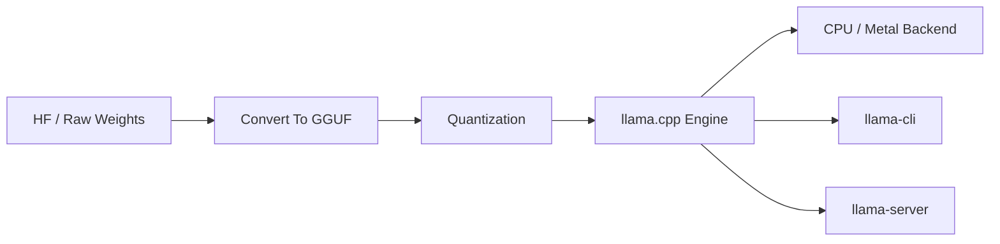
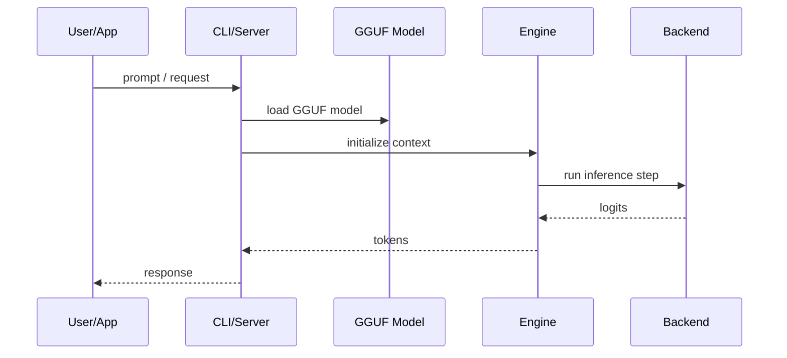

# llama.cpp

## 它解决什么问题

`llama.cpp` 解决的是“模型如何在本地 CPU / Metal / 边缘环境下真正推理起来”这个问题。它是本地推理底座，而不是分发产品。

## 为什么现在值得关注

如果你想理解 GGUF、量化、本地推理、server / CLI 和大量上层壳层为什么能成立，`llama.cpp` 是绕不过去的底层样本。

## 它在技术生态里的位置

- 属于 `local inference engine`
- 更像 `底座`
- 很多本地产品和壳层都能建立在它之上
- 与 `Ollama`、`LM Studio` 这类更上层产品形成上下层关系

## 工作原理

它的工作原理是把模型权重转成适合本地执行的 `GGUF` 格式，再通过 C/C++ 推理引擎、量化、CPU/Metal backend 和轻量 server / CLI 把模型跑起来。README 和工具区能看到 CLI、server、GGUF 转换、量化和一整圈生态工具。

## 核心组件与架构

- ggml / GGUF
- quantization
- CLI / server
- conversion tools
- platform backends（CPU / Metal 等）

## 核心对象模型 / 核心抽象

- GGUF
- quantized weights
- backend
- `llama-cli`
- `llama-server`
- model conversion

## 主流程 / 关键链路

### 链路 1：Model conversion 主链路

1. 从原始 HF / LoRA 权重出发
2. 转成 GGUF
3. 可选进一步量化
4. 进入本地执行引擎

### 链路 2：Local inference 主链路

1. CLI / server 加载 GGUF 模型
2. backend 初始化 CPU / Metal 等执行面
3. 推理循环生成 token
4. 结果返回给 CLI 或 API

### 链路 3：生态集成主链路

1. 上层产品引用 `llama.cpp` 作为执行底座
2. 壳层负责模型管理 / API / UI
3. `llama.cpp` 保持底层执行和格式能力

## 架构图

## 数据流图 / 请求流图

## 工程质量观察

- 底层味很重，工程价值高
- 生态极广，说明它确实成了本地推理事实底座之一
- README 工具区能直接看到生态扩散与格式中心地位

## 和相邻项目怎么区分

- 和 `Ollama`：上层壳层 vs 底层执行引擎
- 和 `MLX`：`MLX` 是 Apple Silicon 原生数组框架；`llama.cpp` 是本地 LLM 专用底座
- 和 `vLLM`：一个偏本地边缘，一个偏高吞吐服务

## 自托管 / 运行判断

它适合：

- 本地推理原理学习
- GGUF / quantization / backend 研究
- Mac / CPU / edge inference 实验

## 适合什么场景

- 本地推理底层学习
- GGUF / 量化
- Mac / CPU / edge execution

### 不太适合

- 通用训练框架学习
- 大规模在线服务容量规划
- 企业平台控制面研究

## 适配度标签

- `local_fit: high`
- `mac_fit: high`
- `production_fit: medium`
- `learning_fit: high`
- 解释见：[[../04-Patterns/项目适配度标签说明|项目适配度标签说明]]

## 对我来说最重要的学习价值

它能帮助你真正理解“本地模型为什么能跑起来”，这会让你对 `Ollama`、`LM Studio`、`MLX-LM` 这种更上层体验有更稳的分层判断。

## 推荐的学习动作

1. 先理解 `GGUF -> quantization -> engine -> backend -> CLI/server` 这条链
2. 再对照 `Ollama` 看哪些问题是谁在解决
3. 最后在 Mac 上亲手跑一次最小 server

## 下一步实验建议

1. 做一次 `HF model -> GGUF -> llama-server` 的最小流程图
2. 记录量化对本地资源要求的影响
3. 再把它和 `MLX-LM` 对比为“本地底座的两条路线”

## 风险与边界

- 很容易陷入底层实现细节而忘记整体分层
- 不是所有人都需要一直停在这个层次
- 学习价值很高，但对业务团队的直接生产迁移价值未必最高

## 官方入口

- [llama.cpp GitHub](https://github.com/ggml-org/llama.cpp)
- [Supported Backends](https://github.com/ggml-org/llama.cpp#supported-backends)
- [llama-cli](https://github.com/ggml-org/llama.cpp#llama-cli)

## 相关项目

- [[Ollama]]
- [[MLX]]
- [[../04-Patterns/本地优先 AI 开发模式|本地优先 AI 开发模式]]

## 关联

- [[项目索引|项目索引]]
- [[../01-Categories/本地模型与本地优先开发|本地模型与本地优先开发]]
- [[../02-Organizations/ggml-org|ggml-org]]
- [[../../AI-Learning/09-Systems/llama-cpp|llama-cpp]]
