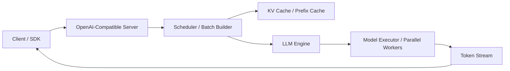
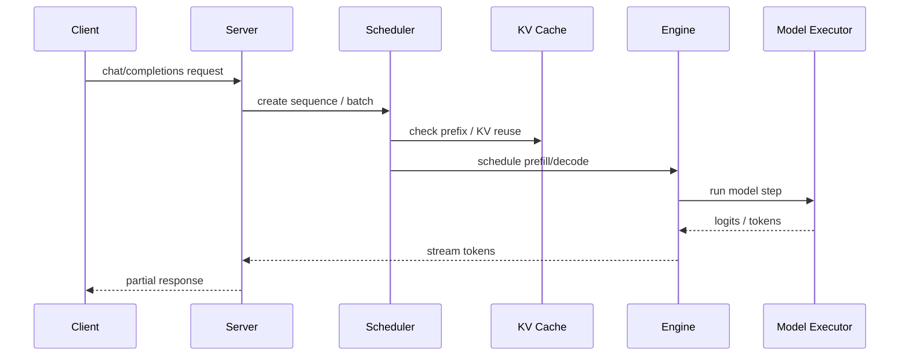

# vLLM

## 它解决什么问题

`vLLM` 解决的是“大模型推理怎么在单机或集群上高吞吐、低浪费地跑起来”这个问题。它不是模型本身，也不是 Kubernetes 平台，而是一个偏推理数据面的 serving engine：负责请求调度、KV cache 管理、批处理、并行执行和 OpenAI-compatible serving。

## 为什么现在值得关注

只要你在学 `serving`、`agent`、`browser-computer`、`OpenAI-compatible API`，最终都会撞到推理成本、KV cache、并发调度和长上下文吞吐这些问题。`vLLM` 是这条路线最有代表性的开源样本之一。

## 它在技术生态里的位置

- 属于 `serving data plane`
- 更像 `底座 + 子系统`
- 经常作为 `KServe`、`Ray Serve`、`BentoML`、自建推理平台的后端引擎
- 和 `SGLang` 是最常被并列比较的一组

## 工作原理

`vLLM` 的核心原理不是“把模型包一层 HTTP 服务”，而是把推理过程拆成：请求进入、调度、prefix/KV 复用、batch 组织、模型执行、token 回传。围绕这条链，`vLLM` 重点优化的是显存利用率、batch 形成速度和多并行形态下的吞吐。官方文档把 `OpenAI-Compatible Server`、`Parallelism and Scaling`、`Disaggregated Serving`、`Prefix Caching`、`Structured Outputs` 都放在主线上，这个信号很明确：它研究的是推理数据面，而不是简单 API 封装。

## 核心组件与架构

- `LLM Engine`
- `OpenAI-Compatible Server`
- `Scheduler / Batch Builder`
- `KV Cache / Prefix Caching`
- `Parallelism and Scaling`
- `Disaggregated Serving / Prefill`
- `Metrics / Monitoring / OTel`
- 可以接 `KServe`、`Ray`、`LangChain`、`LlamaIndex`

## 核心对象模型 / 核心抽象

- request
- sequence / sequence group
- batch
- KV cache block
- engine
- worker
- model executor
- compatibility API
- prefill / decode path

## 主流程 / 关键链路

### 链路 1：Online serving 主链路

1. 客户端发送 OpenAI-compatible 请求
2. server 把请求转成内部 sequence / batch
3. scheduler 基于可用 KV cache 和并行配置组织执行
4. engine 驱动模型执行 prefill / decode
5. token 流式返回给客户端

### 链路 2：KV cache / prefix reuse 主链路

1. prompt 进入 engine
2. prefix 被识别与缓存
3. 后续相似请求复用前缀状态
4. 节省 prefill 成本，提高吞吐

### 链路 3：Disaggregated serving 主链路

1. prefill 与 decode 分到不同执行面
2. 中间状态通过系统内协议传递
3. 让长 prompt 和持续 decode 不互相拖垮

## 架构图

## 数据流图 / 请求流图

## 工程质量观察

- 文档结构很工程化：把 `serving`、`parallelism`、`disaggregated serving`、`metrics`、`benchmarking` 直接放主线
- 明显是为生产吞吐和资源利用率而设计，不是只为 notebook inference
- 和 `KServe`、`Ray` 等平台层能清楚拼接，边界感很清楚
- 性能与扩展性优先，意味着理解门槛比本地壳层工具更高

## 和相邻项目怎么区分

- 和 `SGLang`：都在推理数据面，但 `SGLang` 更强调 generation runtime、structured output、parser；`vLLM` 更像通用高吞吐引擎
- 和 `Ollama`：`Ollama` 是本地壳层，`vLLM` 是服务底座
- 和 `KServe`：`KServe` 是 Kubernetes 平台层，`vLLM` 是它可以接入的执行后端之一
- 和 `Ray`：`Ray` 是分布式 runtime；`vLLM` 是推理 workload 本身的引擎

## 自托管 / 运行判断

它适合：

- GPU 机器或集群上的 serving 研究
- 生产推理平台选型
- 理解 KV cache / batching / disaggregated serving

它不适合：

- 在你的 Mac 上做完整性能实验
- 作为第一个“本地跑模型”入口

## 适合什么场景

- 推理平台
- GPU 集群 serving
- OpenAI-compatible inference API
- 大吞吐、多租户、长上下文推理研究

### 不太适合

- 只想在 Mac 上轻松本地聊天
- 不需要吞吐和成本工程
- 团队还没进入 serving / capacity planning 阶段

## 适配度标签

- `local_fit: medium`
- `mac_fit: low`
- `production_fit: high`
- `learning_fit: high`
- 解释见：[[../04-Patterns/项目适配度标签说明|项目适配度标签说明]]

## 对我来说最重要的学习价值

它特别适合帮助你建立“推理为什么难”的判断力。很多团队以为推理就是包一层 API；学 `vLLM` 后会真正理解：真正难的是 KV、batch、prefill/decode、并行、资源利用率和服务层级。

## 推荐的学习动作

1. 先看 `OpenAI-Compatible Server`、`Parallelism and Scaling`、`Disaggregated Serving`
2. 再看 metrics / benchmarking，理解它如何量化吞吐与 latency
3. 最后再和 `SGLang`、`KServe`、`Ray Serve` 做边界比较

## 下一步实验建议

1. 在知识库里补一张 `vLLM vs SGLang` 对照卡
2. 用一份真实推理 workload 设计容量规划题
3. 先做架构图和主流程，不急着在 Mac 上硬跑完整 serving 栈

## 风险与边界

- Mac 本地不适合作为主实验面
- 文档里的很多能力默认站在 GPU / cluster 视角
- 生产价值很高，但学习时容易陷入“配置细节”而忽略核心抽象

## 官方入口

- [vLLM Docs](https://docs.vllm.ai/en/latest/)
- [OpenAI-Compatible Server](https://docs.vllm.ai/en/latest/serving/openai_compatible_server.html)
- [Parallelism and Scaling](https://docs.vllm.ai/en/latest/serving/parallelism_scaling.html)
- [Disaggregated Serving](https://docs.vllm.ai/en/latest/examples/online_serving/disaggregated_serving.html)

## 相关项目

- [[SGLang]]
- [[KServe]]
- [[Ray]]
- [[../04-Patterns/Serving 数据面与推理加速模式|Serving 数据面与推理加速模式]]

## 关联

- [[项目索引|项目索引]]
- [[../01-Categories/推理服务与 Serving 数据面|推理服务与 Serving 数据面]]
- [[../02-Organizations/vLLM Project|vLLM Project]]
- [[../../AI-Engineering/07-Topics/Disaggregated Serving 与推理数据面|Disaggregated Serving 与推理数据面]]
