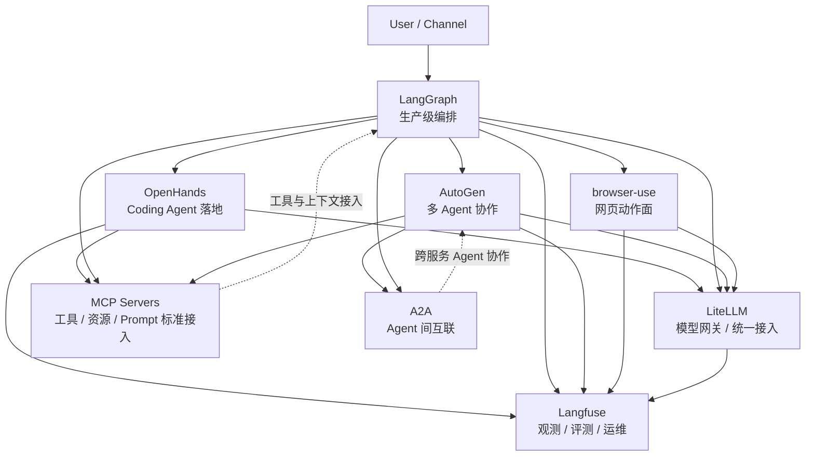

# Agent 系统核心 8 关系图

这张图不是按 stars 排项目，而是按 `Agent 系统分层` 来看 8 个核心样本怎么拼成一套完整系统。

## 怎么读这张图

- `LiteLLM` 是模型入口层：让上层不用直接和每个 provider 的 SDK 耦合
- `Langfuse` 是控制面：让系统可观察、可评测、可回归
- `LangGraph` 是编排内核：让 agent workflow 可中断、可恢复、可检查点
- `AutoGen` 是多 Agent 协作范式：强调消息驱动和 runtime
- `OpenHands` 是产品化 coding agent 样本：把 runtime 变成可交付表面
- `browser-use` 是网页动作面：让 agent 真正能操作 web
- `MCP Servers` 是标准化工具接入生态：把 tools/resources/prompts 从宿主里解耦
- `A2A` 是 Agent 间互联协议：把 remote agents 变成一等协作对象

## 最关键的边界

### `MCP` 不是 `A2A`

- `MCP`：你接的是工具、资源、prompt
- `A2A`：你接的是另一个独立 agent 服务

### `LangGraph` 不是 `AutoGen`

- `LangGraph`：更偏 workflow orchestration
- `AutoGen`：更偏 message-based multi-agent runtime

### `LiteLLM` 不是 `Langfuse`

- `LiteLLM`：入口和路由
- `Langfuse`：观测、评测和治理

### `browser-use` 不是 `OpenHands`

- `browser-use`：网页动作层
- `OpenHands`：coding agent 产品/runtime 落地层

## 推荐阅读顺序

1. [[../03-Projects/LiteLLM|LiteLLM]]
2. [[../03-Projects/Langfuse|Langfuse]]
3. [[../03-Projects/LangGraph|LangGraph]]
4. [[../03-Projects/AutoGen|AutoGen]]
5. [[../03-Projects/OpenHands|OpenHands]]
6. [[../03-Projects/browser-use|browser-use]]
7. [[../03-Projects/MCP Servers|MCP Servers]]
8. [[../03-Projects/A2A|A2A]]
