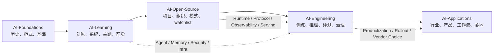

# AI 总控制塔

> 这是整个 AI 知识库的一页总入口。目标不是“再多一个索引”，而是让你先判断问题属于哪一层，再沿着最短路径进入对应的总览、索引、地图、主题、系统或项目页。

## 先看这张图

## 这套知识库应该回答什么

- `为什么现代 AI 会走到今天`：[[AI-Foundations/专题总览|AI-Foundations]]
- `现在 AI 世界里有哪些关键对象、系统和主线`：[[AI-Learning/专题总览|AI-Learning]]
- `哪些开源项目值得持续研究，它们分别代表什么工程模式`：[[AI-Open-Source/专题总览|AI-Open-Source]]
- `一个 AI 系统如何被真正构建、评测、上线与治理`：[[AI-Engineering/专题总览|AI-Engineering]]
- `AI 最终如何进入业务、组织与工作流`：[[AI-Applications/专题总览|AI-Applications]]

## 先别搜，先判断问题属于哪一层

- 我想补历史、范式、数学直觉、经典论文：[[AI-Foundations/专题总览|AI-Foundations]]
- 我想看模型、系统、公司、人物、前沿主题：[[AI-Learning/专题总览|AI-Learning]]
- 我想知道哪些开源项目值得跟、怎么切源码：[[AI-Open-Source/专题总览|AI-Open-Source]]
- 我想理解训练、推理、MLOps、Agent Runtime、AI Security：[[AI-Engineering/专题总览|AI-Engineering]]
- 我想做行业落地、workflow 设计、vendor choice：[[AI-Applications/专题总览|AI-Applications]]

## 按任务走最短路径

- 总问题入口：[[AI 问题导航|AI 问题导航]]
- 总决策入口：[[AI 决策导航|AI 决策导航]]
- 想系统看整个 AI 全景：[[AI-Learning/07-Maps/AI 五大专题审察与组织|AI 五大专题审察与组织]] -> [[AI-Learning/07-Maps/AI 五大专题导航.canvas|AI 五大专题导航（Canvas）]] -> [[AI-Learning/07-Maps/AI Ecosystem Map|AI Ecosystem Map]]
- 想搭 Agent：[[我想搭 Agent]]
- 想做 LLMOps / AgentOps：[[我想做 LLMOps 与 AgentOps]]
- 想做 AI Security：[[我想做 AI Security]]
- 想选 AI 开源栈：[[我想选 AI 开源栈]]
- 想把 Mac 变成 AI 实验室：[[我想把 Mac 变成 AI 实验室]]
- 想理解 AI 记忆与自改进：[[我想理解 AI 记忆与自改进]]
- 想通过人物、组织与案例理解 AI：[[我想通过人物、组织与案例理解 AI]]
- 想通过作者、论文与时间线理解 AI：[[我想通过作者、论文与时间线理解 AI]]
- 想知道最近半年哪些 AI 知识最值得重投入：[[AI-Learning/11-Recent-Supplements/最近半年最值得重投入学习的 AI 主线（截至 2026-04-07）|最近半年最值得重投入学习的 AI 主线（截至 2026-04-07）]]
- 想接上 `2026-04-29` 之后的 AI 新变化：[[AI-Learning/11-Recent-Supplements/2026-04-29 至 2026-05-15 AI 拓扑补线：Governed Agents、Device Intelligence 与 Evaluation Institutionalization|2026-04-29 至 2026-05-15 AI 拓扑补线]]
- 想接上 `2026-04-07` 之后的 AI 新变化：[[AI-Learning/11-Recent-Supplements/2026-04-07 至 2026-04-29 AI 拓扑补线：Frontier Work Models、Sandbox Agents 与 Enterprise Model Lifecycle|2026-04-07 至 2026-04-29 AI 拓扑补线]]
- 想快速把截至 `2026-04-07` 的新模型格局刷新到脑子里：[[AI-Learning/11-Recent-Supplements/截至 2026-04-07 的 2026 新模型刷新|截至 2026-04-07 的 2026 新模型刷新]]
- 想先集中看所有 recent supplement，而不是在根目录翻找：[[AI-Learning/11-Recent-Supplements/补线索引|补线索引]]
- 想把近五年关键论文直接接回模型、系统和产品路线：[[近五年关键 AI 论文与路线映射（2021-2025）]]
- 想补最近两年的 long context、multimodal 和 computer use 新路线：[[AI-Learning/11-Recent-Supplements/2024-2026 AI 新路线补线：Long Context、Multimodal 与 Computer Use|2024-2026 AI 新路线补线：Long Context、Multimodal 与 Computer Use]]
- 想把 `voice / realtime` 单独接回真实语音工作流：[[AI-Learning/11-Recent-Supplements/2024-2026 AI 新路线补线：Voice、Realtime 与语音工作流|2024-2026 AI 新路线补线：Voice、Realtime 与语音工作流]]
- 想把 `OCR / document AI` 单独接回企业文档工作流：[[AI-Learning/11-Recent-Supplements/2024-2026 AI 新路线补线：OCR、Document AI 与文档工作流|2024-2026 AI 新路线补线：OCR、Document AI 与文档工作流]]
- 想补上 `2025-2026` 里 research agent、memory 和 runtime 的新变化：[[AI-Learning/11-Recent-Supplements/2025-2026 AI 新路线补线：Deep Research、Memory 与 Agent Runtime|2025-2026 AI 新路线补线：Deep Research、Memory 与 Agent Runtime]]
- 想补上 `2025-2026` 的 model behavior governance 与 AI Act：[[AI-Learning/11-Recent-Supplements/2025-2026 AI 治理补线：Model Spec、Preparedness、Transparency 与 AI Act|2025-2026 AI 治理补线：Model Spec、Preparedness、Transparency 与 AI Act]]
- 想理解 Foundations 争论今天怎么变成 LLM / agent 问题：[[哪些 AI Foundations 争论今天还活着]]

## 不用 Google 时，先找哪类资产

- `专题总览`：先判断自己在看哪一层
- `人物 / 组织 / 系统 / 案例`：先判断自己缺哪类证据，再进具体页
- `索引页`：先缩小到主题、系统、模型、项目或行业
- `地图页`：先看关系，再进正文
- `主题 / 系统 / 项目页`：真正展开知识点
- `学习进度 / 恢复笔记 / 当前工作台`：快速恢复到上次思路和下一步动作

## 如果想随时回顾，按这个顺序

1. 打开 [[AI 总控制塔]]
2. 进入对应专题的 `专题总览`
3. 打开该专题的 `地图索引`
4. 再进入 `主题索引 / 系统索引 / 项目索引`
5. 最后看 `学习进度 / 恢复笔记 / 当前工作台`

## 当前这套图谱最强的枝干

- `Agent / Harness / Memory / Self-Improving` 这条线已经既有概念层，也有工程层和实验层
- `MLOps / LLMOps / Observability` 已经形成平台、工程图和 vendor tradeoff 三层
- `AI Security` 已经不只是 threat list，而是有控制点、release gate 和 operating model
- `Mac-first 本地 AI` 已经不是零散工具记录，而是一条可执行路径
- `AI-Open-Source` 已经从项目收藏，收敛成 `Agent 系统核心 8` 样本线
- 现在也开始有 `人物线 + 案例线 + rollout 判断线`，更接近“专家如何回顾 AI”，而不是“目录里有什么”
- `2026-04-07` 之后的前沿变化已经先收成 `frontier work model -> sandbox agent runtime -> enterprise model lifecycle` 三条拓扑线
- `2026-04-29` 之后的新变化进一步收成 `governed agents -> mobile steering -> vertical workflows -> device intelligence -> institutional eval` 五条拓扑线

## 仍值得继续补强的地方

- `AI-Foundations` 的人物线、作者线和 glossary 扩展版还可以更完整
- `AI-Learning` 的人物层还没有模型、系统、公司层那么厚
- `AI-Applications` 的行业案例、组织 rollout 和 failure case 还可以继续加深
- 还可以继续补“按问题检索”的专题对比页，让跨 area 跳转更少依赖记忆

## 全局入口

- [[../当前工作台|当前工作台]]
- [[AI 问题导航|AI 问题导航]]
- [[AI 决策导航|AI 决策导航]]
- [[我想通过人物、组织与案例理解 AI]]
- [[我想通过作者、论文与时间线理解 AI]]
- [[什么时候该看人物、组织、系统与案例]]
- [[怎么读 AI 人物：路线、分歧与信号]]
- [[怎么读 AI 组织：能力画像、生态位与 Adoptability]]
- [[AI Rollout Operating Packet：试点、门禁、复盘与规模化]]
- [[AI Failure Packet：任务边界、事实源、审批、回滚与责任]]
- [[怎么读 AI 论文：问题、转折点与长期影响]]
- [[AI-Learning/11-Recent-Supplements/补线索引|补线索引]]
- [[AI-Learning/11-Recent-Supplements/2026-04-29 至 2026-05-15 AI 拓扑补线：Governed Agents、Device Intelligence 与 Evaluation Institutionalization|2026-04-29 至 2026-05-15 AI 拓扑补线]]
- [[AI-Learning/11-Recent-Supplements/2026-04-07 至 2026-04-29 AI 拓扑补线：Frontier Work Models、Sandbox Agents 与 Enterprise Model Lifecycle|2026-04-07 至 2026-04-29 AI 拓扑补线]]
- [[AI-Learning/11-Recent-Supplements/最近半年最值得重投入学习的 AI 主线（截至 2026-04-07）|最近半年最值得重投入学习的 AI 主线（截至 2026-04-07）]]
- [[AI-Learning/11-Recent-Supplements/截至 2026-04-07 的 2026 新模型刷新|截至 2026-04-07 的 2026 新模型刷新]]
- [[近五年关键 AI 论文与路线映射（2021-2025）]]
- [[AI-Learning/11-Recent-Supplements/2024-2026 AI 新路线补线：Long Context、Multimodal 与 Computer Use|2024-2026 AI 新路线补线：Long Context、Multimodal 与 Computer Use]]
- [[AI-Learning/11-Recent-Supplements/2024-2026 AI 新路线补线：Voice、Realtime 与语音工作流|2024-2026 AI 新路线补线：Voice、Realtime 与语音工作流]]
- [[AI-Learning/11-Recent-Supplements/2024-2026 AI 新路线补线：OCR、Document AI 与文档工作流|2024-2026 AI 新路线补线：OCR、Document AI 与文档工作流]]
- [[AI-Learning/11-Recent-Supplements/2025-2026 AI 新路线补线：Deep Research、Memory 与 Agent Runtime|2025-2026 AI 新路线补线：Deep Research、Memory 与 Agent Runtime]]
- [[AI-Learning/11-Recent-Supplements/2025-2026 AI 治理补线：Model Spec、Preparedness、Transparency 与 AI Act|2025-2026 AI 治理补线：Model Spec、Preparedness、Transparency 与 AI Act]]
- [[AI 历史主时间线：从符号主义到大模型]]
- [[怎么用 AI 基础双语术语表：从术语到现代 AI]]
- [[哪些 AI 作者与论文最值得反复看]]
- [[哪些 AI Foundations 争论今天还活着]]
- [[从 Symbolic AI 到 LLM Agent：旧问题的新形式]]
- [[哪些 AI 组织最值得长期研究]]
- [[哪些 AI 失败案例最值得反复复盘]]
- [[AI-Learning/07-Maps/AI 五大专题审察与组织|AI 五大专题审察与组织]]
- [[AI-Learning/07-Maps/AI 五大专题导航.canvas|AI 五大专题导航（Canvas）]]
- [[AI-Learning/07-Maps/AI 五大专题导航.base|AI 五大专题导航（Base）]]
- [[AI-Learning/07-Maps/AI Ecosystem Map|AI Ecosystem Map]]
