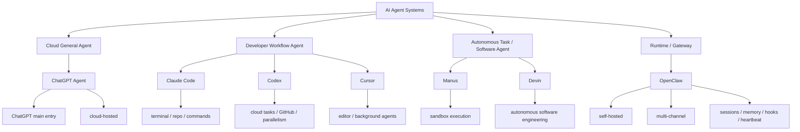

# AI Agent Product Positioning Map

## 怎么读这张图

- 这不是“谁更强”的图，而是“谁主要在解决什么问题”的图
- `ChatGPT Agent` 更偏通用入口型
- `Claude Code`、`Codex`、`Cursor` 更偏 developer workflow，但入口和执行方式不同
- `Manus`、`Devin` 更偏更高自治的任务 / 软件工程代理
- `OpenClaw` 更偏运行时基础设施型

## 关联

- [[../09-Systems/ChatGPT Agent|ChatGPT Agent]]
- [[../09-Systems/Claude Code|Claude Code]]
- [[../09-Systems/Codex|Codex]]
- [[../09-Systems/Cursor|Cursor]]
- [[../09-Systems/Devin|Devin]]
- [[../09-Systems/Manus|Manus]]
- [[../09-Systems/OpenClaw|OpenClaw]]
- [[../09-Systems/AI Agent Systems 对比：OpenClaw、ChatGPT Agent、Claude Code、Manus|AI Agent Systems 对比：OpenClaw、ChatGPT Agent、Claude Code、Manus]]
- [[AI Coding Agent Positioning Map]]
- [[../09-Systems/AI Coding Agent Systems 对比：Claude Code、Codex、Cursor、Devin|AI Coding Agent Systems 对比：Claude Code、Codex、Cursor、Devin]]
