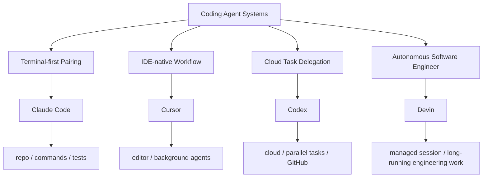

# AI Coding Agent Positioning Map

## 怎么读这张图

- 这不是能力排行榜，而是入口与工作方式图
- `Claude Code` 最适合拿来理解 terminal-first coding agent
- `Cursor` 最适合拿来理解 IDE-native agent
- `Codex` 最适合拿来理解 cloud-first / delegated coding agent
- `Devin` 最适合拿来理解更强自治的软件工程 agent

## 相关

- [[../09-Systems/Claude Code|Claude Code]]
- [[../09-Systems/Codex|Codex]]
- [[../09-Systems/Cursor|Cursor]]
- [[../09-Systems/Devin|Devin]]
- [[../09-Systems/AI Coding Agent Systems 对比：Claude Code、Codex、Cursor、Devin|AI Coding Agent Systems 对比：Claude Code、Codex、Cursor、Devin]]
- [[AI Agent Product Positioning Map]]
