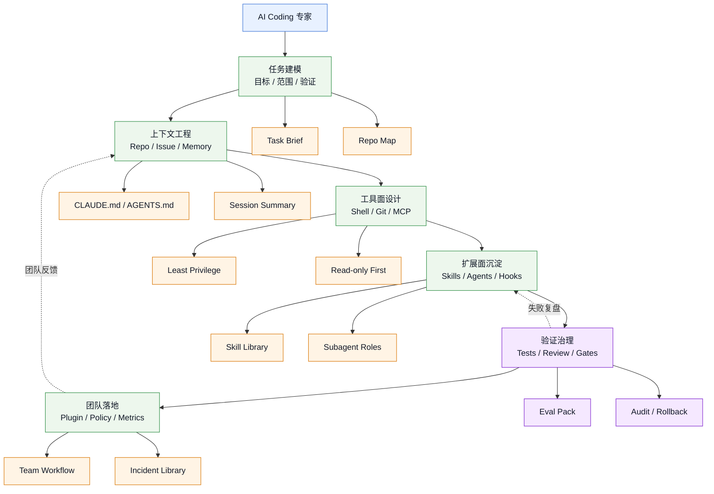

# AI Coding 专家能力图谱

## 图谱意图

这是一张 `capability-map`，回答一个问题：

> 个人如何从“会用 coding agent”成长为“能设计 AI Coding 工作台”的专家？

## 图谱

## 怎么读

- 左到右是成长路径：先会描述任务，再会管理上下文，再会控制工具，最后形成团队能力
- `扩展面沉淀` 是分水岭：没有沉淀，AI Coding 只是一次次临时对话
- `验证治理` 是上线门槛：没有测试、review、审计、回滚，就不能进入真实工程机制

## 推荐钻取

- [[../06-Topics/AI Coding 专家能力体系|AI Coding 专家能力体系]]
- [[Claude Code 生态能力图]]
- [[../../AI-Engineering/08-Maps/AI Coding 团队落地路线图|AI Coding 团队落地路线图]]
- [[../../AI-Engineering/08-Maps/AI Coding 安全治理决策图|AI Coding 安全治理决策图]]

