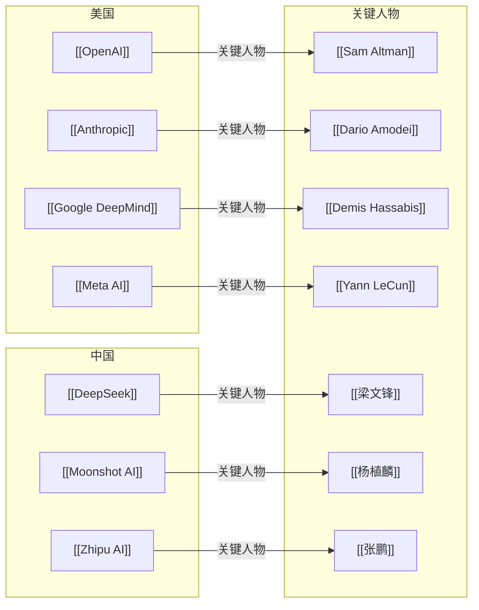

# AI Company-People Map

> 这一张图只看公司与关键人物的关系。

## 怎么看这张图

- 这张图适合先建立“公司是谁在代表”的感知
- 后面如果你补更多公司，优先先把关键人物挂上来
- 如果一个人物跨多个组织活动，也可以继续扩展这里

## 返回

- [[AI Ecosystem Map]]
- [[AI Company-Models Map]]
- [[AI Topic-Papers Map]]
