# AI Ecosystem Map

## 地图结构

- 当前页是总图，用来把公司、人物、模型、论文、主题串起来
- 子图 1：[[AI Company-People Map]]
- 子图 2：[[AI Company-Models Map]]
- 子图 3：[[AI Topic-Papers Map]]
- 子图 4：[[过去半年全球 AI 前沿动态图]]
- 子图 5：[[AI 前沿主题演化图]]
- 子图 6：[[AI Infra 与推理服务生态图]]
- Canvas 版本：[[AI Ecosystem Map.canvas]]
- Excalidraw 版本：[[AI Ecosystem Map Excalidraw]]

## 总览图

```mermaid
graph TD
    subgraph companies["公司"]
        openai["[[OpenAI]]"]
        anthropic["[[Anthropic]]"]
        deepseek["[[DeepSeek]]"]
        gdm["[[Google DeepMind]]"]
        meta["[[Meta AI]]"]
        moonshot["[[Moonshot AI]]"]
        zhipu["[[Zhipu AI]]"]
        alibaba["[[Alibaba Cloud]]"]
        baidu["[[Baidu]]"]
        minimax["[[MiniMax]]"]
        mistralc["[[Mistral AI]]"]
        coherec["[[Cohere]]"]
        xai["[[xAI]]"]
    end

    subgraph people["人物"]
        sam["[[Sam Altman]]"]
        dario["[[Dario Amodei]]"]
        liang["[[梁文锋]]"]
        demis["[[Demis Hassabis]]"]
        yann["[[Yann LeCun]]"]
        yang["[[杨植麟]]"]
        zhang["[[张鹏]]"]
    end

    subgraph models["模型 / 产品"]
        gpt["[[GPT 系列]]"]
        claude["[[Claude 系列]]"]
        r1["[[DeepSeek-R1]]"]
        gemini["[[Gemini 系列]]"]
        llama["[[Llama 系列]]"]
        kimi["[[Kimi]]"]
        glm["[[GLM 系列]]"]
        qwen["[[Qwen 系列]]"]
        ernie["[[ERNIE 系列]]"]
        grok["[[Grok]]"]
        minimaxm["[[MiniMax 系列]]"]
        mistralm["[[Mistral 系列]]"]
        aya["[[Aya 系列]]"]
    end

    subgraph papers["论文 / 技术报告"]
        fewshot["[[Language Models are Few-Shot Learners]]"]
        constitutional["[[Constitutional AI]]"]
        r1report["[[DeepSeek-R1 Technical Report]]"]
        qwenreport["[[Qwen Technical Report]]"]
        ernireport["[[ERNIE Technical Report]]"]
        grokreport["[[Grok Technical Overview]]"]
        minimaxreport["[[MiniMax Technical Report]]"]
    end

    subgraph topics["主题"]
        foundation["[[Foundation Models]]"]
        reasoning["[[Reasoning Models]]"]
        safety["[[AI Safety]]"]
        openweight["[[Open-Weight Models]]"]
        china["[[China AI Ecosystem]]"]
        multimodal["[[Multimodal Models]]"]
        longcontext["[[Long Context]]"]
        workbench["[[AI Coding Workbench]]"]
        sovereign["[[Sovereign AI]]"]
        documentai["[[OCR 与 Document AI]]"]
    end

    openai -->|关键人物| sam
    anthropic -->|关键人物| dario
    deepseek -->|关键人物| liang
    gdm -->|关键人物| demis
    meta -->|关键人物| yann
    moonshot -->|关键人物| yang
    zhipu -->|关键人物| zhang

    openai -->|代表模型| gpt
    anthropic -->|代表模型| claude
    deepseek -->|代表模型| r1
    gdm -->|代表模型| gemini
    meta -->|代表模型| llama
    moonshot -->|代表产品| kimi
    zhipu -->|代表模型| glm
    alibaba -->|代表模型| qwen
    baidu -->|代表模型| ernie
    minimax -->|代表模型| minimaxm
    mistralc -->|代表模型| mistralm
    coherec -->|代表模型| aya
    xai -->|代表产品| grok

    gpt -->|相关论文| fewshot
    claude -->|相关论文| constitutional
    r1 -->|技术报告| r1report
    qwen -->|技术报告| qwenreport
    ernie -->|技术报告| ernireport
    grok -->|技术说明| grokreport
    minimaxm -->|技术报告| minimaxreport

    foundation -->|底座模型| gpt
    foundation -->|底座模型| claude
    foundation -->|底座模型| gemini
    foundation -->|底座模型| glm
    foundation -->|底座模型| qwen
    foundation -->|底座模型| ernie
    foundation -->|底座模型| mistralm
    reasoning -->|覆盖| gpt
    reasoning -->|覆盖| claude
    reasoning -->|覆盖| r1
    reasoning -->|覆盖| gemini
    reasoning -->|覆盖| grok
    safety -->|重点关注| claude
    openweight -->|重点关注| llama
    openweight -->|重点关注| r1
    openweight -->|重点关注| qwen
    openweight -->|重点关注| mistralm
    multimodal -->|重点关注| gemini
    multimodal -->|重点关注| llama
    multimodal -->|重点关注| qwen
    multimodal -->|重点关注| minimaxm
    multimodal -->|重点关注| mistralm
    longcontext -->|重点关注| claude
    longcontext -->|重点关注| kimi
    workbench -->|重点关注| openai
    workbench -->|重点关注| anthropic
    workbench -->|重点关注| gdm
    workbench -->|重点关注| alibaba
    sovereign -->|重点关注| coherec
    sovereign -->|重点关注| anthropic
    sovereign -->|重点关注| xai
    sovereign -->|重点关注| baidu
    documentai -->|重点关注| mistralm
    documentai -->|重点关注| glm
    documentai -->|重点关注| ernie
    china -->|重点关注| deepseek
    china -->|重点关注| liang
    china -->|重点关注| moonshot
    china -->|重点关注| zhipu
    china -->|重点关注| alibaba
    china -->|重点关注| baidu
    china -->|重点关注| minimax
```

## 阅读顺序建议

1. 先看 [[AI Company-People Map]]
2. 再看 [[AI Company-Models Map]]
3. 再看 [[AI Topic-Papers Map]]
4. 再看 [[过去半年全球 AI 前沿动态图]] 和 [[AI 前沿主题演化图]]
5. 再看 [[AI Infra 与推理服务生态图]]
6. 最后回到当前总图

## 对应笔记

- 公司：[[OpenAI]]、[[Anthropic]]、[[DeepSeek]]、[[Google DeepMind]]、[[Meta AI]]、[[Moonshot AI]]、[[Zhipu AI]]、[[Alibaba Cloud]]、[[Baidu]]、[[MiniMax]]、[[Mistral AI]]、[[Cohere]]、[[xAI]]
- 人物：[[Sam Altman]]、[[Dario Amodei]]、[[梁文锋]]、[[Demis Hassabis]]、[[Yann LeCun]]、[[杨植麟]]、[[张鹏]]
- 模型：[[GPT 系列]]、[[Claude 系列]]、[[DeepSeek-R1]]、[[Gemini 系列]]、[[Llama 系列]]、[[Kimi]]、[[GLM 系列]]、[[Qwen 系列]]、[[ERNIE 系列]]、[[Grok]]、[[MiniMax 系列]]、[[Mistral 系列]]、[[Aya 系列]]
- 论文：[[Language Models are Few-Shot Learners]]、[[Constitutional AI]]、[[DeepSeek-R1 Technical Report]]、[[Qwen Technical Report]]、[[ERNIE Technical Report]]、[[Grok Technical Overview]]、[[MiniMax Technical Report]]
- 主题：[[Foundation Models]]、[[Reasoning Models]]、[[AI Safety]]、[[Open-Weight Models]]、[[China AI Ecosystem]]、[[Multimodal Models]]、[[Long Context]]、[[AI Coding Workbench]]、[[Sovereign AI]]、[[OCR 与 Document AI]]、[[AI 基础设施与 GPU Cloud]]、[[Inference Serving]]

## 说明

如果后面节点继续增加，优先扩展子图，不要直接把所有节点堆进总图。
