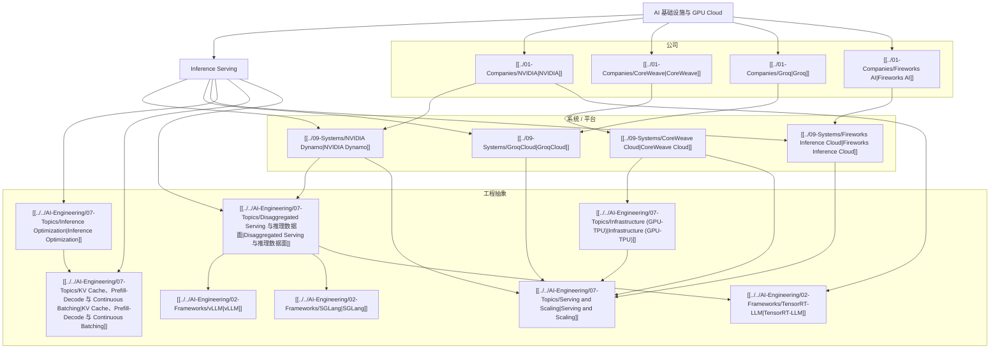

# AI Infra 与推理服务生态图

## 怎么读这张图

- `AI 基础设施与 GPU Cloud` 看的是供给与平台底座
- `Inference Serving` 看的是能力如何被稳定、低成本地交付
- 公司页回答“谁在这个市场里占位”
- 系统页回答“它们把能力包装成了什么平台或数据面”
- 工程页回答“这些平台背后的真正系统问题是什么”

## 推荐顺序

1. [[../06-Topics/AI 基础设施与 GPU Cloud|AI 基础设施与 GPU Cloud]]
2. [[../06-Topics/Inference Serving|Inference Serving]]
3. [[../01-Companies/NVIDIA|NVIDIA]]
4. [[../01-Companies/CoreWeave|CoreWeave]]
5. [[../01-Companies/Groq|Groq]]
6. [[../01-Companies/Fireworks AI|Fireworks AI]]
7. [[../09-Systems/NVIDIA Dynamo|NVIDIA Dynamo]]
8. [[../09-Systems/CoreWeave Cloud|CoreWeave Cloud]]
9. [[../09-Systems/GroqCloud|GroqCloud]]
10. [[../09-Systems/Fireworks Inference Cloud|Fireworks Inference Cloud]]
11. [[../../AI-Engineering/08-Maps/Inference and Serving Map|Inference and Serving Map]]

## 关联

- [[AI Ecosystem Map]]
- [[AI Company-Systems Map]]
- [[../../AI-Engineering/08-Maps/Inference and Serving Map|Inference and Serving Map]]
