# AI Topic-Papers Map

> 这一张图把主题、模型和论文 / 技术报告串起来。

```mermaid
graph TD
    subgraph topics["主题"]
        foundation["[[Foundation Models]]"]
        reasoning["[[Reasoning Models]]"]
        safety["[[AI Safety]]"]
        openweight["[[Open-Weight Models]]"]
        china["[[China AI Ecosystem]]"]
        multimodal["[[Multimodal Models]]"]
        longcontext["[[Long Context]]"]
    end

    subgraph models["模型"]
        gpt["[[GPT 系列]]"]
        claude["[[Claude 系列]]"]
        r1["[[DeepSeek-R1]]"]
        gemini["[[Gemini 系列]]"]
        llama["[[Llama 系列]]"]
        kimi["[[Kimi]]"]
        glm["[[GLM 系列]]"]
        qwen["[[Qwen 系列]]"]
        ernie["[[ERNIE 系列]]"]
        grok["[[Grok]]"]
        minimaxm["[[MiniMax 系列]]"]
    end

    subgraph papers["论文 / 技术报告"]
        fewshot["[[Language Models are Few-Shot Learners]]"]
        constitutional["[[Constitutional AI]]"]
        r1report["[[DeepSeek-R1 Technical Report]]"]
        attention["[[Attention Is All You Need]]"]
        geminireport["[[Gemini Technical Report]]"]
        llamareport["[[Llama 3 Herd of Models]]"]
        glmreport["[[GLM Technical Report]]"]
        kimireport["[[Kimi Technical Report]]"]
        qwenreport["[[Qwen Technical Report]]"]
        ernireport["[[ERNIE Technical Report]]"]
        grokreport["[[Grok Technical Overview]]"]
        minimaxreport["[[MiniMax Technical Report]]"]
    end

    foundation --> gpt
    foundation --> claude
    foundation --> gemini
    foundation --> glm
    foundation --> qwen
    foundation --> ernie
    reasoning --> gpt
    reasoning --> claude
    reasoning --> r1
    reasoning --> gemini
    safety --> claude
    openweight --> llama
    openweight --> r1
    openweight --> qwen
    multimodal --> gpt
    multimodal --> gemini
    multimodal --> llama
    multimodal --> qwen
    multimodal --> minimaxm
    longcontext --> claude
    longcontext --> kimi
    china --> r1
    china --> kimi
    china --> glm
    china --> qwen
    china --> ernie
    china --> minimaxm
    reasoning --> grok

    gpt --> fewshot
    gpt -.-> attention
    claude --> constitutional
    claude -.-> attention
    r1 --> r1report
    r1 -.-> attention
    gemini -.-> attention
    gemini --> geminireport
    glm -.-> attention
    glm --> glmreport
    llama -.-> attention
    llama --> llamareport
    kimi --> kimireport
    qwen -.-> attention
    qwen --> qwenreport
    ernie --> ernireport
    grok --> grokreport
    minimaxm --> minimaxreport
```

## 怎么看这张图

- 这张图适合把“主题”与“论文”连起来看
- 论文不是孤立读物，而是理解模型和主题的入口
- 后续可以继续加 benchmark、技术路线和争议事件

## 返回

- [[AI Ecosystem Map]]
- [[AI Company-People Map]]
- [[AI Company-Models Map]]
