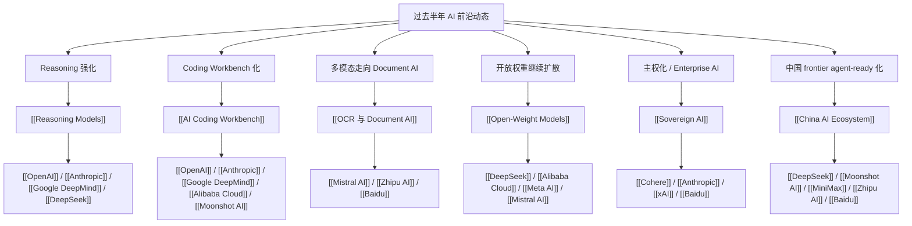

# AI 前沿主题演化图

## 怎么读这张图

- 这张图不是时间线，而是“最近半年到底沉淀出哪些 durable themes”。
- 如果你已经读过新闻总结和时间线，这张图适合帮你把短期事件压成长期框架。

## 推荐搭配阅读

1. [[../05-News/过去半年全球 AI 前沿动态（2025-09-25 至 2026-03-25）|过去半年全球 AI 前沿动态（2025-09-25 至 2026-03-25）]]
2. [[Reasoning Models]]
3. [[AI Coding Workbench]]
4. [[OCR 与 Document AI]]
5. [[Open-Weight Models]]
6. [[Sovereign AI]]
7. [[China AI Ecosystem]]
