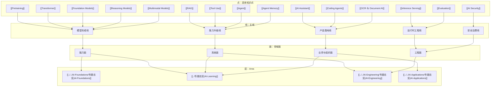

# AI 知识点点线面图

> 这页不是替代 `AI Ecosystem Map`。
> `AI Ecosystem Map` 更偏对象关系，这页更偏知识结构关系。

## 这张图解决什么问题

- 一个知识点属于哪条主线
- 一条主线落在哪个领域面
- 一个领域面应该主要去哪个 area 深化
- 你下次回来应该从哪条 trunk 重启

## 点线面层总图

## 五条最值得重投入的主线

### 1. 模型形成线

`Pretraining -> Transformer -> Foundation Models -> Reasoning / Multimodal`

- 适合解决：为什么某些模型能力强、为什么能力边界会变
- drill-down：[[../06-Topics/模型形成线：Pretraining、Transformer、Foundation Models、Reasoning 与 Multimodal|模型形成线：Pretraining、Transformer、Foundation Models、Reasoning 与 Multimodal]]
- 主要 area：[[../../AI-Foundations/专题总览|AI-Foundations]]、[[../专题总览|AI-Learning]]

### 2. 能力升级线

`Prompt -> Context -> Retrieval -> Tool Use -> Agent -> Memory -> Multi-Agent`

- 适合解决：模型怎样变成可执行系统
- drill-down：[[../06-Topics/能力升级线：Prompt、Context、RAG、Tool Use、Agent、Memory 与 Multi-Agent|能力升级线：Prompt、Context、RAG、Tool Use、Agent、Memory 与 Multi-Agent]]
- 主要 area：[[../专题总览|AI-Learning]]、[[../../AI-Engineering/专题总览|AI-Engineering]]

### 3. 运行时工程线

`Inference -> Serving -> Evaluation -> Release Gate`

- 适合解决：为什么 demo 和生产系统差这么多
- drill-down：[[../06-Topics/运行时工程线：Inference、Serving、Evaluation、Release Gate 与 Security|运行时工程线：Inference、Serving、Evaluation、Release Gate 与 Security]]
- 主要 area：[[../../AI-Engineering/专题总览|AI-Engineering]]

### 4. 安全治理线

`AI Safety -> AI Security -> Prompt Injection -> Tool Safety -> Approval / Audit`

- 适合解决：为什么 AI 系统不能只看准确率，还要看风险边界
- drill-down：[[../06-Topics/安全治理线：AI Safety、AI Security、Prompt Injection、Approval、Audit 与 Release Gate|安全治理线：AI Safety、AI Security、Prompt Injection、Approval、Audit 与 Release Gate]]
- 主要 area：[[../专题总览|AI-Learning]]、[[../../AI-Engineering/专题总览|AI-Engineering]]、[[../../AI-Applications/专题总览|AI-Applications]]

### 5. 产品落地线

`Model/API -> Product Surface -> Workflow -> Rollout -> ROI`

- 适合解决：能力怎样真正进入产品和组织
- drill-down：[[../06-Topics/产品落地线：Model、Workflow、Case Study、Rollout、ROI 与 Governance|产品落地线：Model、Workflow、Case Study、Rollout、ROI 与 Governance]]
- 主要 area：[[../../AI-Applications/专题总览|AI-Applications]]

## 怎么用这张图

1. 先判断你手上的问题是一个 `点`、一条 `线`，还是一个 `面`
2. 如果只是点，往上找它属于哪条主线
3. 如果是线，再看它主要落在哪个领域面
4. 最后去对应 area 深挖，而不是在全 vault 里盲搜
5. 如果你已经知道主干，但想把它变成判断体系，就转到 [[../06-Topics/AI 五条主干专家工作台|AI 五条主干专家工作台]]

## 建议重启顺序

如果你想系统回顾整个 AI 域，建议：

1. [[../06-Topics/AI 领域知识点总纲：点、线、面与层|AI 领域知识点总纲：点、线、面与层]]
2. [[AI 五大专题审察与组织]]
3. [[../06-Topics/模型形成线：Pretraining、Transformer、Foundation Models、Reasoning 与 Multimodal|模型形成线：Pretraining、Transformer、Foundation Models、Reasoning 与 Multimodal]]
4. [[../06-Topics/能力升级线：Prompt、Context、RAG、Tool Use、Agent、Memory 与 Multi-Agent|能力升级线：Prompt、Context、RAG、Tool Use、Agent、Memory 与 Multi-Agent]]
5. [[../06-Topics/运行时工程线：Inference、Serving、Evaluation、Release Gate 与 Security|运行时工程线：Inference、Serving、Evaluation、Release Gate 与 Security]]
6. [[../06-Topics/安全治理线：AI Safety、AI Security、Prompt Injection、Approval、Audit 与 Release Gate|安全治理线：AI Safety、AI Security、Prompt Injection、Approval、Audit 与 Release Gate]]
7. [[../06-Topics/产品落地线：Model、Workflow、Case Study、Rollout、ROI 与 Governance|产品落地线：Model、Workflow、Case Study、Rollout、ROI 与 Governance]]
8. [[../06-Topics/AI 五条主干专家工作台|AI 五条主干专家工作台]]

## 关联

- [[../06-Topics/AI 领域知识点总纲：点、线、面与层|AI 领域知识点总纲：点、线、面与层]]
- [[../06-Topics/模型形成线：Pretraining、Transformer、Foundation Models、Reasoning 与 Multimodal|模型形成线：Pretraining、Transformer、Foundation Models、Reasoning 与 Multimodal]]
- [[../06-Topics/能力升级线：Prompt、Context、RAG、Tool Use、Agent、Memory 与 Multi-Agent|能力升级线：Prompt、Context、RAG、Tool Use、Agent、Memory 与 Multi-Agent]]
- [[../06-Topics/运行时工程线：Inference、Serving、Evaluation、Release Gate 与 Security|运行时工程线：Inference、Serving、Evaluation、Release Gate 与 Security]]
- [[../06-Topics/安全治理线：AI Safety、AI Security、Prompt Injection、Approval、Audit 与 Release Gate|安全治理线：AI Safety、AI Security、Prompt Injection、Approval、Audit 与 Release Gate]]
- [[../06-Topics/产品落地线：Model、Workflow、Case Study、Rollout、ROI 与 Governance|产品落地线：Model、Workflow、Case Study、Rollout、ROI 与 Governance]]
- [[../06-Topics/AI 五条主干专家工作台|AI 五条主干专家工作台]]
- [[AI Ecosystem Map]]
- [[地图索引]]
- [[../06-Topics/AI 主题索引|AI 主题索引]]
