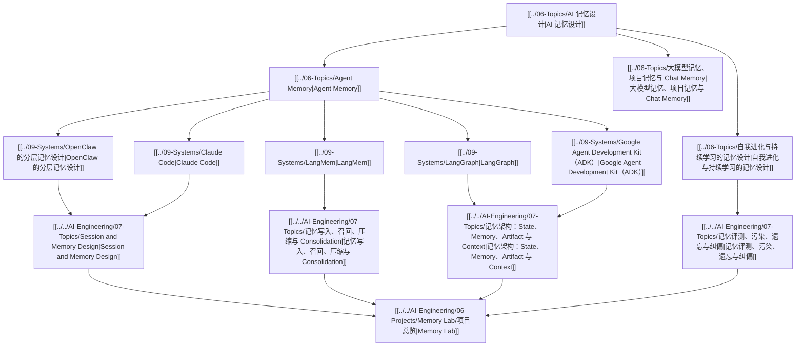

# AI 记忆设计图

## 怎么读

- 上层先区分 memory 的抽象类型
- 中层看各家系统如何把 memory 做成正式能力
- 下层再看 engineering pattern 和实验项目

## 关联

- [[AI Agent Capability Map]]
- [[AI 记忆学习导航.canvas|AI 记忆学习导航（Canvas）]]
- [[AI 记忆学习导航.base|AI 记忆学习导航（Base）]]
- [[../../AI-Engineering/08-Maps/AI Memory Engineering Map|AI Memory Engineering Map]]
