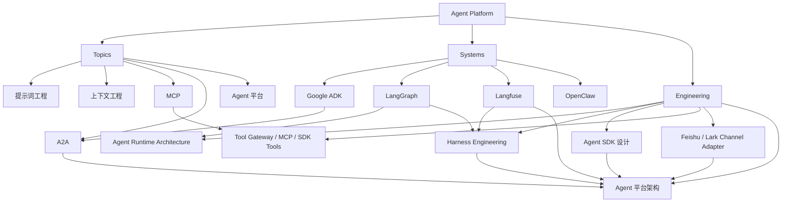

# Agent 平台生态图

## 怎么读这张图

- `Topic` 层回答：平台为什么会出现
- `System` 层回答：具体用哪些 runtime / framework / observability system
- `Engineering` 层回答：怎么把这些东西真正拼成一个平台

## 推荐顺序

1. [[../06-Topics/Agent 平台|Agent 平台]]
2. [[../09-Systems/Google Agent Development Kit（ADK）|Google Agent Development Kit（ADK）]]
3. [[../09-Systems/LangGraph|LangGraph]]
4. [[../09-Systems/Langfuse|Langfuse]]
5. [[../../AI-Engineering/07-Topics/Agent SDK 设计|Agent SDK 设计]]
6. [[../../AI-Engineering/07-Topics/Tool Gateway、MCP Servers 与 SDK Tools|Tool Gateway、MCP Servers 与 SDK Tools]]
7. [[../../AI-Engineering/07-Topics/飞书与 Lark 作为 Agent Channel Adapter|飞书与 Lark 作为 Agent Channel Adapter]]
8. [[../../AI-Engineering/07-Topics/Agent 平台架构（LangGraph、Langfuse、ADK）|Agent 平台架构（LangGraph、Langfuse、ADK）]]

## 关联

- [[AI Agent Systems Map]]
- [[AI Agent Capability Map]]
- [[Agent Prompt-Context-Harness Map]]
- [[../../AI-Engineering/08-Maps/Agent 平台技术栈图|Agent 平台技术栈图]]
