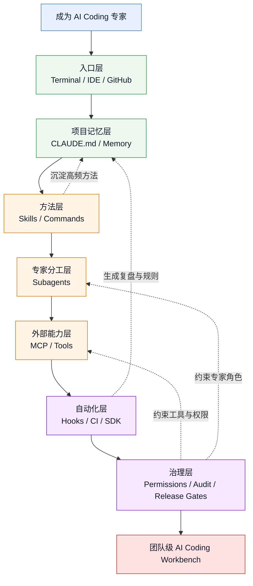

# Claude Code 生态能力图

## 图谱

## 怎么读

- 从 `入口层` 到 `治理层` 是从个人使用到团队操作系统的升级路径
- `Skills / Commands` 解决“方法复用”
- `Subagents` 解决“专家分工”
- `MCP / Tools` 解决“外部上下文与动作”
- `Hooks / CI / SDK` 解决“自动化闭环”
- `Permissions / Audit / Release Gates` 解决“可控和可上线”

## 相关

- [[../09-Systems/Claude Code 生态全景|Claude Code 生态全景]]
- [[../09-Systems/Claude Code 能力安装清单|Claude Code 能力安装清单]]
- [[../09-Systems/Claude Code 自定义能力工作台：Skills、Plugins、Hooks、MCP|Claude Code 自定义能力工作台：Skills、Plugins、Hooks、MCP]]
- [[../../AI-Engineering/07-Topics/Claude Code Harness 工程实践|Claude Code Harness 工程实践]]

