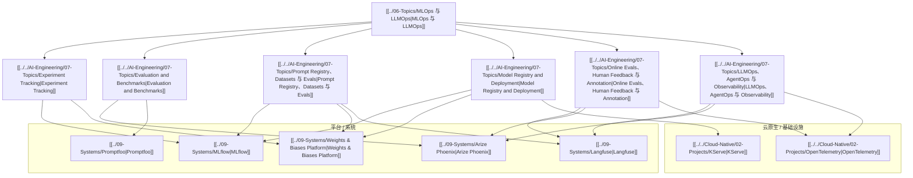

# MLOps 与 LLMOps 生态图

## 怎么读这张图

- 左边是生命周期问题
- 中间是平台层
- 右下是承接这些平台的云原生基础设施

真正重要的不是某个工具单点强不强，而是：

- 它在哪个生命周期节点最强
- 它和其它层怎么拼起来
- 它更适合 `experiment system`、`release gate`，还是 `production feedback loop`

## 推荐顺序

1. [[../06-Topics/MLOps 与 LLMOps|MLOps 与 LLMOps]]
2. [[../../AI-Engineering/08-Maps/MLOps 与 LLMOps 工程图|MLOps 与 LLMOps 工程图]]
3. [[../09-Systems/MLflow|MLflow]]
4. [[../09-Systems/Weights & Biases Platform|Weights & Biases Platform]]
5. [[../09-Systems/Langfuse|Langfuse]]
6. [[../09-Systems/Arize Phoenix|Arize Phoenix]]
7. [[../09-Systems/Promptfoo|Promptfoo]]

## 关联

- [[AI Infra 与推理服务生态图]]
- [[Agent 平台生态图]]
- [[../../AI-Engineering/08-Maps/AI Engineering Stack Map|AI Engineering Stack Map]]
