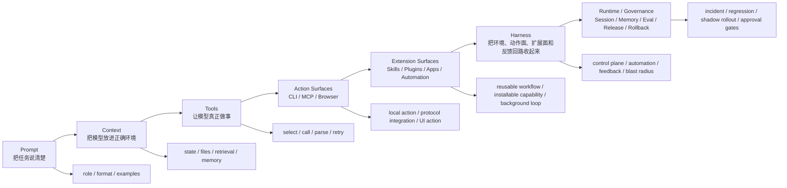

# Prompt、Context、Tools 与 Harness 渐进图

## 怎么读这张图

- `Prompt` 不是过时层，而是最内层控制
- `Context` 决定模型在这一轮到底看见什么
- `Tools` 让系统从理解走向执行
- `CLI / MCP / Browser` 是不同动作面，不是简单二选一
- `Skills / Plugins / Apps / Automation` 是扩展面和持续执行层
- `Harness` 是把前面这些能力收进同一个工作台
- `Runtime / Governance` 是系统进入长期运行之后的运营层

## 推荐顺序

1. [[../06-Topics/提示词工程|提示词工程]]
2. [[../06-Topics/上下文工程|上下文工程]]
3. [[../06-Topics/Tool Use|Tool Use]]
4. [[../06-Topics/从提示词到 Harness：Agent 能力的渐进式主线|从提示词到 Harness：Agent 能力的渐进式主线]]
5. [[../06-Topics/MCP（Model Context Protocol）|MCP（Model Context Protocol）]]
6. [[../06-Topics/Browser Agents 与 Computer Use|Browser Agents 与 Computer Use]]
7. [[../../AI-Engineering/07-Topics/MCP 与 CLI 模式|MCP 与 CLI 模式]]
8. [[../../AI-Engineering/07-Topics/Prompt、Context、Tools、CLI、Skills、Plugins 与 Harness 的工程分层|Prompt、Context、Tools、CLI、Skills、Plugins 与 Harness 的工程分层]]
9. [[../../AI-Engineering/07-Topics/Harness Engineering|Harness Engineering]]
10. [[../../AI-Engineering/07-Topics/技能、插件、应用与自动化：Harness 的扩展面|技能、插件、应用与自动化：Harness 的扩展面]]
11. [[../../AI-Engineering/07-Topics/Harness 工作流模式：Terminal、Desktop、Cloud 与 Channel|Harness 工作流模式：Terminal、Desktop、Cloud 与 Channel]]
12. [[../../AI-Engineering/07-Topics/Hooks、Cron、CI 与 Background Agents：Harness 自动化闭环|Hooks、Cron、CI 与 Background Agents：Harness 自动化闭环]]
13. [[../../AI-Engineering/07-Topics/Agent Runtime Architecture|Agent Runtime Architecture]]
14. [[../../AI-Engineering/07-Topics/Session and Memory Design|Session and Memory Design]]
15. [[../../AI-Engineering/07-Topics/Runtime 发布门槛、灰度与 Blast Radius 控制|Runtime 发布门槛、灰度与 Blast Radius 控制]]

## 关联

- [[Agent Prompt-Context-Harness Map]]
- [[AI Agent Capability Map]]
- [[../../AI-Engineering/08-Maps/Harness Engineering 与 Agent 扩展生态图|Harness Engineering 与 Agent 扩展生态图]]
- [[../../AI-Engineering/08-Maps/Harness 工作流与自动化模式图|Harness 工作流与自动化模式图]]
