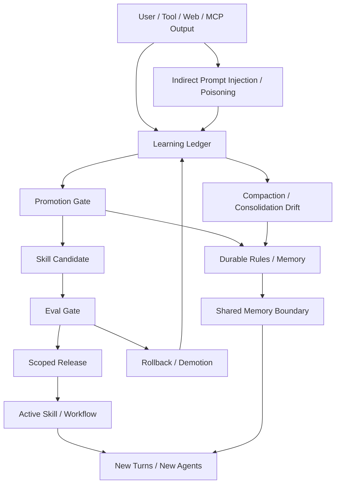

# Self-Improving Memory 风险与治理图

## 怎么读

- 左边是风险输入面：tool、web、MCP、retrieval 都可能带来 poisoning
- 中间是治理面：learning、promotion、eval、release
- 右边是扩散面：一旦进入 active skill，问题会从单次错误变成跨 session 复用

## 关联

- [[../06-Topics/记忆污染、Memory Poisoning 与自改进风险|记忆污染、Memory Poisoning 与自改进风险]]
- [[../../AI-Engineering/07-Topics/自改进记忆的 Incident Library、Poisoning 与 Failure Cases|自改进记忆的 Incident Library、Poisoning 与 Failure Cases]]
- [[../../AI-Engineering/07-Topics/自改进 Skill 的 Eval Gate、Release Gate 与 Rollback|自改进 Skill 的 Eval Gate、Release Gate 与 Rollback]]
- [[../../AI-Engineering/07-Topics/共享记忆边界：用户、项目、多 Agent 与租户隔离|共享记忆边界：用户、项目、多 Agent 与租户隔离]]
