# 过去半年全球 AI 前沿动态图

```mermaid
flowchart TD
  A["过去半年全球 AI 前沿动态
2025-09-25 至 2026-03-25"] --> B["闭源 frontier 加速"]
  A --> C["agent / coding 平台化"]
  A --> D["中国厂商强化 reasoning + agent"]
  A --> E["开放权重与全球化路线"]
  A --> F["主权化 / enterprise AI"]
  A --> G["原生多模态 / OCR / computer use"]

  B --> B1["[[OpenAI]]
GPT-5.2-Codex / GPT-5.3-Codex / GPT-5.4"]
  B --> B2["[[Anthropic]]
Sonnet 4.5 / 4.6, Opus 4.x"]
  B --> B3["[[Google DeepMind]]
Gemini 3 / 3.1 Flash-Lite"]
  B --> B4["[[xAI]]
Grok 4.1 / 4.1 Fast"]

  C --> C1["[[OpenAI]]
Codex GA / AgentKit / App Server / Harness"]
  C --> C2["[[Anthropic]]
Claude Agent SDK / Xcode integration"]
  C --> C3["[[Google DeepMind]]
Google Antigravity"]
  C --> C4["[[xAI]]
Agent Tools API"]
  C --> C5["[[Alibaba Cloud]]
Qwen Code"]

  D --> D1["[[DeepSeek]]
V3.2 reasoning-first for agents"]
  D --> D2["[[Moonshot AI]]
Kimi K2 Thinking / CLI"]
  D --> D3["[[MiniMax]]
M2.5"]
  D --> D4["[[Zhipu AI]]
GLM-5 / GLM-4.7 / GLM-4.6V"]
  D --> D5["[[Baidu]]
ERNIE 5.0"]

  E --> E1["[[Mistral AI]]
Mistral 3 / OCR 3"]
  E --> E2["[[Cohere]]
Tiny Aya 2.0 / multilingual"]

  F --> F1["[[Cohere]]
SAP sovereign AI"]
  F --> F2["[[xAI]]
Grok Business / Enterprise"]
  F --> F3["[[Anthropic]]
GOV.UK"]
  F --> F4["[[Baidu]]
千帆平台承载文心 5.0"]

  G --> G1["[[Anthropic]]
computer use 更成熟"]
  G --> G2["[[Google DeepMind]]
Gemini 3 agentic + multimodal"]
  G --> G3["[[Mistral AI]]
OCR 3"]
  G --> G4["[[Zhipu AI]]
GLM-4.6V / GLM-OCR"]
  G --> G5["[[Baidu]]
原生全模态统一建模"]
```

## 怎么读这张图

- `闭源 frontier 加速`：看谁在把 reasoning、coding、computer use 继续往上拉。
- `agent / coding 平台化`：看谁不只是发模型，而是在发 SDK、tool surface、app server、workbench。
- `中国厂商强化 reasoning + agent`：看中国头部厂商如何从 benchmark 竞争走向 agent-ready 叙事。
- `开放权重与全球化路线`：看欧洲 / 加拿大公司如何在 multilingual、OCR、sovereign AI 上保持独特路线。
- `主权化 / enterprise AI`：看 AI 如何从消费与开发者层进入组织级部署。
- `原生多模态 / OCR / computer use`：看 frontier 模型如何从“文本推理”扩展到可执行、多模态与文档理解。

## 推荐搭配阅读

1. [[../05-News/过去半年全球 AI 前沿动态（2025-09-25 至 2026-03-25）|过去半年全球 AI 前沿动态（2025-09-25 至 2026-03-25）]]
2. [[../05-News/全球 AI 前沿动态时间线（2025-09-25 至 2026-03-25）|全球 AI 前沿动态时间线（2025-09-25 至 2026-03-25）]]
3. [[AI Ecosystem Map]]
4. [[AI Company-Models Map]]
5. [[AI Company-Systems Map]]
