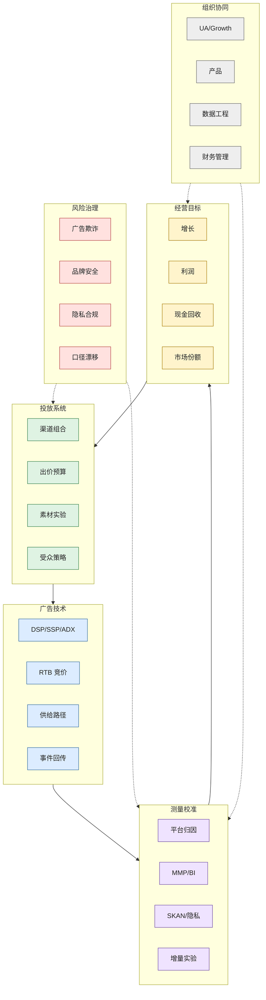

# 广告投放总览图

> 图类型：panorama-map。它回答的问题是：广告投放作为一个知识系统，由哪些层组成，它们如何互相约束。

## 读图方式

- 从上方经营目标开始：广告不是买流量，而是买可持续增长。
- 中间是投放系统和广告技术：决定能不能以合适成本拿到合适流量。
- 测量校准把平台信号翻译成经营判断。
- 风险治理和组织协同是两条护栏，影响所有层。

## 下钻

- [[指标体系与口径治理|指标体系与口径治理]]
- [[RTB 与程序化广告链路|RTB 与程序化广告链路]]
- [[归因、SKAN 与信号损失|归因、SKAN 与信号损失]]

