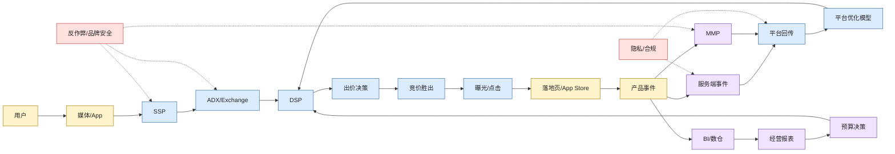

# 广告投放链路架构图

> 图类型：layered-architecture。它回答的问题是：一次广告请求、一次转化和后续优化数据如何流动。

## 专家看点

- 竞价链路看的是延迟、信号、出价和供给质量。
- 数据回流看的是事件准确性、去重、延迟、隐私约束和平台匹配。
- 经营闭环看的是平台优化和 BI/财务决策之间是否对齐。

## 下钻

- [[RTB 与程序化广告链路|RTB 与程序化广告链路]]
- [[归因、SKAN 与信号损失|归因、SKAN 与信号损失]]
- [[渠道异常排查 Runbook|渠道异常排查 Runbook]]

