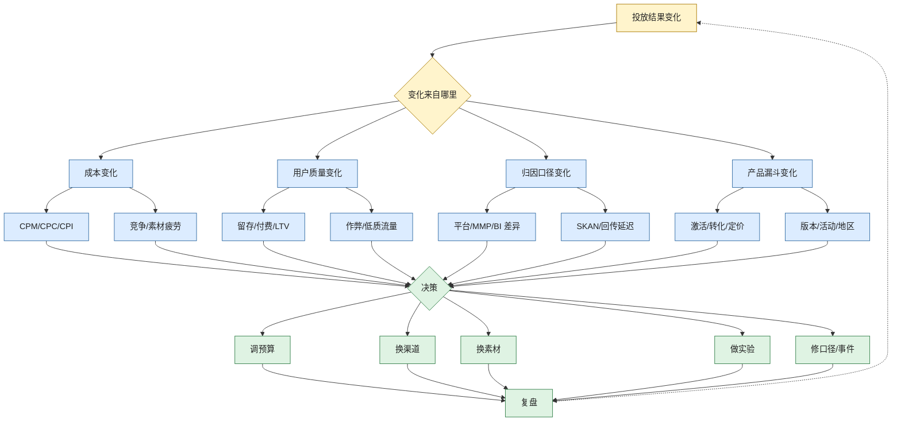

# 投放指标与决策图

> 图类型：decision-map。它回答的问题是：面对投放数据时，如何从指标走到预算、渠道、实验和组织决策。

## 使用方式

- 不要看到 ROAS 掉了就直接停渠道。
- 先判断变化来自成本、质量、归因还是产品漏斗。
- 再决定是调预算、换渠道、换素材、做实验，还是修数据口径。

## 下钻

- [[指标体系与口径治理|指标体系与口径治理]]
- [[广告投放决策导航|广告投放决策导航]]
- [[每日投放巡检 Runbook|每日投放巡检 Runbook]]
