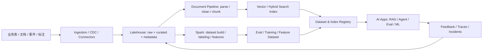

# AI 数据供给链路图

## 读图要点

- Lakehouse 是可追溯数据底座，vector index 只是服务层
- RAG data、eval data、training data、feature data 要分开管理
- Registry 把 dataset、index、schema、owner、权限、版本和下游 AI 应用连起来
- Feedback / traces / incidents 应该回流成 eval、retrieval tuning 和数据质量改进
- 权限、删除、更正、保留期限必须能从源系统传到下游索引和数据集

## 关联

- [[../09-Case-Studies/AI 数据供给链路|AI 数据供给链路]]
- [[../05-Topics/数据治理与指标可信度|数据治理与指标可信度]]
- [[../05-Topics/Apache Iceberg 与 Lakehouse 表格式|Apache Iceberg 与 Lakehouse 表格式]]
- [[../../AI-Engineering/07-Topics/Prompt Registry、Datasets 与 Evals|Prompt Registry、Datasets 与 Evals]]

