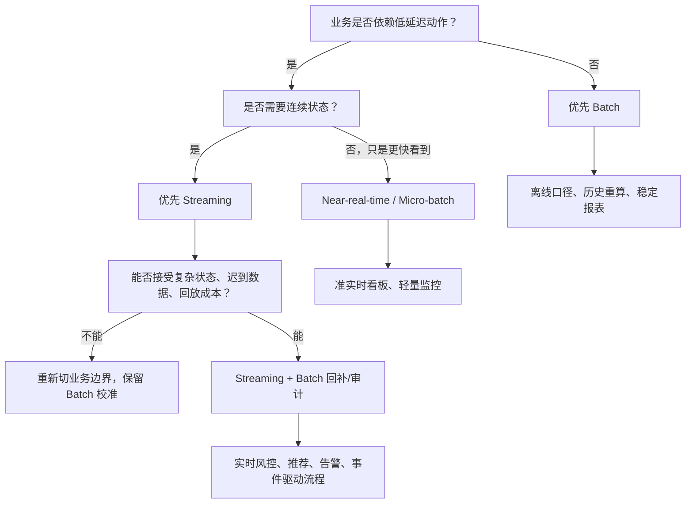

# Batch Streaming 判断图

## 怎么读这张图

- 如果只是“更快看到数据”，不一定需要完整 streaming 架构
- 如果数据会触发业务动作，才真正进入 streaming 判断
- 如果涉及财务、审计、监管或最终口径，通常仍需要 batch 校准

## 关联

- [[../05-Topics/Batch 与 Streaming 判断框架|Batch 与 Streaming 判断框架]]
- [[../大数据决策导航|大数据决策导航]]

