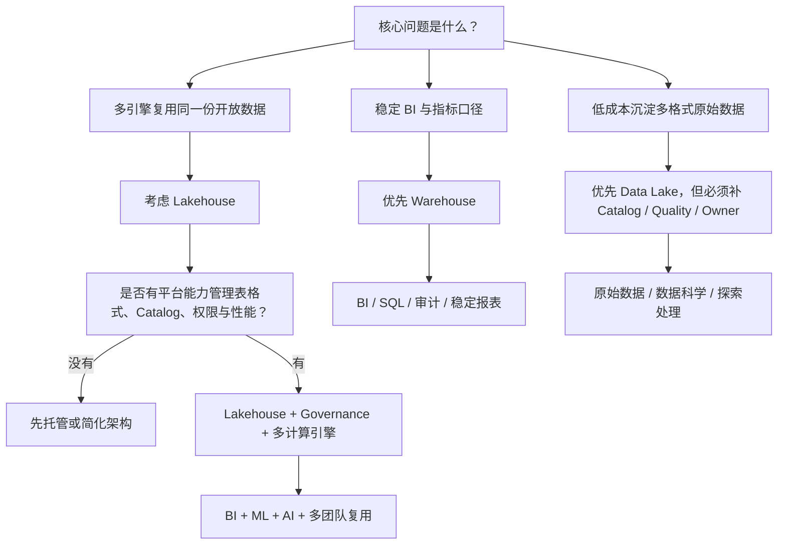

# Warehouse Lakehouse 判断图

## 怎么读这张图

- Warehouse、data lake、lakehouse 不是简单新旧替代关系
- Lakehouse 的核心不是对象存储，而是开放存储上的表管理、catalog、治理和多引擎复用
- 如果团队平台能力不足，过早自建 lakehouse 可能放大复杂度

## 关联

- [[../05-Topics/Warehouse、Data Lake 与 Lakehouse|Warehouse、Data Lake 与 Lakehouse]]
- [[../大数据决策导航|大数据决策导航]]

