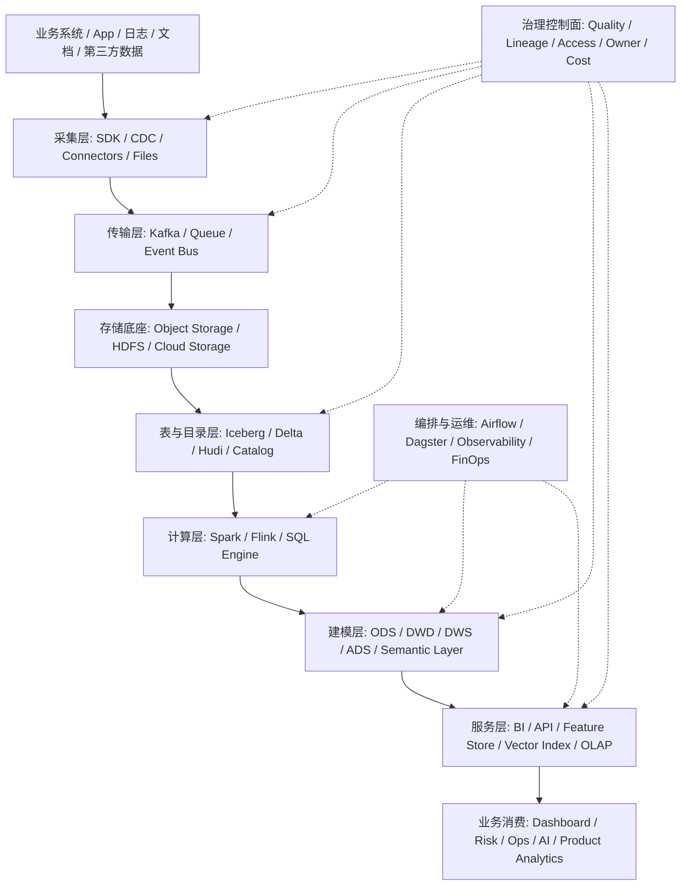

# 大数据全景架构图

## 这页解决什么问题

这页不是产品清单，而是回答：

> 一个现代大数据平台，通常由哪些层组成？每层解决什么问题？常见产品应该放在哪一层理解？

先有架构层次，再讨论公司和产品，才不会被厂商名词带着走。

## 全景图

## 1. Source 层：事实从哪里来

典型来源：

- 业务数据库
- App / Web 行为
- 服务端日志
- 交易和支付事件
- 文档和知识库
- 第三方数据
- 人工标注和审核

核心判断：哪些是权威事实源，哪些只是观察信号。

## 2. Ingestion 层：数据怎么进平台

常见方式：

- SDK 埋点
- log collector
- CDC
- file import
- API connector
- document connector

核心判断：schema、顺序、重复、延迟、权限和失败补偿怎么处理。

## 3. Transport 层：数据怎么流动

常见产品形态：

- Kafka / event log
- queue
- cloud pub/sub
- event bus

核心判断：你需要的是一次性消息派发，还是可回放、多消费者复用的事件日志。

## 4. Storage 层：数据怎么长期存在

常见形态：

- warehouse
- data lake
- lakehouse
- object storage
- HDFS

核心判断：数据是为了稳定 BI、低成本沉淀、多引擎复用，还是 AI / ML / 运营系统共同使用。

## 5. Table / Catalog 层：文件怎么变成表

这一层让开放存储上的数据更像可管理的表：

- schema evolution
- partition evolution
- snapshot
- rollback
- catalog
- permission integration

典型关键词：Iceberg、Delta、Hudi、Hive Metastore、Glue Catalog、Unity Catalog、Nessie。

## 6. Compute 层：数据怎么被计算

常见计算模式：

- batch：Spark、SQL jobs
- streaming：Flink、Kafka Streams
- interactive：Trino / Presto、warehouse SQL
- ML / feature：Spark、Ray、feature pipelines

核心判断：延迟、吞吐、状态、回放、成本和开发体验。

## 7. Modeling 层：数据怎么变成业务语言

这一层最容易被低估。

它负责：

- 数仓分层
- 维度建模
- 指标口径
- semantic layer
- data mart
- data product

如果这一层弱，平台工具越多，指标越乱。

## 8. Serving 层：数据如何被使用

常见服务形态：

- BI dashboard
- ad hoc query
- OLAP serving
- API / reverse ETL
- feature store
- vector index
- eval dataset
- alerting / automation

核心判断：谁使用、延迟要求、权限边界、SLA 和 fallback。

## 9. Governance 控制面：为什么能信

治理不是某个单独工具，而是横跨全链路：

- data quality
- lineage
- catalog
- owner
- data contract
- access control
- privacy
- retention
- cost attribution

成熟平台的差异，往往不在“能不能算”，而在“能不能长期可信地复用”。

## 10. Orchestration / Ops：怎么持续运行

这一层负责：

- 调度
- 依赖
- 重跑
- backfill
- 监控
- incident response
- 成本优化
- capacity planning

典型关键词：Airflow、Dagster、Prefect、OpenLineage、OpenTelemetry、FinOps。

## 读公司和产品时怎么套这张图

讨论任何公司或产品，先放到层级里：

- 它是 storage / compute / catalog / governance / BI / AI data serving 哪一层
- 它控制的是底座、工作流、指标口径，还是业务消费入口
- 它替代的是哪一层旧方案
- 它和上游 / 下游如何集成
- 它的 lock-in 在数据、接口、元数据，还是工作流

## 关联

- [[../05-Topics/大数据系统主干|大数据系统主干]]
- [[../05-Topics/数据生命周期与 Data Lifecycle|数据生命周期与 Data Lifecycle]]
- [[../05-Topics/数仓建模与指标口径|数仓建模与指标口径]]
- [[../05-Topics/Semantic Layer 与指标治理|Semantic Layer 与指标治理]]
- [[大数据公司与产品版图]]

