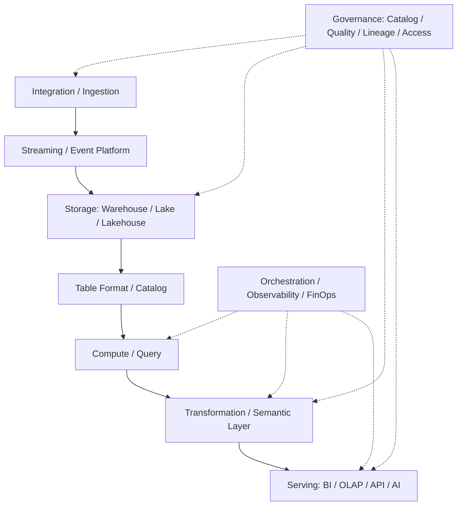

# 大数据公司与产品版图

## 这页怎么用

这页不是最新市场排名，而是后续讨论公司和产品时的“放置架”。

讨论任何公司 / 产品前，先问它属于哪一层：

- ingestion / integration
- streaming / event platform
- storage / lakehouse / warehouse
- compute / query
- orchestration
- transformation / semantic layer
- governance / catalog / quality / lineage
- BI / analytics
- AI data serving

## 产品版图骨架

## 索引入口

- [[../01-Companies/公司索引|公司索引]]
- [[../02-Products/产品索引|产品索引]]
- [[../02-Products/常用大数据产品速览|常用大数据产品速览]]

## 后续讨论时的分类

### Cloud Data Platforms

典型讨论对象：

- Snowflake
- Databricks
- BigQuery
- Redshift
- Microsoft Fabric / Synapse

关注点：

- warehouse vs lakehouse
- SQL 体验
- data sharing
- governance
- AI data integration
- lock-in 和成本模型

### Streaming / Event Platforms

典型讨论对象：

- Apache Kafka / Confluent
- Apache Flink
- cloud pub/sub / streaming services

关注点：

- event log
- schema registry
- stateful processing
- event time
- exactly-once 语义
- operational complexity

### Lakehouse Table / Catalog

典型讨论对象：

- Apache Iceberg
- Delta Lake
- Apache Hudi
- Hive Metastore / Glue Catalog / Unity Catalog / Nessie

关注点：

- table format
- catalog
- schema evolution
- snapshot
- governance integration
- 多引擎兼容

### Query / OLAP

典型讨论对象：

- Trino / Presto
- ClickHouse
- Druid
- Pinot
- DuckDB

关注点：

- interactive query
- real-time OLAP
- serving latency
- concurrency
- cost
- data freshness

### Transformation / Semantic Layer

典型讨论对象：

- dbt
- Cube
- MetricFlow / semantic metrics
- 组织自建 metric layer

关注点：

- metric ownership
- reusable transformations
- testing
- semantic consistency
- BI / API / AI 复用

### Governance / Quality / Lineage

典型讨论对象：

- DataHub
- OpenMetadata
- OpenLineage / Marquez
- Great Expectations
- Monte Carlo 类 data observability

关注点：

- catalog
- lineage
- quality
- ownership
- incident
- policy enforcement

### Orchestration

典型讨论对象：

- Airflow
- Dagster
- Prefect

关注点：

- scheduling
- dependency
- backfill
- asset awareness
- operational recovery

## 读产品时的 8 个问题

1. 它处在哪一层
2. 它解决的是技术问题、治理问题，还是协作问题
3. 它依赖哪些上游和下游
4. 它控制的数据、元数据或工作流是什么
5. 它和 open table format / catalog 的关系是什么
6. 它更适合 batch、streaming、interactive，还是 serving
7. 它的成本模型和 lock-in 在哪里
8. 它是否能接入 AI data / eval / agent 场景

## 关联

- [[大数据全景架构图]]
- [[../05-Topics/数仓建模与指标口径|数仓建模与指标口径]]
- [[../05-Topics/Semantic Layer 与指标治理|Semantic Layer 与指标治理]]
- [[../01-Companies/公司索引|公司索引]]
- [[../02-Products/常用大数据产品速览|常用大数据产品速览]]
