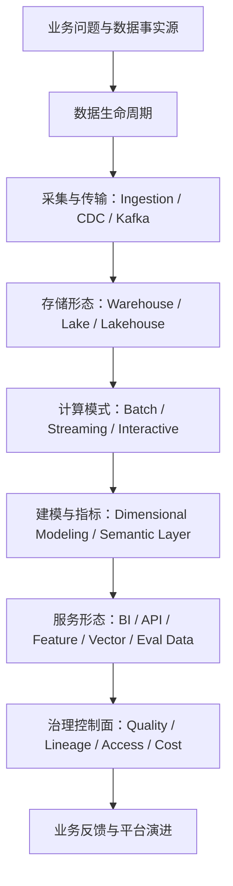

# 大数据学习路线图

## 最短路径

## 第一阶段：先建立大图

- 读：[[../05-Topics/大数据系统主干|大数据系统主干]]
- 目标：知道每一层解决什么问题，而不是记工具名
- 输出：能画出一条数据从产生到服务的链路

## 第二阶段：理解数据建模

- 重点：事实表、维度表、宽表、指标口径、semantic layer
- 关键问题：为什么同一个业务指标会出现多个版本
- 输出：能解释 ODS / DWD / DWS / ADS 或类似分层到底在防什么混乱

## 第三阶段：理解计算模式

- 重点：batch、streaming、interactive
- 关键问题：延迟、吞吐、状态、一致性、回放和成本如何 trade off
- 输出：能判断一个场景该用离线、实时，还是混合链路

## 第四阶段：理解存储形态

- 重点：warehouse、data lake、lakehouse
- 关键问题：开放存储、表格式、catalog、权限、查询性能谁负责
- 输出：能解释为什么 lakehouse 不是“把文件扔到对象存储”

## 第五阶段：理解治理与平台化

- 重点：quality、lineage、catalog、owner、access control、FinOps
- 关键问题：组织为什么愿意信并复用这批数据
- 输出：能把数据平台从“工具集合”讲成“可信数据产品系统”

## 第六阶段：接到 AI 与业务系统

- 重点：datasets、feature store、vector store、eval data、RAG facts
- 关键问题：AI 系统需要什么样的数据新约束：版本、freshness、隐私、可追溯
- 关联：[[../../AI-Engineering/专题总览|AI-Engineering]]

## 本轮不要急着做的事

- 不要一开始铺满所有工具
- 不要把 Hadoop 历史当主线
- 不要在没有业务问题的情况下比较 Spark 和 Flink
- 不要把治理当成最后补的文档层

