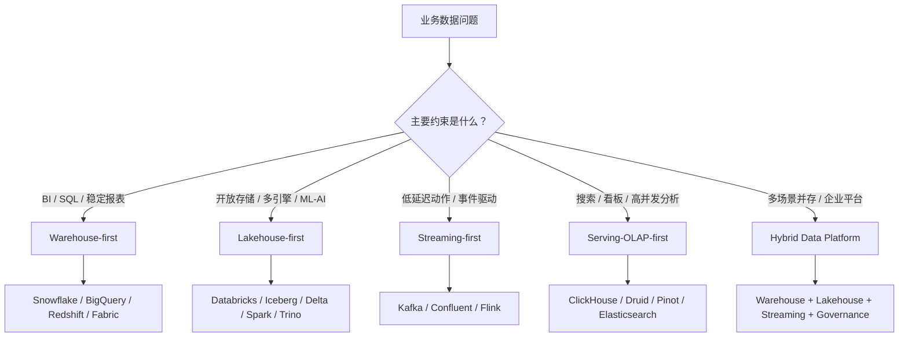

# 大数据常见架构模式图

## 这页解决什么问题

这页把常见大数据架构收成几种模式，方便后续讨论公司、产品和架构设计时快速定位：

> 你现在面对的是 warehouse-first、lakehouse-first、streaming-first、还是 hybrid data platform？

## 模式总图

## 1. Warehouse-first

适合：

- BI 报表和 SQL 分析是主要需求
- 数据团队希望减少底层运维
- 指标口径、权限、共享、审计是重点
- 企业已经围绕 SQL 和 BI 建立工作流

常见组合：

- Snowflake + dbt + BI
- BigQuery + Looker / BI + Dataform
- Redshift / Fabric / Synapse + 云生态

风险：

- 成本治理容易滞后
- 原始数据、多格式数据和 ML / AI 数据链路可能需要额外设计
- 过度依赖 warehouse 内部语义，跨平台复用受限

## 2. Lakehouse-first

适合：

- 原始数据、多格式数据和历史数据很多
- BI、ML、AI、数据科学都要复用同一数据底座
- 希望用开放存储和表格式降低数据锁定
- 团队有能力管理 catalog、权限、compaction、表维护

常见组合：

- Object Storage + Iceberg / Delta + Spark + Trino
- Databricks Lakehouse
- Flink / Spark 写入 lakehouse，Trino / BI 查询

风险：

- 组件多，平台能力要求高
- 查询体验、权限、性能、catalog 需要整体设计
- 如果治理弱，会变成“更复杂的数据湖”

## 3. Streaming-first

适合：

- 低延迟业务动作是核心
- 事件驱动系统很多
- 需要多消费者复用实时事件
- 风控、运营、监控、推荐、实时特征很重要

常见组合：

- Kafka / Confluent + Flink + OLAP / Lakehouse
- CDC + Kafka + Flink + Warehouse / Lakehouse
- Event platform + schema registry + stream governance

风险：

- schema、topic、retention、幂等和回放设计复杂
- streaming 不替代最终口径和历史重算
- on-call 和状态恢复成本高

## 4. Serving-OLAP-first

适合：

- 高并发、低延迟分析查询
- 用户行为看板、监控、实时分析、产品 analytics
- 数据已经被建模好，需要快速消费

常见组合：

- Kafka / Flink -> ClickHouse / Druid / Pinot
- Lakehouse / Warehouse -> serving OLAP
- OLAP + dashboard / API

风险：

- Serving 层不是治理底座
- 写入模型、预聚合、索引和查询模式强相关
- 实时快不等于最终口径准确

## 5. Hybrid Data Platform

适合：

- 企业同时有 BI、实时、AI、ML、运营自动化和审计需求
- 数据平台要服务多业务线
- 既需要托管体验，也需要开放数据底座

常见组合：

- Kafka + Flink + Lakehouse + Warehouse + Semantic Layer + Governance
- Warehouse 服务 BI，Lakehouse 服务多格式和 AI，Streaming 服务实时动作
- Catalog / lineage / quality / access 横跨各层

风险：

- 架构复杂度高
- 如果没有 owner 和治理，很容易工具堆叠
- 成本归因和数据产品责任必须明确

## 一句话判断

- 稳定 SQL 和 BI 优先：先看 `warehouse-first`
- 多格式、多引擎、AI / ML 复用优先：先看 `lakehouse-first`
- 低延迟事件和业务动作优先：先看 `streaming-first`
- 高并发实时查询优先：先看 `serving-OLAP-first`
- 企业多场景并存：最终多半会走 `hybrid`

## 关联

- [[大数据全景架构图]]
- [[大数据公司与产品版图]]
- [[../大数据架构设计决策导航|大数据架构设计决策导航]]
- [[../02-Products/常用大数据产品速览|常用大数据产品速览]]

