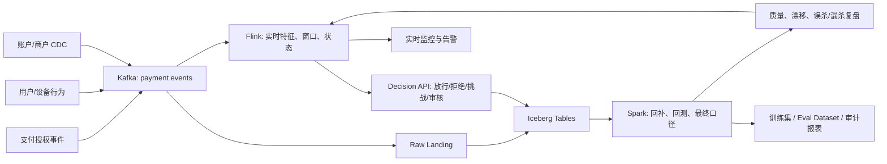

# 支付实时风控数据链路图

## 读图要点

- Kafka 是事件日志层，保证多消费者、解耦和回放
- Flink 是实时计算层，负责状态、窗口和低延迟特征
- Iceberg / Lakehouse 是可审计、可回放、可多引擎访问的数据底座
- Spark 是批处理校准层，负责历史重算、回测和最终口径
- 治理控制点贯穿事件定义、schema、owner、lineage、quality、access 和 retention

## 关联

- [[../09-Case-Studies/支付实时风控数据链路|支付实时风控数据链路]]
- [[../05-Topics/Kafka 与事件日志|Kafka 与事件日志]]
- [[../05-Topics/Flink 与流处理|Flink 与流处理]]
- [[../05-Topics/Spark 与批处理|Spark 与批处理]]
- [[../05-Topics/Apache Iceberg 与 Lakehouse 表格式|Apache Iceberg 与 Lakehouse 表格式]]

